# SenticRAG — Retrieval-Augmented Aspect Sentiment & Feedback Intelligence Engine

[](https://github.com/khuonglaptri3/SenticRAG/actions/workflows/ci.yml)
[](https://www.python.org/)
[](LICENSE)
[](infra/docker/)
[](docs/architecture/)

**SenticRAG** is an enterprise-grade AI engine designed for large-scale customer review analysis, aspect-based sentiment extraction, and grounded conversational intelligence with verified citations.

---

## 🌟 Key Capabilities

- **Aspect-Based Sentiment Analysis (ABSA):** Bóc tách cảm xúc đa khía cạnh (Chất lượng, Giá cả, Giao hàng, CSKH) với kiến trúc lai (TF-IDF Baseline và Transformer PhoBERT / viBERT fine-tuned).
- **Advanced RAG Engine:** Tìm kiếm lai (Hybrid Search: Dense Vector qua Qdrant + Sparse BM25Okapi) hợp nhất qua giải thuật **Reciprocal Rank Fusion (RRF)** và Cross-Encoder Reranker.
- **Citation & Evidence Grounding:** Tự động đối chiếu và đính kèm ID phản hồi gốc (`[Ref: #RV-xxxxx]`) cho từng luận điểm trong câu trả lời để triệt tiêu ảo giác (Hallucination).
- **Hierarchical Memory Module:** Phân tầng bộ nhớ Working Context, Message Buffer, Archival Vector Memory và tận dụng **Prompt Caching** giảm 50% chi phí suy luận.
- **Production-Ready Operations:** Đóng gói Docker đa tầng (`Dockerfile.api`, `Dockerfile.train`), quản lý hạ tầng Terraform + Helm/EKS, giám sát OpenTelemetry + Prometheus/Grafana.

---

## 🏗️ 7-Layer Architecture Overview

```mermaid
flowchart TD
    subgraph L1["1. Input & Gateway Layer"]
        direction TB
        INGEST["Review Ingestors (CSV/JSON/Streams)"]
        NORM["Text & Emoji Normalizer"]
        PII["PII Anonymizer (Mask Phone/Name/Email)"]
        RL["Rate Limiter (Token Bucket)"]
    end

    subgraph L2["2. Core Reasoning & Orchestration"]
        direction TB
        FM["Foundation Models (Cloud LLM / Self-hosted SLM)"]
        QP["Query Planner & Multi-step Decomposition"]
        REFLECT["Self-RAG Reflection & Grounding Verifier"]
    end

    subgraph L3["3. Hierarchical Memory Module"]
        direction TB
        CTX["Working Context & Prompt Cache (24h)"]
        BUF["Message Buffer (Rolling 10-msg Window)"]
        VEC["Archival Vector Memory (Qdrant)"]
        STORE["Recall Store (Postgres / Redis)"]
    end

    subgraph L4["4. Knowledge & Retrieval Layer"]
        direction TB
        HYBRID["Hybrid Search (Qdrant Dense + BM25 Sparse)"]
        RRF["Reciprocal Rank Fusion (RRF)"]
        RERANK["Cross-Encoder Reranker (BGE)"]
        CITE["Citation Mapping Engine"]
    end

    subgraph L5["5. Tools & Action Protocols"]
        direction TB
        FC["Pydantic Structured Outputs"]
        ANALYTICS["Feedback Analytics Tool Calling"]
        WORKER["Async Worker (Negative Spike Alert)"]
    end

    subgraph L6["6. Output & Guardrails Layer"]
        direction TB
        SCHEMA["Pydantic Schema Validator"]
        HALLUC["Hallucination Verifier"]
        FILTER["Unicode & Strictness Output Filter"]
    end

    subgraph L7["7. Observability & Operations"]
        direction TB
        OTEL["OpenTelemetry Distributed Tracing"]
        METRICS["Prometheus Metrics & Grafana Dashboards"]
        DRIFT["Concept & Data Drift Monitoring"]
        TESTS["Automated Evaluation (Recall@K, Macro-F1)"]
    end

    L1 --> L2
    L2 <--> L3
    L2 <--> L4
    L2 --> L5
    L2 --> L6
    L1 -.-> L7
    L2 -.-> L7
    L6 -.-> L7
```



---

## 📁 Repository Structure

```text
SenticRAG — Retrieval-Augmented Aspect Sentiment & Feedback Intelligence Engine/
├── apps/                          # Runtime services
│   ├── api/                       # Core FastAPI service (/predict, /stats, /health)
│   ├── rag_service/               # Grounded RAG query answering service (/ask)
│   └── worker/                    # Background consumers & trend alert jobs
├── packages/                      # Domain packages
│   ├── common/                    # Logging, settings, exceptions
│   ├── data_contracts/            # Pydantic data schemas & contracts
│   ├── ml_core/                   # Metrics, evaluation, artifact lifecycle
│   ├── retrieval/                 # Embeddings, Qdrant vectorstore, rerankers, citations
│   └── llm/                       # LLM clients, prompt templates, structured outputs, guardrails
├── pipelines/                     # Independent offline processing & training pipelines
│   ├── ingest_reviews/            # Ingestion from external sources
│   ├── validate_reviews/          # Data validation & PII sanitization
│   ├── label_reviews/             # Aspect & sentiment labeling
│   ├── train_sentiment/           # Reproducible aspect sentiment training
│   ├── build_embeddings/          # Embedding generation
│   ├── index_qdrant/              # Qdrant vector collection indexing
│   └── eval_rag/                  # Offline RAG evaluation harness (Recall@K, Groundedness)
├── infra/                         # Infrastructure as Code
│   ├── docker/                    # Dockerfile.api & Dockerfile.train
│   ├── helm/                      # Kubernetes Helm charts (project-a/)
│   ├── terraform/                 # Terraform modules for EKS, ECR, IAM, S3, KMS
│   └── observability/             # Prometheus, Grafana, OpenTelemetry configs
├── configs/                       # Environment, training, and evaluation configs
├── tests/                         # Test pyramid (unit, integration, smoke, load, e2e)
├── docs/                          # Architectural specs, ADRs, model cards, runbooks
├── pyproject.toml                 # Monorepo dependencies & packaging
└── Makefile                       # Standard development workflows
```

---

## 🚀 Quickstart

### Prerequisites
- Python >= 3.11
- Docker & Docker Compose
- Qdrant Vector DB & Redis

### 1. Installation
```bash
git clone git@github.com:khuonglaptri3/SenticRAG.git
cd "SenticRAG"
python3 -m venv .venv
source .venv/bin/activate
pip install -e ".[dev]"
```

### 2. Run Test Suite
```bash
make test-unit
```

### 3. Local Development Server
```bash
make run-api
```
Truy cập tài liệu API tự động tại: `http://localhost:8000/docs`

---

## 🌿 Gitflow Branching Strategy

Dự án tuân thủ nghiêm ngặt mô hình **Gitflow**:
- `main`: Nhánh ổn định cao nhất, chứa các bản phát hành Production được gắn tag phiên bản (`v0.1.0`, `v1.0.0`).
- `develop`: Nhánh tích hợp chính cho toàn bộ tính năng mới.
- `feature/*`: Nhánh phát triển tính năng riêng lẻ (tách từ `develop`, merge về `develop`).
- `release/*`: Nhánh chuẩn bị phát hành phiên bản mới.
- `hotfix/*`: Nhánh xử lý sự cố khẩn cấp trên Production (tách từ `main`, merge về cả `main` và `develop`).

Tất cả commit tuân theo quy chuẩn **Conventional Commits**:
- `feat(scope): ...` — Tính năng mới
- `fix(scope): ...` — Sửa lỗi
- `docs(scope): ...` — Thêm hoặc cập nhật tài liệu
- `chore(scope): ...` — Cấu hình, bảo trì, build tool
- `ci(scope): ...` — Cấu hình GitHub Actions / Jenkins
- `infra(scope): ...` — Cấu hình Docker, Helm, Terraform

---

## 📄 License
Phát hành theo giấy phép [MIT License](LICENSE).
