# Báo Cáo Đối Chiếu Kiến Trúc AI Pipeline: Dự Án T-Insights Kiosk vs. Lý Thuyết AI Agent Pipeline

**Dự án:** T-Insights Android Kiosk — Voice AI Reception Assistant  
**Tài liệu tham chiếu gốc:** [`docs/architecture.md`](file:///home/intern-tdkhuong/Desktop/VoiceAgent_T_Info/docs/architecture.md) (Mục 3: AI Pipeline Architecture)  
**Mục tiêu:** Đối chiếu, phân loại và định vị toàn bộ các thành phần, module mã nguồn được xây dựng trong dự án vào khung kiến trúc 7 tầng chuẩn lý thuyết của hệ thống AI Agent Pipeline.

---

## 1. Sơ Đồ Tổng Thể Đối Chiếu Kiến Trúc (Architecture Mapping Flow)

```mermaid
flowchart TD
    subgraph L1["1. INPUT & GATEWAY LAYER"]
        direction TB
        MP["Multimodal Parsers<br/>• fastrtc (WebRTC 16kHz PCM)<br/>• audio/processing (AEC, Denoise)<br/>• audio/vad/humaware_vad (Silero VAD)<br/>• direct_whispercpp / parakeet (STT)"]
        SR["Semantic Router<br/>• model_registry.py (Language Swap)<br/>• rag/retrieval.py (_INTENT_ROUTES)<br/>• session/booking.py (Intent Classifier)"]
        PII["PII Anonymizer<br/>• shared/utils/redact.py<br/>(redact_secrets, mask_phone, mask_name)"]
        RL["Rate Limiter<br/>• session/booking_ticket.py<br/>(allow_read sliding window, One-shot ticket)"]
    end

    subgraph L2["2. CORE REASONING & ORCHESTRATION"]
        direction TB
        FM["Foundation Model (LLM/SLM)<br/>• OpenAI gpt-4o-mini (Cloud)<br/>• llama.cpp / vLLM (Gemma-4, Qwen - Local)"]
        CSM["Cyclic State Machine<br/>• realtime/voice_handler.py (Turn Loop)<br/>• session/booking.py (Room Booking FSM)"]
        PE["Planning Engine<br/>• 2-Phase Field Collection Dialog<br/>• rag/context_builder.py (Context Planning)"]
        RF["Reflection Loop<br/>• dev_trace.py (STT Loopback Eval)<br/>• speech_filters.py (Query Contextualization)"]
    end

    subgraph L3["3. HIERARCHICAL MEMORY MODULE"]
        direction TB
        WC["Working Context (Core Memory)<br/>• session_state.py (SessionStateMemory)"]
        MB["Message Buffer<br/>• conversation_history.py (10-msg Rolling Window)"]
        RS["Recall Storage<br/>• session/state.py (Runtime session state)<br/>• data/uploads/bookings.jsonl"]
        AVM["Archival Vector Memory<br/>• rag/index.py (FAISS Index + Metadata)"]
        CW["Context Window Management<br/>• rag/context_builder.py<br/>• OpenAI Prompt Caching (24h retention)"]
    end

    subgraph L4["4. KNOWLEDGE & RETRIEVAL LAYER"]
        direction TB
        HRAG["Advanced RAG (Hybrid Search)<br/>• rag/retrieval.py (FAISS Cosine + BM25Okapi)<br/>• Reciprocal Rank Fusion (RRF)"]
        RERANK["Cross-Encoder Reranker<br/>• rag/reranker.py (sentence-transformers CrossEncoder)"]
        GRAG["GraphRAG (Knowledge Graph)<br/>• [Chưa triển khai - Flat Chunks]"]
    end

    subgraph L5["5. TOOLS & ACTION PROTOCOLS"]
        direction TB
        FC["Function Calling / Action Markers<br/>• reply_markers.py (BOOKING_SUBMIT, ROOM_BOOKING)<br/>• integrations/room_booking (HTTP Client)"]
        MCP["Model Context Protocol (MCP)<br/>• pipeline/mcp_client.py (Internal Orchestrator)"]
        SANDBOX["MicroVM Sandboxes<br/>• [Chưa triển khai - In-container Execution]"]
    end

    subgraph L6["6. OUTPUT & GUARDRAILS LAYER"]
        direction TB
        HV["Hallucination Verifier<br/>• audio/speech_filters.py (Whisper Hallucination Filter)<br/>• voice_handler.py (Post-TTS Grace Guard)"]
        PSV["Pydantic Schema Validator<br/>• shared/schemas/llm_extraction.py<br/>• shared/schemas/booking.py"]
        OF["Output Filter<br/>• audio/tts_utils.py (clean_for_tts)<br/>• 4-Layer Language Strictness (Unicode Filter)"]
    end

    subgraph L7["7. OBSERVABILITY & OPERATIONS"]
        direction TB
        DT["Distributed Tracing<br/>• pipeline/dev_trace.py (PipelineTrace, Ring Buffer)"]
        TCA["Token/Cost Accounting<br/>• providers/llm/openAI.py (_log_usage, Prompt Cache Log)"]
        DM["Drift Monitoring<br/>• session/conversation_log.py (SQLite Audit)<br/>• ASR Phonetic Mishear Updating"]
        AE["Automated Evaluation<br/>• tests/ (test_rag, test_guardrails, e2e_suite)"]
    end

    L1 --> L2
    L2 <--> L3
    L2 <--> L4
    L2 --> L5
    L2 --> L6
    L1 -.-> L7
    L2 -.-> L7
    L6 -.-> L7
```

---

## 2. Phân Tích Chi Tiết 7 Tầng Kiến Trúc

### Tầng 1: Input and Gateway Layer

Tầng này chịu trách nhiệm thu nhận tín hiệu đầu vào đa phương thức, chuẩn hóa dữ liệu, bảo vệ an toàn danh tính và kiểm soát lưu lượng truy cập trước khi đưa vào hệ thống suy luận.

| Thành phần lý thuyết | Module tương ứng trong Project | Phân tích chi tiết chức năng & mã nguồn | Trạng thái |
| :--- | :--- | :--- | :--- |
| **Multimodal Parsers** | • [`serving/app/server.py`](file:///home/intern-tdkhuong/Desktop/VoiceAgent_T_Info/t_insights_kiosk/serving/app/server.py) • [`ai/audio/processing/pipeline.py`](file:///home/intern-tdkhuong/Desktop/VoiceAgent_T_Info/t_insights_kiosk/ai/audio/processing/pipeline.py) • [`ai/audio/vad/humaware_vad.py`](file:///home/intern-tdkhuong/Desktop/VoiceAgent_T_Info/t_insights_kiosk/ai/audio/vad/humaware_vad.py) • [`ai/audio/validation.py`](file:///home/intern-tdkhuong/Desktop/VoiceAgent_T_Info/t_insights_kiosk/ai/audio/validation.py) • [`ai/providers/stt/`](file:///home/intern-tdkhuong/Desktop/VoiceAgent_T_Info/t_insights_kiosk/ai/providers/stt/) • [`ingestion/kb_pipeline/crawl_pdfs.py`](file:///home/intern-tdkhuong/Desktop/VoiceAgent_T_Info/t_insights_kiosk/ingestion/kb_pipeline/crawl_pdfs.py) | - **Luồng Audio Inbound**: Tiếp nhận âm thanh 16kHz PCM qua WebRTC (`fastrtc`). Xử lý tiền xử lý tín hiệu âm thanh DSP qua AEC (`aec.py`), khử ồn phổ âm học (`noise_suppression.py`), phân đoạn giọng nói dựa trên Silero VAD (`HumAwareVADModel`). Kiểm định chất lượng âm thanh (`validate_audio_quality` kiểm tra duration $\ge 0.4s$, energy $\ge 0.0015$, voiced-ratio $\ge 7\%$). - **STT Parsing**: Dịch âm thanh thành văn bản qua Whisper.cpp CUDA (`direct_whispercpp.py` cho EN) và Parakeet CTC / Gipformer (`direct_gipformer.py` / `stt_http_service.py` cho VI). - **Luồng Document Inbound**: Parser PDF và crawler Playwright bóc tách tài liệu đa phương thức ngoại tuyến. | **Đã triển khai** |
| **Semantic Router** | • [`ai/rag/retrieval.py`](file:///home/intern-tdkhuong/Desktop/VoiceAgent_T_Info/t_insights_kiosk/ai/rag/retrieval.py) • [`serving/session/booking.py`](file:///home/intern-tdkhuong/Desktop/VoiceAgent_T_Info/t_insights_kiosk/serving/session/booking.py) • [`serving/pipeline/model_registry.py`](file:///home/intern-tdkhuong/Desktop/VoiceAgent_T_Info/t_insights_kiosk/serving/pipeline/model_registry.py) | - **Định tuyến Ngôn ngữ**: Hàm `update_pipeline_language()` tráo đổi tức thời con trỏ STT, TTS và prompt hệ thống tương ứng. - **Định tuyến Ngữ nghĩa Truy vấn (Intent Routes)**: Mảng `_INTENT_ROUTES` và hàm `has_domain_qualifier()` trong `retrieval.py` phân tích từ khóa ngữ nghĩa để định tuyến câu hỏi tới đúng trang (dịch vụ, giải pháp, ngành dọc, chứng chỉ) và tinh chỉnh trọng số tài liệu tương ứng. - **Phân loại Ý định Tác vụ**: `detect_booking_intent_llm()` và `classify_booking_kind()` phân luồng giữa đặt lịch khách thăm và đặt phòng họp nội bộ. | **Đã triển khai** |
| **PII Anonymizer** | • [`shared/utils/redact.py`](file:///home/intern-tdkhuong/Desktop/VoiceAgent_T_Info/t_insights_kiosk/shared/utils/redact.py) | - `redact_secrets()`: Lọc bỏ toàn bộ token bảo mật (OpenAI API key `sk-...`, PEM Private Keys, Bearer token, password) trước khi lưu vào SQLite database (`conversations.db`). - `mask_phone()` & `mask_name()`: Ẩn danh hóa số điện thoại (`0901234567` → `********67`) và tên khách (`Le Van An` → `L* V** A*`) trên log stdout để đảm bảo quyền riêng tư. | **Đã triển khai** |
| **Rate Limiter** | • [`serving/session/booking_ticket.py`](file:///home/intern-tdkhuong/Desktop/VoiceAgent_T_Info/t_insights_kiosk/serving/session/booking_ticket.py) | - Hàm `allow_read(key)` triển khai giải thuật Sliding Window Rate Limiter (tối đa 20 request / 60 giây) bảo vệ endpoint tra cứu danh bạ nhân viên khỏi hành vi quét vét dữ liệu. - Hệ thống Ticket cấp phép một lần (`issue_ticket`, `validate_ticket`, `revoke_ticket`) kiểm soát quyền ghi cuộc họp, tự động hết hạn sau TTL (10 phút) để chống replay attack. | **Đã triển khai** |

---

### Tầng 2: Core Reasoning And Orchestration

Trung tâm điều phối logic, duy trì vòng lặp hội thoại và thực thi suy luận ngữ cảnh.

| Thành phần lý thuyết | Module tương ứng trong Project | Phân tích chi tiết chức năng & mã nguồn | Trạng thái |
| :--- | :--- | :--- | :--- |
| **Foundation Model (LLM/SLM)** | • [`ai/providers/llm/openAI.py`](file:///home/intern-tdkhuong/Desktop/VoiceAgent_T_Info/t_insights_kiosk/ai/providers/llm/openAI.py) • [`ai/providers/llm/ollama.py`](file:///home/intern-tdkhuong/Desktop/VoiceAgent_T_Info/t_insights_kiosk/ai/providers/llm/ollama.py) • [`ai/providers/llm/factory.py`](file:///home/intern-tdkhuong/Desktop/VoiceAgent_T_Info/t_insights_kiosk/ai/providers/llm/factory.py) | - Mặc định sử dụng OpenAI `gpt-4o-mini` (Cloud) thông qua OpenAILLM wrapper. - Hỗ trợ chuyển đổi sang SLM tự host (Gemma-4 12B hoặc Qwen 2.5 / Qwen 3.8) thông qua cấu hình `LLM_BASE_URL` nối tới engine `llama.cpp` hoặc `vLLM` chuẩn OpenAI-compatible. | **Đã triển khai** |
| **Planning Engine** | • [`serving/session/booking.py`](file:///home/intern-tdkhuong/Desktop/VoiceAgent_T_Info/t_insights_kiosk/serving/session/booking.py) • [`ai/rag/context_builder.py`](file:///home/intern-tdkhuong/Desktop/VoiceAgent_T_Info/t_insights_kiosk/ai/rag/context_builder.py) | - **Task / Dialogue Planning**: Thay vì dùng autonomous agent planning dài vòng (như ReAct) gây trễ âm thanh, hệ thống áp dụng cơ chế quy hoạch hội thoại 2 giai đoạn (2-Phase LLM dialogue): Giai đoạn 1 thu thập đồng thời 3 thông tin bắt buộc (`name, phone, visit_time`), hỏi bổ sung thông tin còn thiếu; Giai đoạn 2 xác nhận lời nói và phát sinh cờ submit. - `build_rag_context()`: Lập kế hoạch ngữ cảnh câu hỏi, tự động mở rộng từ khóa, chèn thông tin liên hệ và cắt tỉa độ dài tài liệu. | **Triển khai tinh giản (Domain-Adapted)** |
| **Cyclic State Machine** | • [`serving/realtime/voice_handler.py`](file:///home/intern-tdkhuong/Desktop/VoiceAgent_T_Info/t_insights_kiosk/serving/realtime/voice_handler.py) • [`serving/session/manager.py`](file:///home/intern-tdkhuong/Desktop/VoiceAgent_T_Info/t_insights_kiosk/serving/session/manager.py) • [`serving/session/booking.py`](file:///home/intern-tdkhuong/Desktop/VoiceAgent_T_Info/t_insights_kiosk/serving/session/booking.py) | - **Turn Loop FSM**: Vòng lặp lượt nói tuần hoàn: `Lắng nghe` → `VAD Detect Speech End` → `Tiền xử lý âm thanh` → `STT` → `Filter Chain` → `Booking / RAG` → `LLM Streaming` → `Sentence Splitter` → `TTS Streaming` → `WebRTC Speaker` → `Post-TTS Grace Window` → `Lắng nghe`. - **Session Lifecycle FSM**: `Trang nạp` → `Bật WebRTC` → `Chào đón (Prewarm Greeting)` → `Hội thoại liên tục` → `Inactivity Timeout / Tạm biệt` → `Reset phiên`. - **Room Booking State Machine**: Máy trạng thái tuần hoàn đặt phòng: `idle` → `confirming_room_booking` → `awaiting_employee` → `[confirming_identity]` → `selecting_slot` → `confirm_pending` → `idle`. | **Đã triển khai hoàn chỉnh** |
| **Reflection Loop** | • [`serving/pipeline/dev_trace.py`](file:///home/intern-tdkhuong/Desktop/VoiceAgent_T_Info/t_insights_kiosk/serving/pipeline/dev_trace.py) • [`serving/realtime/reply_markers.py`](file:///home/intern-tdkhuong/Desktop/VoiceAgent_T_Info/t_insights_kiosk/serving/realtime/reply_markers.py) • [`ai/audio/speech_filters.py`](file:///home/intern-tdkhuong/Desktop/VoiceAgent_T_Info/t_insights_kiosk/ai/audio/speech_filters.py) | - **STT Loopback Self-Evaluation** (Stage 6 trong `dev_trace.py`): Đưa âm thanh TTS vừa tổng hợp chạy ngược lại vào mô hình STT, so sánh chuỗi văn bản nhận dạng với phản hồi gốc qua `SequenceMatcher` để phát hiện suy giảm chất lượng. - **Query Contextualization Reflection**: `contextualize_query()` soi chiếu câu hỏi ngắn ("Nói rõ hơn đi", "Còn gì nữa?") với lượt phản hồi liền trước để tái tạo câu truy vấn đầy đủ. - **Verbal Confirmation Fallback**: `extract_booking_from_summary()` đối chiếu lại tin nhắn tóm tắt trước đó khi mô hình quên phát cờ lệnh `BOOKING_SUBMIT`. | **Triển khai tinh giản (Domain-Adapted)** |

---

### Tầng 3: Hierarchical Memory Module

Cấu trúc lưu trữ và phân cấp bộ nhớ giúp duy trì ngữ cảnh ngắn hạn, trung hạn và tri thức dài hạn.

| Thành phần lý thuyết | Module tương ứng trong Project | Phân tích chi tiết chức năng & mã nguồn | Trạng thái |
| :--- | :--- | :--- | :--- |
| **Working Context (Core Memory)** | • [`ai/conversation/session_state.py`](file:///home/intern-tdkhuong/Desktop/VoiceAgent_T_Info/t_insights_kiosk/ai/conversation/session_state.py) (`SessionStateMemory`) | - Lưu trữ thực thể và sự thật cốt lõi về khách thăm (`name`, `interests`, `facts`). - Cơ chế cập nhật bất đồng bộ (`extract_async()`): Khởi chạy task chạy ngầm gọi LLM trích xuất fact trong lúc âm thanh TTS đang phát tới người dùng (thời gian trễ = 0ms). - Format thành khối `--- Session State ---` tiêm trực tiếp vào đầu System Prompt làm chân lý xác thực ("Ground Truth") cho toàn bộ các lượt tiếp theo. | **Đã triển khai** |
| **Message Buffer** | • [`ai/conversation/conversation_history.py`](file:///home/intern-tdkhuong/Desktop/VoiceAgent_T_Info/t_insights_kiosk/ai/conversation/conversation_history.py) (`ConversationHistory`) | - Quản lý buffer trượt lưu giữ **10 tin nhắn gần nhất (5 lượt thoại)** nhằm giữ nhịp ngữ cảnh tự nhiên. - Sử dụng cơ chế xóa theo cặp (`del self.messages[:2]`) để duy trì tính toàn vẹn của cấu trúc luân phiên `user` - `assistant`. | **Đã triển khai** |
| **Recall Storage** | • [`serving/session/state.py`](file:///home/intern-tdkhuong/Desktop/VoiceAgent_T_Info/t_insights_kiosk/serving/session/state.py) • `data/uploads/bookings.jsonl` | - Lưu trữ các biến trạng thái runtime trong phiên (`LAST_BOOKING`, `BOOKING_ACTIVE`, `ROOM_BOOKING_CHAT_BOOKING`). - Ghi append-only thông tin đặt hẹn vào tệp local `bookings.jsonl` làm bản sao lưu an toàn. | **Đã triển khai** |
| **Archival Vector Memory** | • [`ai/rag/index.py`](file:///home/intern-tdkhuong/Desktop/VoiceAgent_T_Info/t_insights_kiosk/ai/rag/index.py) • `data/knowledge_base/{en,vn}/` | - Vector Index FAISS (`index.faiss` + `meta.json`) được đóng gói sẵn trong image Docker, chứa toàn bộ tri thức doanh nghiệp được mã hóa bởi mô hình `paraphrase-multilingual-MiniLM-L12-v2`. | **Đã triển khai** |
| **Context Window** | • [`ai/rag/context_builder.py`](file:///home/intern-tdkhuong/Desktop/VoiceAgent_T_Info/t_insights_kiosk/ai/rag/context_builder.py) • [`ai/providers/llm/openAI.py`](file:///home/intern-tdkhuong/Desktop/VoiceAgent_T_Info/t_insights_kiosk/ai/providers/llm/openAI.py) | - Lắp ráp cửa sổ ngữ cảnh theo thứ tự tối ưu: System Prompt cố định $\rightarrow$ Session State Memory $\rightarrow$ Chunks RAG $\rightarrow$ 10 tin nhắn gần nhất $\rightarrow$ Câu hỏi hiện tại. - **Tối ưu Prompt Caching**: Tận dụng tính năng prompt cache của OpenAI (`prompt_cache_key`, `retention="24h"`), đưa phần persona cố định lên đầu prefix giúp tái sử dụng cache, giảm 50% chi phí và rút ngắn thời gian phản hồi (TTFT). | **Đã triển khai** |

---

### Tầng 4: Knowledge & Retrieval Layer

Cung cấp cơ chế tìm kiếm, sắp xếp và chắt lọc tài liệu hỗ trợ sinh phản hồi chính xác.

| Thành phần lý thuyết | Module tương ứng trong Project | Phân tích chi tiết chức năng & mã nguồn | Trạng thái |
| :--- | :--- | :--- | :--- |
| **Advanced RAG (Hybrid Search)** | • [`ai/rag/retrieval.py`](file:///home/intern-tdkhuong/Desktop/VoiceAgent_T_Info/t_insights_kiosk/ai/rag/retrieval.py) • [`ai/rag/bm25_utils.py`](file:///home/intern-tdkhuong/Desktop/VoiceAgent_T_Info/t_insights_kiosk/ai/rag/bm25_utils.py) | - Triển khai cơ chế Hybrid Search kết hợp tìm kiếm ngữ nghĩa Dense Vector (FAISS cosine similarity) và tìm kiếm từ khóa Sparse Keyword (BM25Okapi) qua thuật toán **Reciprocal Rank Fusion (RRF)**: $$\text{RRF Score} = \frac{1}{60 + \text{rank}_{\text{BM25}}} + \frac{1}{60 + \text{rank}_{\text{FAISS}}}$$ - Chuẩn hóa điểm về $[0, 1]$, lọc theo ngưỡng tương đồng (`score >= 0.3`), áp dụng điểm phạt tài liệu PDF (`-0.08`), tăng trọng số trang chủ đích (`_INTENT_BOOST = 0.25`) và giảm trọng số trang giới thiệu chung (`_ABOUT_DAMP = 0.08`). | **Đã triển khai hoàn chỉnh** |
| **Cross-Encoder Reranker** | • [`ai/rag/reranker.py`](file:///home/intern-tdkhuong/Desktop/VoiceAgent_T_Info/t_insights_kiosk/ai/rag/reranker.py) | - Sử dụng mô hình Cross-Encoder (`sentence_transformers.CrossEncoder`) để đọc đồng thời cặp `(query, passage)`, tái chấm điểm top ứng viên đã được lọc từ bước RRF, khắc phục nhược điểm mất thông tin tương tác của Bi-Encoder. | **Đã triển khai** |
| **GraphRAG (Knowledge Graph)** | *Không có module trong dự án* | - Dự án hiện tại sử dụng kiến trúc Semantic Chunker + Vector/BM25 Index phẳng, **chưa tích hợp đồ thị tri thức (Knowledge Graph / GraphRAG)**. | **Chưa triển khai** |

---

### Tầng 5: Tools & Action Protocols

Giao thức gọi hàm, tương tác công cụ và môi trường cô lập thực thi.

| Thành phần lý thuyết | Module tương ứng trong Project | Phân tích chi tiết chức năng & mã nguồn | Trạng thái |
| :--- | :--- | :--- | :--- |
| **Function Calling** | • [`ai/providers/llm/openAI.py`](file:///home/intern-tdkhuong/Desktop/VoiceAgent_T_Info/t_insights_kiosk/ai/providers/llm/openAI.py) • [`serving/realtime/reply_markers.py`](file:///home/intern-tdkhuong/Desktop/VoiceAgent_T_Info/t_insights_kiosk/serving/realtime/reply_markers.py) • [`integrations/room_booking/client.py`](file:///home/intern-tdkhuong/Desktop/VoiceAgent_T_Info/t_insights_kiosk/integrations/room_booking/client.py) | - `openAI.py` hỗ trợ `detect_intention(conv, tool_list)` và `construct_tool_response()`. - **Action Marker Protocol (Tối ưu cho Voice Realtime)**: Trong luồng phát âm thanh trực tiếp, việc gọi function calling JSON có thể gây khựng âm thanh do độ trễ mạng. Dự án sử dụng giao thức Streaming Marker: LLM xuất marker dạng văn bản có cấu trúc: `BOOKING_SUBMIT: name=... | phone=... | visit_time=...` hoặc `ROOM_BOOKING_SUBMIT: room_id=... | title=... | start=... | end=...`. - `apply_reply_markers()` bóc tách marker, thực hiện gửi dữ liệu ngầm lên Google Forms hoặc kích hoạt `RoomBookingClient` gọi hệ thống Meeting Room API. | **Đã triển khai (Kèm biến thể Streaming Action Marker)** |
| **Model Context Protocol (MCP)** | • [`serving/pipeline/mcp_client.py`](file:///home/intern-tdkhuong/Desktop/VoiceAgent_T_Info/t_insights_kiosk/serving/pipeline/mcp_client.py) | - Tệp trong dự án mang tên `mcp_client.py`, nhưng bản chất đóng vai trò là **Pipeline Client & Model Orchestrator** (quản lý kết nối STT, LLM, TTS, session context), chứ **chưa phải là implementation chuẩn của giao thức Model Context Protocol** (JSON-RPC qua stdio/SSE) của Anthropic. | **Khác biệt về định nghĩa (Tên gọi nội bộ)** |
| **MicroVM Sandboxes** | *Không có module trong dự án* | - Các hành động (POST Google Form, gọi API phòng họp, đọc ghi DB) được thực thi trực tiếp bởi tiến trình Python trong Docker container thông qua background daemon threads / async tasks, **không sử dụng môi trường MicroVM cô lập (như Firecracker hay gVisor)**. | **Chưa triển khai** |

---

### Tầng 6: Output & Guardrails Layer

Hàng rào an toàn kiểm soát ảo giác, kiểm định tính hợp lệ của cấu trúc dữ liệu và lọc đầu ra.

| Thành phần lý thuyết | Module tương ứng trong Project | Phân tích chi tiết chức năng & mã nguồn | Trạng thái |
| :--- | :--- | :--- | :--- |
| **Hallucination Verifier** | • [`ai/audio/speech_filters.py`](file:///home/intern-tdkhuong/Desktop/VoiceAgent_T_Info/t_insights_kiosk/ai/audio/speech_filters.py) • [`serving/realtime/voice_handler.py`](file:///home/intern-tdkhuong/Desktop/VoiceAgent_T_Info/t_insights_kiosk/serving/realtime/voice_handler.py) • [`ai/rag/query.py`](file:///home/intern-tdkhuong/Desktop/VoiceAgent_T_Info/t_insights_kiosk/ai/rag/query.py) | - `filter_hallucinations()`: Chặn danh sách đen các câu ảo giác kinh điển của Whisper (như *"thank you for watching"*, *"subscribe"*, *"so let's see"*, phụ đề video Youtube); kiểm tra tỷ lệ từ đơn nhất (`unique_ratio < 0.40`) và lặp từ liên tiếp ($\ge 4$ lần). - **Post-TTS Grace Guard**: Tham số `KIOSK_POST_TTS_GRACE_S = 1.0s` loại bỏ các tín hiệu âm thanh ngay sau khi bot vừa dứt lời để ngăn Whisper ảo giác từ tiếng vang phòng của chính loa kiosk. - `score_url_alignment()`: Chấm điểm đối soát liên kết trang với nội dung thực tế để loại trừ URL bị mô hình bịa đặt. | **Đã triển khai** |
| **Pydantic Schema Validator** | • [`shared/schemas/llm_extraction.py`](file:///home/intern-tdkhuong/Desktop/VoiceAgent_T_Info/t_insights_kiosk/shared/schemas/llm_extraction.py) • [`shared/schemas/booking.py`](file:///home/intern-tdkhuong/Desktop/VoiceAgent_T_Info/t_insights_kiosk/shared/schemas/booking.py) • [`shared/schemas/requests.py`](file:///home/intern-tdkhuong/Desktop/VoiceAgent_T_Info/t_insights_kiosk/shared/schemas/requests.py) | - `SessionExtraction`: Kiểm định Pydantic cho dữ liệu trích xuất thực thể chạy ngầm. - `VisitorBooking`: Xác thực tên khách ($\ge 2$ ký tự), số điện thoại hợp lệ (7-15 chữ số), thời gian hợp lệ. - `RoomBookingDraft`: Bắt buộc các trường `room_id`, `title`, `creator_id` và chuẩn hóa thời gian nghiêm ngặt theo định dạng `MM/DD/YYYY HH:MM:SS`. | **Đã triển khai hoàn chỉnh** |
| **Output Filter** | • [`ai/audio/tts_utils.py`](file:///home/intern-tdkhuong/Desktop/VoiceAgent_T_Info/t_insights_kiosk/ai/audio/tts_utils.py) • [`shared/utils/text.py`](file:///home/intern-tdkhuong/Desktop/VoiceAgent_T_Info/t_insights_kiosk/shared/utils/text.py) • [`serving/realtime/voice_handler.py`](file:///home/intern-tdkhuong/Desktop/VoiceAgent_T_Info/t_insights_kiosk/serving/realtime/voice_handler.py) | - **Lọc văn bản trước khi sang TTS**: Hàm `clean_for_tts()` gỡ bỏ toàn bộ định dạng markdown, dấu sao, link URL thô, biểu tượng code block để giọng đọc mượt mà. - **4-Layer Language Strictness Guard**: Tầng 4 tại `voice_handler.py` kiểm tra tỷ lệ ký tự ngoại lai (`foreign_script_ratio()`) quét qua 30 bảng mã Unicode, tự động thay thế bằng câu xin nói lại nếu mô hình nói sai ngôn ngữ chỉ định. - `strip_booking_marker()`: Cắt bỏ các cờ lệnh kỹ thuật khỏi văn bản hiển thị lên màn hình Kiosk. | **Đã triển khai** |

---

### Tầng 7: Observability & Operations

Giám sát vận hành, đo đạc độ trễ, quản lý chi phí token và kiểm thử tự động.

| Thành phần lý thuyết | Module tương ứng trong Project | Phân tích chi tiết chức năng & mã nguồn | Trạng thái |
| :--- | :--- | :--- | :--- |
| **Distributed Tracing** | • [`serving/pipeline/dev_trace.py`](file:///home/intern-tdkhuong/Desktop/VoiceAgent_T_Info/t_insights_kiosk/serving/pipeline/dev_trace.py) • [`serving/api/admin_routes.py`](file:///home/intern-tdkhuong/Desktop/VoiceAgent_T_Info/t_insights_kiosk/serving/api/admin_routes.py) | - Lớp `PipelineTrace` và `_StageRecorder` đo đạc thời gian chạy (ms) và trạng thái thành công/lỗi của từng chặng: `text_filters` $\rightarrow$ `booking_intent` $\rightarrow$ `rag_retrieval` $\rightarrow$ `llm` $\rightarrow$ `tts` $\rightarrow$ `stt_loopback` $\rightarrow$ `vad`. - Lưu vết vào ring buffer thread-safe (`_MAX_TRACES = 50`), cung cấp API `/api/admin/dev-traces` phục vụ giám sát trực tiếp trên Admin Dashboard. | **Đã triển khai** |
| **Token/Cost Accounting** | • [`ai/providers/llm/openAI.py`](file:///home/intern-tdkhuong/Desktop/VoiceAgent_T_Info/t_insights_kiosk/ai/providers/llm/openAI.py) | - Hàm `_log_usage()` theo dõi chính xác từng lượt gọi: `prompt_tokens`, `cached_tokens` (số lượng token được tái sử dụng qua prompt caching), `completion_tokens`, tỷ lệ % cache hit và thời gian thực thi (s) để kiểm soát chi phí API. | **Đã triển khai** |
| **Drift Monitoring** | • [`serving/session/conversation_log.py`](file:///home/intern-tdkhuong/Desktop/VoiceAgent_T_Info/t_insights_kiosk/serving/session/conversation_log.py) • [`ai/audio/speech_filters.py`](file:///home/intern-tdkhuong/Desktop/VoiceAgent_T_Info/t_insights_kiosk/ai/audio/speech_filters.py) | - Ghi nhận toàn bộ phiên và lượt thoại vào SQLite (`conversations.db`) kèm dấu mốc thời gian GMT+7. - Đội ngũ dự án sử dụng nhật ký này để audit hiện tượng trôi âm vị học (ASR phonetic drift) thực tế từ người dùng, từ đó cập nhật bảng chuẩn hóa từ viết tắt (`normalize_acronyms`) và ghép từ mượn (`rejoin_vietnamese_words`). Chưa có pipeline tính toán độ lệch thống kê tự động thời gian thực (Evidently AI). | **Triển khai mức cơ bản (Log Audit)** |
| **Automated Evaluation** | • Thư mục [`tests/`](file:///home/intern-tdkhuong/Desktop/VoiceAgent_T_Info/tests/) | - Bộ kiểm thử tự động phong phú kiểm soát chất lượng:   + Kiểm thử độ chính xác truy xuất RAG: `test_rag.py`, `test_rag_rank.py`, `test_rag_gate.py`, `test_rag_hard.py`.   + Kiểm thử hàng rào an toàn: `test_guardrails.py`.   + Kiểm thử bộ lọc tiếng: `test_speech_filters.py`.   + Kiểm thử kịch bản hội thoại toàn diện End-to-End: `e2e_full_suite.py`, `e2e_room_booking.py`. | **Đã triển khai** |

---

## 3. Bảng Ma Trận Mức Độ Trưởng Thành (Implementation Maturity Matrix)

| Lớp kiến trúc lý thuyết | Mức độ hoàn thiện trong Dự án | Ghi chú kỹ thuật |
| :--- | :---: | :--- |
| **1. Input & Gateway Layer** | **95%** | Rất mạnh ở xử lý âm thanh đa phương thức thực tế (AEC, VAD, STT bilingual), Rate limiting và PII secret masking. |
| **2. Core Reasoning & Orchestration** | **90%** | Cyclic State Machine rất hoàn chỉnh cho Voice Turn Loop và Room Booking FSM. Planning được thiết kế dạng 2-phase dialogue để tối ưu độ trễ. |
| **3. Hierarchical Memory Module** | **95%** | Phân tầng rõ rệt: Message Buffer (10 tin nhắn) + Working Context trích xuất ngầm không tốn độ trễ (`SessionStateMemory`) + Archival Vector FAISS + Prompt Caching. |
| **4. Knowledge & Retrieval Layer** | **85%** | RAG nâng cao kết hợp Hybrid Search (Vector + BM25Okapi + RRF) và Cross-Encoder Reranker. **Chưa có GraphRAG**. |
| **5. Tools & Action Protocols** | **70%** | Hoạt động tin cậy thông qua Streaming Action Markers và REST Client. **Chưa áp dụng chuẩn MCP của Anthropic và MicroVM Sandboxes**. |
| **6. Output & Guardrails Layer** | **95%** | Hệ thống bảo vệ 4 tầng ngôn ngữ khắt khe, bộ lọc ảo giác Whisper và Pydantic Schema Validation rất chặt chẽ. |
| **7. Observability & Operations** | **80%** | Pipeline tracing chi tiết, Token accounting và Test suite E2E tự động hoàn chỉnh. Giám sát Drift ở mức độ audit logs. |

---

## 4. Kết Luận & Đánh Giá Kỹ Thuật

1. **Sự phù hợp với bài toán Voice Kiosk thời gian thực:**  
   Kiến trúc AI Pipeline của dự án được tối ưu hóa đặc biệt cho tương tác giọng nói thời gian thực (độ trễ phản hồi < 1 giây). Một số kỹ thuật lý thuyết phức tạp như *Autonomous ReAct Planning* hay *MicroVM Sandboxing* được chủ động thay thế bằng **2-Phase Conversational State Machine** và **Streaming Action Markers** để triệt tiêu độ trễ mạng và tránh hiện tượng gián đoạn giọng nói của bộ tổng hợp âm thanh (TTS).

2. **Các điểm sáng kiến trúc:**  
   - **Cơ chế cập nhật bộ nhớ Working Context bất đồng bộ (`extract_async`)**: Chạy ngầm song song với quá trình phát âm thanh TTS, giúp AI tích lũy thông tin thực thể mà không làm người dùng phải chờ đợi.  
   - **Hàng rào an toàn đa lớp (4-Layer Language Guard & Whisper Hallucination Filter)**: Giải quyết triệt để các vấn đề cố hữu của mô hình nhận dạng giọng nói trong môi trường sảnh tiếp tân có nhiều tiếng ồn và tiếng vọng phòng.  
   - **Tối ưu hóa chi phí với Prompt Caching**: Tổ chức cấu trúc prompt phân tách tĩnh/động giúp đạt tỷ lệ cache hit 50-94%, giảm đáng kể chi phí API và thời gian prefill.

3. **Hướng nâng cấp trong tương lai (Roadmap):**  
   - Bổ sung **GraphRAG** để biểu diễn mối quan hệ phức tạp giữa các phòng ban, dịch vụ và nhân sự TMA.  
   - Chuẩn hóa các tool giao tiếp ra bên ngoài theo đúng đặc tả kỹ thuật của **Model Context Protocol (MCP)**.  
   - Tích hợp thêm công cụ đo lường độ lệch dữ liệu tự động (Automated Drift Monitoring) theo chu kỳ tuần/tháng.
