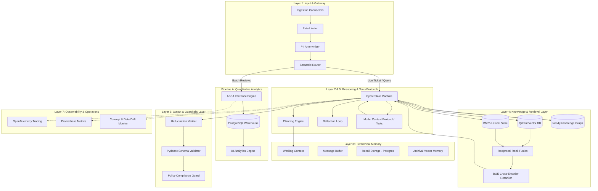

# SENTICRAG PLATFORM ARCHITECTURE BLUEPRINT

## User-Story-Driven Customer Intelligence, Root-Cause Investigation & Actionable Customer Care

> **Comprehensive Technical Architecture & System Specification**  
> Core Paradigm: **User Story → Capability → Data & Knowledge → AI Pipeline → Actionable Decision → Collaborative Feedback → Business Metrics**

---

## 0. Executive Purpose & Scope

The SenticRAG architecture unifies production AI engineering principles with product-driven capabilities. Rather than building a generic AI demo or a passive sentiment dashboard, SenticRAG solves the fundamental enterprise question:

> **"Whom does the system serve, what decisions does it govern, and what grounded knowledge powers those decisions?"**

SenticRAG is built around four primary stakeholders:
1. **Buyer / Customer**: Needs fast, accurate, and policy-compliant resolution to defects without repeating information.
2. **Support Agent**: Requires pre-triaged tickets, linked root-cause evidence, applicable warranty clauses, and a controllable resolution draft.
3. **Product / CX Analyst**: Needs a 100% macro corpus view to detect emerging trends, drill down into representative qualitative feedback, and register validated root causes into the Knowledge Graph.
4. **Product Manager / CPO**: Monitors defect trajectories across hardware/software versions in real time and tracks customer care resolution efficacy.

The ultimate objective of SenticRAG is an enterprise closed loop:

$$\text{Observe} \longrightarrow \text{Understand} \longrightarrow \text{Explain} \longrightarrow \text{Resolve} \longrightarrow \text{Learn}$$

- **Observe**: ABSA scans 100% of the corpus to provide quantitative macro analytics.
- **Understand**: Advanced Hybrid Retrieval isolates representative cohorts for qualitative investigation.
- **Explain**: GraphRAG traverses relationships linking defects, versions, symptoms, root causes, policies, and evidence.
- **Resolve**: The Resolution Engine synthesizes policy-grounded drafts and action controls for support workflows.
- **Learn**: Analyst and Agent feedback is funneled back into the Knowledge Graph, evaluation datasets, and active-learning pipelines.

---

## 1. Product Thesis & Core Problem

### 1.1. Three Value Layers of SenticRAG

| Layer | User Question | Primary Mechanism | Data Scope | Core Output |
| :--- | :--- | :--- | :--- | :--- |
| **Quantitative** | *"What is increasing or decreasing?"* | Aspect-Based Sentiment Analysis (ABSA) | 100% Corpus | KPIs, sentiment distribution, anomaly alerts |
| **Qualitative** | *"Why is this happening?"* | Metadata Filtering + Hybrid Retrieval | Top-K Representative Cases | Evidence pack, symptom summaries, defect patterns |
| **Actionable** | *"How should this be resolved?"* | GraphRAG + Policy Registry + LLM Guardrails | Evidence + Policy + Customer Context | Policy-grounded resolution drafts, action controls, routing |

#### Module Responsibility Invariants
- **ABSA is not retrieval:** ABSA runs across the entire corpus to extract structured aspect/polarity metadata. It does not answer conversational questions.
- **Retrieval does not replace statistical aggregations:** Retrieval acts as a qualitative magnifying glass fetching representative evidence for an identified statistical anomaly.
- **GraphRAG is not merely conversational QA:** GraphRAG manages operational enterprise knowledge:
  $$\text{Issue} \rightarrow \text{Product / Version} \rightarrow \text{Symptom} \rightarrow \text{Root Cause} \rightarrow \text{Policy} \rightarrow \text{Resolution} \rightarrow \text{Service Center}$$
- **LLM never invents business policies:** LLMs only summarize and draft based strictly on retrieved policy clauses and evidence. High-risk financial or legal commitments trigger human approval gates.

---

## 2. Personas & Jobs-To-Be-Done (JTBD)

### 2.1. Buyer
- **JTBD:** "When my purchased device malfunctions, I want accurate guidance conforming to official policy without repeating details across multiple channels."
- **Pain Points:** Long wait times, generic ungrounded bot replies, lack of return/warranty clarity.
- **Desired Outcomes:** Sub-minute First Response Time (FRT), verifiable policy answers, immediate actionable next steps.

### 2.2. Support Agent
- **JTBD:** "When I open a ticket, I want the system to have pre-classified aspects, verified warranty eligibility, and drafted a grounded reply with citations so I can resolve tickets rapidly with full control."
- **Pain Points:** Time wasted categorizing tickets, manual searching of warranty PDFs, fear of hallucinated AI promises.
- **Desired Outcomes:** Structured ticket context, side-by-side policy citations, 1-click approval or escalation.

### 2.3. Product / CX Analyst
- **JTBD:** "When an aspect KPI spikes, I want to drill down from the macro trend into specific reviews, validate the engineering root cause, and update the knowledge base so the rest of the company benefits."
- **Pain Points:** Disconnect between BI charts and raw reviews, lack of version-specific defect tracking, no formal mechanism to feed insights back into support operations.
- **Desired Outcomes:** Real-time anomaly alerts, representative Top-K cohorts, interactive Graph traversal, 1-click root-cause registration.

### 2.4. Product Manager / CPO
- **JTBD:** "I want real-time visibility into defect severity across software and hardware releases to make confident recall, hotfix, and resource allocation decisions."
- **Desired Outcomes:** Real-time defect trends by version, mean resolution time (MTTR), customer satisfaction (CSAT) impact.

---

## 3. Core User Stories

```text
+-------------------+-----------------------------------------------------------------------------------+
| Story ID          | Summary & Primary Acceptance Focus                                                |
+-------------------+-----------------------------------------------------------------------------------+
| US-BUY-01         | Buyer defect report → Automated policy-compliant resolution (< 60s, zero PII leak)|
| US-AGENT-01       | Pre-triaged ticket card + citation-backed draft + 1-click active learning feedback|
| US-ANALYST-01     | Macro trend detection → Top-K cohort drilldown → Root-cause graph registration    |
| US-PM-01          | Real-time defect tracking by SKU/firmware → MTTR/CSAT executive impact metrics   |
| US-STEWARD-01     | Knowledge Steward validation & publishing of pending graph ontology mutations     |
+-------------------+-----------------------------------------------------------------------------------+
```

---

## 4. Traceability Matrix

$$\text{User Story} \longrightarrow \text{Required Capability} \longrightarrow \text{Software Module} \longrightarrow \text{Target KPI}$$

| User Story | Required Capability | Module | Target KPI |
| :--- | :--- | :--- | :--- |
| `US-BUY-01` | PII masking, Policy retrieval, Guarded generation | `packages/customer_context`, `packages/policy`, `packages/llm` | FRT < 60s, 0% unsupported refund promises |
| `US-AGENT-01` | Aspect classification, Grounded drafting, Citation mapping | `packages/absa`, `packages/retrieval`, `packages/resolution` | AHT reduction $\ge 40\%$, Draft acceptance rate $\ge 80\%$ |
| `US-ANALYST-01` | 100% corpus aggregation, Hybrid search, Graph traversal | `packages/analytics`, `packages/retrieval`, `packages/graph` | Time to root cause < 2 hours, Drift detection latency < 24h |
| `US-PM-01` | Defect trend reporting, Resolution efficacy monitoring | `apps/analyst_dashboard`, `packages/analytics` | MTTR, FCR, Anomaly alert precision $\ge 90\%$ |
| `US-STEWARD-01`| Graph mutation approval, Taxonomy versioning | `packages/feedback`, `packages/graph` | Knowledge freshness < 24h, Zero cyclic graph errors |

---

## 5. End-to-End Architecture & 7-Layer Alignment

### 5.1. Logical Architecture



---

### 5.2. Two Decoupled Execution Pipelines

1. **Pipeline A — Corpus Analytics / ABSA (Throughput-Oriented)**
   - *Flow:* Ingest $\rightarrow$ PII Mask $\rightarrow$ ABSA Inference across 100% corpus $\rightarrow$ PostgreSQL $\rightarrow$ BI Aggregation.
   - *Characteristics:* Asynchronous batch/streaming, independent of $top\_k$, deterministic and versioned.
2. **Pipeline B — Investigation & Resolution (Latency-Oriented)**
   - *Flow:* Query/Ticket $\rightarrow$ Metadata Filter $\rightarrow$ Dense/Sparse Hybrid Retrieval $\rightarrow$ RRF Fusion $\rightarrow$ BGE Reranker $\rightarrow$ Graph Traversal $\rightarrow$ Policy Evaluation $\rightarrow$ Grounded LLM Generation $\rightarrow$ Guardrails.
   - *Characteristics:* Real-time ($< 2s$ execution budget), citation-aware, schema-enforced.

---

### 5.3. 7-Layer AI Agent Alignment

| Layer | Architecture Layer | Core Components | Operational Role in SenticRAG |
| :--- | :--- | :--- | :--- |
| **Layer 1** | **Input & Gateway** | Multimodal Parsers, Semantic Router, PII Anonymizer, Rate Limiter | Ingests multi-channel reviews/tickets; redacts PII; enforces Redis sliding window rate limits; routes traffic to Pipeline A or B. |
| **Layer 2** | **Core Reasoning** | Foundation Models, Planning Engine, Cyclic State Machine, Reflection Loop | Decomposes complex queries; coordinates ticket resolution steps via FSM; executes reflection loops before output emission. |
| **Layer 3** | **Hierarchical Memory** | Working Context, Message Buffer, Recall Storage, Archival Vector Memory | Preserves prompt working state, maintains N-turn conversation context, retrieves customer ticket history from relational stores. |
| **Layer 4** | **Knowledge & Retrieval** | Hybrid Search (Dense + BM25), BGE Cross-Encoder Reranker, Neo4j GraphRAG | Executes multi-modal retrieval; fuses scores via RRF; scores deep context with Cross-Encoders; traverses defect ontology. |
| **Layer 5** | **Tools & Protocols** | Function Calling, Model Context Protocol (MCP), Task Sandboxes | Standardized tool interaction connecting the agent to CRM APIs, warranty eligibility checks, and escalation handlers. |
| **Layer 6** | **Output & Guardrails** | Hallucination Verifier, Pydantic Schema Validator, Output Filter, Policy Guard | Validates claims against evidence citations; enforces rigid JSON schema; prevents unauthorized refund promises. |
| **Layer 7** | **Observability & Ops** | OpenTelemetry, Prometheus, Token/Cost Accounting, Drift Monitoring | Captures distributed traces; attributes token cost per ticket; tracks concept drift across aspect predictions. |

---

### 5.4. Hierarchical Memory Architecture & Technical Roles

```text
+------------------------------------------------------------------------------------+
| 1. Working Context (Core Memory): System Prompt + Policy Playbook + Current Ticket  |
+------------------------------------------------------------------------------------+
                                          |
                                          v
+------------------------------------------------------------------------------------+
| 2. Message Buffer: Multi-turn Dialogue History (Sliding Window Buffer)             |
+------------------------------------------------------------------------------------+
                                          |
                                          v
+------------------------------------------------------------------------------------+
| 3. Recall Storage: Episodic Memory (Customer Ticket & Order History via Postgres)  |
+------------------------------------------------------------------------------------+
                                          |
                                          v
+------------------------------------------------------------------------------------+
| 4. Archival Vector Memory: Semantic Memory (Hybrid Qdrant Vector + Neo4j GraphRAG) |
+------------------------------------------------------------------------------------+
```

#### Memory Role Classification

| Memory Type | Technical Role | Storage Medium | SenticRAG Implementation |
| :--- | :--- | :--- | :--- |
| **Working Memory** | Immediate compute context for current step | In-context prompt, Redis cache | Current ticket payload, decoded customer attributes, active tool outputs. |
| **Episodic Memory** | Record of past interactions and outcomes | PostgreSQL, external session store | Customer purchase history, past support tickets, prior resolution transcripts. |
| **Semantic Memory** | Factual knowledge and relational ontology | Qdrant Vector Store + Neo4j Graph | Indexed review corpus, technical service manuals, defect-root cause graph. |
| **Procedural Memory**| Rules, playbooks, and decision trees | Versioned config, system prompts | Warranty decision trees, return playbooks, agent approval rubrics. |

---

## 6. Technical Module Specifications

### 6.1. Ingestion, Gateway & Semantic Routing (Layer 1)
- **Rate Limiting:** Sliding Window Counter in Redis preventing abuse and bounding cloud LLM costs.
- **Semantic Router:** Lightweight embedding classifier routing incoming text:
  - *Macro Reviews* $\rightarrow$ Pipeline A (Batch ABSA).
  - *Complaints / Tickets* $\rightarrow$ Pipeline B (Real-time Resolution Engine).
  - *Out-of-Scope / Chitchat* $\rightarrow$ Immediate deflection response.
- **PII Anonymization:** Regex and NER-based redaction compliant with data privacy regulations. Separates pseudonymized analytical keys from authorized customer resolution profiles.

### 6.2. ABSA Service — Quantitative Layer
- Decomposes tasks into:
  1. Aspect Term Extraction (ATE)
  2. Aspect Polarity Classification (APC) across `positive`, `neutral`, `negative`.
  3. Aspect Category Detection (`quality`, `battery`, `pricing`, `delivery`, `service`).

### 6.3. Hybrid Retrieval & Reranking Stack (Layer 4)
- **Dense Vector Search:** Qdrant with dense sentence embeddings for semantic similarity.
- **Sparse Lexical Search:** BM25Okapi index for exact SKU, firmware version, and rare error code matching.
- **Rank Fusion:** Reciprocal Rank Fusion (RRF):
  $$RRF\_Score(d) = \sum_{m \in \{dense, sparse\}} \frac{1}{k + rank_m(d)}$$
- **Reranker:** BGE Cross-Encoder reranking Top-50 candidates down to Top-5 representative evidence snippets.

### 6.4. Operational Knowledge Graph & GraphRAG (Neo4j)
- Formal ontology linking `Product`, `Version`, `Symptom`, `RootCause`, `Policy`, `Resolution`, and `ServiceCenter`.
- Traversal queries correlate reported symptoms directly with confirmed engineering root causes and authorized warranty clauses.

### 6.5. LLM Orchestration, MCP Protocols & Guardrails (Layer 2, 5, 6)
- **Planning Engine & Cyclic State Machine (FSM):** Controls lifecycle: `Ingested → Triaged → Context_Retrieved → Evidence_Fused → Resolution_Drafted → Guardrail_Verified → Approved`.
- **Model Context Protocol (MCP):** Standardized tool invocation:
  - `query_customer_order(order_id)`
  - `check_warranty_eligibility(serial_no, defect_code)`
  - `route_ticket_to_specialist(ticket_id, department)`
- **Hallucination Verifier:** Compares generated draft claims sentence-by-sentence against evidence citations.
- **Pydantic Schema Validator:** Guarantees strict output schema conformity.

---

## 7. Security, IAM Roles & Infrastructure Boundaries

### 7.1. GitHub Actions OIDC IAM Roles (Least Privilege)
- `github-project-a-builder`: Assumes temporary credentials via GitHub OIDC (`id-token: write`). Granted ECR push privileges only; zero access to EKS or Secrets Manager.
- `github-project-a-deployer`: Granted staging Helm upgrade permissions.
- `github-project-a-prod-deployer`: Gated strictly by GitHub `production` environment with mandatory human reviewers and branch protection.

### 7.2. EKS Pod Identity / IRSA Roles (One Role per Application)
- **Worker-Node Role Isolation:** Pods are strictly blocked from inheriting EC2 worker node IAM roles.
- `senticrag-api-role` (`apps/api`): Access to Secrets Manager via CSI Driver, S3 read-only for documentation, internal NetworkPolicy access to Postgres, Redis, Qdrant, Neo4j.
- `senticrag-training-worker-role` (`apps/worker`): Granted S3 read/write on dataset buckets, dedicated GPU node taints/tolerations.

### 7.3. Container Security Profile (Non-Root Execution)
- `Dockerfile.train`: Executes under non-privileged `USER trainer` (UID 10001).
- `Dockerfile.api`: Executes under non-privileged `USER app` (UID 10001).
- Enforced Kubernetes security context: `runAsNonRoot: true`, `readOnlyRootFilesystem: true`, `capabilities.drop: ["ALL"]`.

---

## 8. Product API Specification

### 8.1. `POST /api/v1/ingest/feedback`
- **Purpose:** Ingests reviews or support tickets, redacts PII, and queues for processing.
- **Request:** Array of `FeedbackRecord`.
- **Response:** `202 Accepted` with `batch_id`.

### 8.2. `POST /api/v1/investigation/drilldown`
- **Purpose:** Enables analysts to investigate an aspect anomaly cohort.
- **Request:** `product_id`, `aspect`, `sentiment`, `time_window_days`, `top_k`.
- **Response:** `cohort_summary`, `representative_evidence` (with relevance scores), `grounded_root_cause_hypotheses`.

### 8.3. `POST /api/v1/resolution/draft`
- **Purpose:** Synthesizes an evidence-backed resolution draft for customer care.
- **Request:** `ticket_id`, `customer_ref`, `product_id`, `issue_text`.
- **Response:** `case_summary`, `recommended_response`, `recommended_actions`, `citations`, `confidence`, `needs_human_review`.

### 8.4. `POST /api/v1/feedback/contribute`
- **Purpose:** Closed-loop knowledge contribution from support agents and analysts.
- **Request:** `feedback_type`, `target_id`, `contributed_by`, `annotation_payload`.
- **Response:** `contribution_id`, `status: accepted`.

---

## 9. Evaluation Framework & Production Gates

### 9.1. AI Metric Thresholds
- **ABSA Performance:** Macro-F1 $\ge 0.85$ on aspect term extraction and polarity.
- **Retrieval Performance:** Recall@5 $\ge 0.88$, MRR $\ge 0.82$.
- **Groundedness & Faithfulness:** Citation completeness $\ge 95\%$, Unsupported action rate $\le 1\%$.

### 9.2. Business Impact KPIs
- First Response Time (FRT) $< 60\text{s}$.
- Average Handling Time (AHT) reduction $\ge 40\%$.
- First Contact Resolution (FCR) improvement $\ge 15\%$.

---

## 10. Implementation Roadmap

- **Phase 1: Quantitative Core (Weeks 1-3):** Dataset pipelines, PhoBERT ABSA baseline, PostgreSQL BI schema.
- **Phase 2: Qualitative Investigation (Weeks 4-6):** Qdrant vector indexing, BM25 sparse integration, RRF fusion, BGE reranker.
- **Phase 3: Knowledge & Resolution (Weeks 7-9):** Neo4j ontology setup, GraphRAG traversal, Policy Registry, Guardrail synthesis.
- **Phase 4: Collaborative Feedback Loop (Weeks 10-12):** Human annotation ingestion, Active Learning pipeline, Production EKS deployment.
