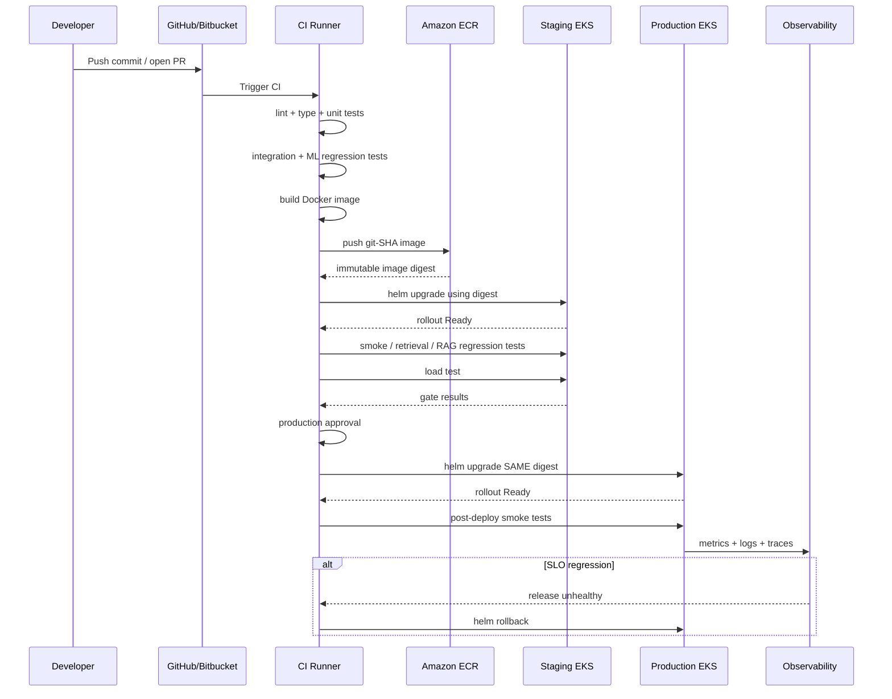
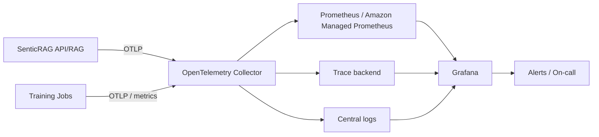
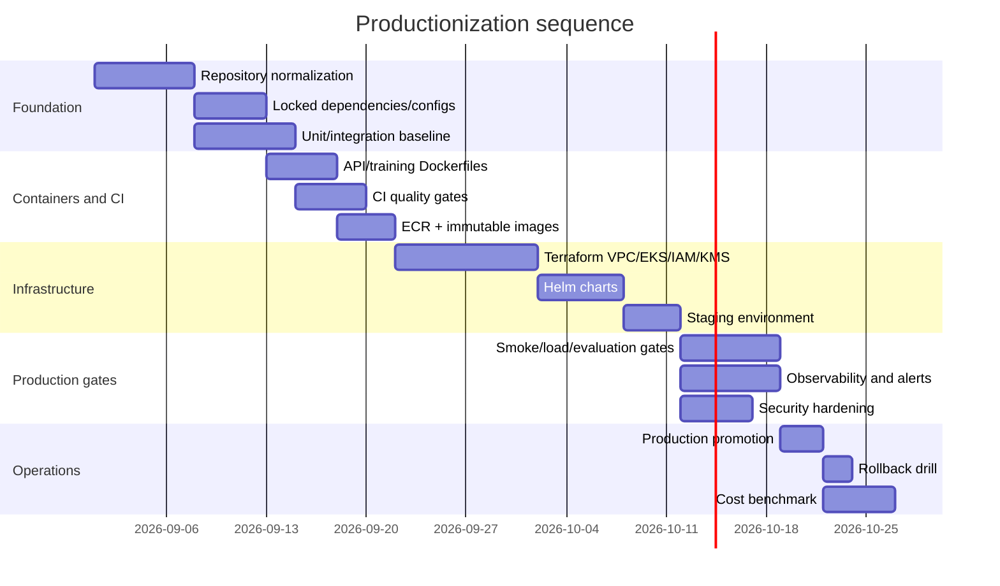

# Production AI Engineering Blueprint: From Code to Production for SenticRAG (Customer Sentiment & Feedback Intelligence Engine)

## Executive summary

This blueprint defines **SenticRAG — Customer Sentiment & Feedback Intelligence Engine** as an end-to-end NLP/RAG system built on a production-grade architecture. The system converges on a mature monorepo shape built around `apps/`, `packages/`, `pipelines/`, `infra/`, `tests/`, `docs/`, and `configs/`; typed FastAPI services; Postgres/Redis/Qdrant; Docker; testing; retrieval and sentiment evaluation; observability; and automated CI/CD. fileciteturn0file0 fileciteturn0file1

The critical qualification is that earlier design reports explicitly noted **the actual repository was not audited line-by-line during initial drafting**. Therefore, this blueprint establishes the production-grade target state: whenever an actual path or implementation was not previously established, it is treated as a **required target-state implementation**. fileciteturn0file0 fileciteturn0file1

This document provides the complete platform and operational layer:

**source control → CI → immutable container artifact → Amazon ECR → staging EKS → Helm deployment → validation gates → production EKS → SLO monitoring → rollback**, with an independent path for **containerized CPU/GPU training → S3-versioned artifacts → offline quality/performance evaluation → explicit model promotion**.

This is intentionally focused on production operations: Kubernetes, infrastructure as code, IAM, image lifecycle, autoscaling, observability, incident response, and cost controls are first-class engineering concerns rather than résumé bonuses. fileciteturn0file1

The most important architectural principle is **independent release and scaling boundaries**. Decomposed components can be deployed and scaled independently: sentiment inference, RAG retrieval, LLM calls, and background automation produce distinct latency, scaling, and security characteristics. Following modern RAG architecture principles, SenticRAG separates Data Augmentation, Inference, Workflow, and Post-Processing stages so each can scale according to its own workload profile. fileciteturn0file2

The target state is:

| Area              | SenticRAG (Target State)                                                               | Production target                                        |
| ----------------- | -------------------------------------------------------------------------------------- | -------------------------------------------------------- |
| Online service    | Sentiment API, RAG service, worker/automation                                          | Independently versioned Helm releases                    |
| Offline pipelines | review ingest, validate, label, sentiment train, embeddings, Qdrant indexing, RAG eval | Containerized jobs with reproducible manifests           |
| Artifacts         | sentiment model, embedding/index metadata, RAG eval reports                            | Versioned S3 artifacts, immutable release manifests      |
| Runtime compute   | CPU for conventional inference; optional GPU for Transformers/self-hosted LLM          | Separate CPU/GPU node pools                              |
| Registry          | Amazon ECR                                                                             | ECR repository per deployable image                      |
| Orchestration     | Amazon EKS + Helm                                                                      | Amazon EKS + Helm                                        |
| CI/CD             | GitHub Actions / Jenkins                                                               | Complete gated staging→production pipeline              |
| Infra as code     | Terraform                                                                              | Terraform for networking, EKS, ECR, IAM, KMS and add-ons |
| Observability     | Logs, latency, token/cost accounting, eval metrics                                     | OpenTelemetry + Prometheus + Grafana + central logs      |
| Secrets           | Environment/secrets hygiene                                                            | AWS Secrets Manager + KMS + EKS Pod Identity             |
| Scaling           | HPA + node autoscaling                                                                 | HPA + node autoscaling/Karpenter                         |
| Rollback          | Automated Helm rollback + model version pointer rollback                               | Helm/image/model rollback playbook                       |

The production release invariant should be:

> **Build once, test once, promote the exact same image digest through staging and production. Never rebuild “the same release” between environments.**

Amazon ECR supports repository-level image scanning and KMS encryption, and Terraform's current AWS provider supports ECR image scanning configuration and KMS-backed encryption directly. ECR can also enforce tag immutability; the recommended design is therefore to identify releases by Git SHA and persist the ECR digest in the release record rather than depending on a mutable `latest` tag. citeturn0search12turn10search3turn0search9

GitHub Actions should authenticate to AWS through OIDC and short-lived role credentials rather than stored AWS access keys. GitHub's deployment environments provide protection rules and reviewer gates, while AWS's official GitHub actions support OIDC role assumption and ECR login. citeturn1search7turn1search0turn16search0turn16search1

For workloads inside EKS, use **one IAM role per application/service account** through EKS Pod Identity or IRSA, with least-privilege policies. AWS currently recommends application-specific IAM roles and documents Pod Identity for mapping Kubernetes service accounts to IAM roles; Secrets Manager can then be accessed through the AWS Secrets and Configuration Provider without embedding credentials in container images or Kubernetes YAML. citeturn0search15turn2search9turn11search5

The complete target flow is:

```mermaid
flowchart LR
    DEV[Developer] --> SCM[GitHub / Bitbucket]
    SCM --> CI[CI: lint + type + unit + integration]
    CI --> SEC[Dependency / image security gates]
    SEC --> BUILD[Docker Build]
    BUILD --> TAG[Git SHA / release tag]
    TAG --> ECR[Amazon ECR]

    ECR --> STG[Staging EKS]
    STG --> HELM1[Helm Upgrade]
    HELM1 --> SMOKE[Smoke + API tests]
    SMOKE --> EVAL[ML / RAG regression]
    EVAL --> LOAD[Load / latency tests]

    LOAD --> APPROVE{Promotion gate}
    APPROVE -->|pass| PROD[Production EKS]
    PROD --> HELM2[Same ECR image digest]
    HELM2 --> VERIFY[Post-deploy verification]
    VERIFY --> OBS[Prometheus / Grafana / OTel]

    VERIFY -->|SLO violation| RB[Helm rollback]
    RB --> PREV[Previous known-good image/model]

    TRAIN[Containerized training job]
    TRAIN --> ART[S3 artifacts + manifest]
    ART --> OFF[Offline quality/performance evaluation]
    OFF --> PROMOTE[Model promotion]
    PROMOTE --> ECR
```



The rendered reference architecture below captures the same design, including separate training, artifact, identity, observability, autoscaling, and IaC planes.


[Download the architecture image](sandbox:/mnt/data/production_ai_architecture.png)

## Target architecture and repository mapping

SenticRAG is **pipeline-first**, flowing from customer review ingestion through validation, labeling, aspect-based sentiment training, embeddings/indexing, RAG, agent workflows, and serving. fileciteturn0file0 fileciteturn0file1

For a production implementation, each service within SenticRAG (`apps/api`, `apps/rag_service`, `apps/worker`) must have its own release boundary, container image digest, IAM role, Helm release configuration, SLOs, autoscaling parameters, and rollback boundary.

A practical target layout is:

```text
project-a/
├── apps/
│   ├── api/
│   │   └── app/
│   │       ├── main.py
│   │       ├── routers/
│   │       ├── services/
│   │       ├── schemas/
│   │       ├── dependencies/
│   │       └── middleware/
│   ├── rag_service/                # required if independently deployed
│   └── worker/
│       ├── jobs/
│       └── consumers/
├── packages/
│   ├── common/
│   │   ├── logging/
│   │   ├── settings/
│   │   └── exceptions/
│   ├── data_contracts/
│   ├── ml_core/
│   │   ├── metrics/
│   │   ├── evaluation/
│   │   └── artifacts/
│   ├── retrieval/
│   │   ├── embeddings/
│   │   ├── vectorstores/
│   │   ├── rerankers/
│   │   └── citations/
│   └── llm/
│       ├── clients/
│       ├── prompts/
│       ├── structured_outputs/
│       └── guardrails/
├── pipelines/
│   ├── ingest_reviews/
│   ├── validate_reviews/
│   ├── label_reviews/
│   ├── train_sentiment/
│   ├── build_embeddings/
│   ├── index_qdrant/
│   └── eval_rag/
├── configs/
│   ├── training/
│   ├── evaluation/
│   └── environments/
├── artifacts/
│   └── README.md                   # convention only; binaries live in S3
├── infra/
│   ├── docker/
│   │   ├── Dockerfile.api
│   │   └── Dockerfile.train
│   ├── helm/
│   │   └── project-a/
│   ├── terraform/
│   │   ├── environments/
│   │   └── modules/
│   └── observability/
│       ├── prometheus/
│       ├── grafana/
│       └── otel/
├── tests/
│   ├── unit/
│   ├── integration/
│   ├── e2e/
│   ├── smoke/
│   └── load/
├── docs/
│   ├── architecture/
│   ├── adr/
│   ├── model_cards/
│   ├── data_cards/
│   ├── reports/
│   └── runbooks/
├── .github/workflows/
│   ├── ci.yml
│   ├── release.yml
│   ├── train.yml
│   └── security.yml
├── pyproject.toml
├── Makefile
└── README.md
```

The first report already recommends nearly all of the application, package, pipeline, test, and documentation layers above. `infra/helm/` and `infra/terraform/` are deliberate additions required by the new production scope rather than claims about files already present. fileciteturn0file0

The complete mapping requested in the prompt is below. **“Actual status: unspecified” is intentional wherever no repository evidence was provided.**

| Production capability                           | SenticRAG Target Mapping                                                                                    | Actual status from supplied material                                           | Required repository change                                                          |
| ----------------------------------------------- | ----------------------------------------------------------------------------------------------------------- | ------------------------------------------------------------------------------ | ----------------------------------------------------------------------------------- |
| CI/CD                                           | `.github/workflows/{ci,release,security}.yml`; `infra/helm/project-a/`                                  | Basic CI/CD was planned; exact files/configs unspecified                       | Add gated build→ECR→staging→prod release workflow                                |
| Containerized training                          | `infra/docker/Dockerfile.train`; `pipelines/train_sentiment/`; optional embedding/fine-tune jobs        | Training exists conceptually; containerized GPU job implementation unspecified | Standard training image, manifest, GPU/CPU resource profile                         |
| Cost/performance                                | `packages/ml_core/evaluation/`, `pipelines/eval_rag/`, `tests/load/`, `docs/reports/performance.md` | Latency/cost/load-eval recommended; benchmark data unspecified                 | Add benchmark harness and versioned result schema                                   |
| Kubernetes/IaC                                  | `infra/helm/project-a/`, `infra/terraform/`                                                             | Kubernetes/Terraform implementation unspecified                                | Add Deployment, Service, Ingress, HPA, EKS/ECR/VPC/IAM code                         |
| Observability                                   | `packages/common/logging/`, API middleware, `infra/observability/`                                      | Observability identified as gap; implementation unspecified                    | OTel instrumentation, Prometheus metrics, Grafana dashboards, alerts                |
| Security/secrets                                | Helm ServiceAccount/securityContext; Terraform IAM/KMS; app settings                                        | JWT/env/secrets hygiene planned; AWS secret flow unspecified                   | Pod Identity, Secrets Manager, KMS, ECR scanning, PSS                               |
| Testing/validation                              | `tests/unit`, `integration`, `e2e`, `smoke`, `load`; `eval_rag`                                 | Test strategy largely present in reports; exact coverage unspecified           | Make tests CI gates and define regression thresholds                                |
| Deployment/rollback/incident/cost playbooks     | `docs/runbooks/`                                                                                          | Runbook directory proposed; content unspecified                                | Add operational procedures and ownership                                            |
| Concrete production artifacts                   | Dockerfiles, Actions/Jenkinsfile, Helm, Terraform, commands                                                 | Unspecified                                                                    | Add examples in this report as starting implementation                              |
| Project-specific ownership and release metadata | model/data cards, ADRs, release manifest                                                                    | Documentation recommended                                                      | Record image digest, model version, dataset version, config and metrics per release |

For SenticRAG, core application capabilities include `/predict` (aspect and sentiment classification), `/stats` (feedback trend analytics), `/ask` (grounded RAG query answering with citations), embeddings generation, Qdrant retrieval, citations verification, Redis caching, and background worker automation. fileciteturn0file1

The RAG subsystem should be treated as at least four logical stages even if some share a runtime: ingestion/index augmentation, retrieval/inference, workflow/tool orchestration, and answer post-validation. That mapping follows the supplied RAG reference guide and is especially valuable because it allows retrieval/index jobs to scale independently from online generation. fileciteturn0file2

## Delivery pipeline and deployment

A production CI/CD pipeline for these projects needs to answer five questions unambiguously:

**What source commit produced this workload? What exact image is running? What tests did it pass? What model/data version does it use? How do we revert it?**

The pipeline below provides those answers.



**Branch and artifact policy.** Pull requests run lint, type checking, unit tests, integration tests and offline lightweight evaluation. Merges to `main` may build a release candidate. A semantic version or explicit release approval triggers production promotion. Container images should be tagged at minimum with the full Git SHA and optionally a release version such as `v1.4.2`; the durable deployment reference should be the ECR digest. ECR supports image tag immutability, and the Terraform AWS provider exposes `image_tag_mutability` plus scan-on-push and KMS encryption configuration. citeturn10search3turn0search9

A minimal release metadata file should be generated for every deployment:

```json
{
  "project": "project-a",
  "release": "v1.4.2",
  "git_sha": "FULL_GIT_SHA",
  "image": "ACCOUNT.dkr.ecr.REGION.amazonaws.com/project-a-api",
  "image_digest": "sha256:...",
  "model_version": "sentiment/model-run-...",
  "dataset_version": "s3-version-id-or-manifest-hash",
  "config_sha256": "...",
  "created_at": "RFC3339_TIMESTAMP",
  "ci_run": "CI_RUN_IDENTIFIER"
}
```

**GitHub authentication.** GitHub Actions should request `id-token: write`, assume a narrowly scoped IAM role via GitHub OIDC, and use temporary credentials. The AWS-maintained `configure-aws-credentials` action recommends OIDC and the AWS ECR action supports building and pushing images after role assumption. GitHub environments can protect staging/production with branch restrictions and required reviewers. citeturn16search0turn16search1turn1search0turn1search7

A representative workflow is:

```yaml
name: release

on:
  push:
    branches: [main]
  workflow_dispatch:

permissions:
  contents: read
  id-token: write

env:
  AWS_REGION: ap-southeast-1
  ECR_REPOSITORY: project-a-api
  EKS_CLUSTER: ai-production
  HELM_RELEASE: project-a
  HELM_CHART: infra/helm/project-a

jobs:
  test:
    runs-on: ubuntu-latest
    steps:
      - uses: actions/checkout@v4

      - uses: actions/setup-python@v5
        with:
          python-version: "3.12"
          cache: pip

      - name: Install locked dependencies
        run: pip install -r requirements.lock

      - name: Static checks
        run: |
          ruff check .
          mypy packages apps pipelines

      - name: Unit tests
        run: pytest tests/unit -q

      - name: Integration tests
        run: pytest tests/integration -q

      - name: Offline regression tests
        run: |
          python -m pipelines.eval_rag \
            --config configs/evaluation/ci.yaml

  build:
    needs: test
    runs-on: ubuntu-latest
    outputs:
      image: ${{ steps.meta.outputs.image }}
    steps:
      - uses: actions/checkout@v4

      # Production hardening: pin third-party Actions by commit SHA.
      - name: Configure AWS credentials
        uses: aws-actions/configure-aws-credentials@v6
        with:
          role-to-assume: arn:aws:iam::123456789012:role/github-project-a-builder
          aws-region: ${{ env.AWS_REGION }}

      - name: Login to ECR
        id: ecr
        uses: aws-actions/amazon-ecr-login@v2

      - name: Build and push
        id: meta
        env:
          REGISTRY: ${{ steps.ecr.outputs.registry }}
          IMAGE_TAG: ${{ github.sha }}
        run: |
          set -euo pipefail

          IMAGE="${REGISTRY}/${ECR_REPOSITORY}:${IMAGE_TAG}"

          docker build \
            --file infra/docker/Dockerfile.api \
            --tag "${IMAGE}" \
            .

          docker push "${IMAGE}"

          echo "image=${IMAGE}" >> "$GITHUB_OUTPUT"

  staging:
    needs: build
    runs-on: ubuntu-latest
    environment: staging
    steps:
      - uses: actions/checkout@v4

      - name: Configure AWS credentials
        uses: aws-actions/configure-aws-credentials@v6
        with:
          role-to-assume: arn:aws:iam::123456789012:role/github-project-a-deployer
          aws-region: ${{ env.AWS_REGION }}

      - name: Configure kubectl
        run: |
          aws eks update-kubeconfig \
            --name "${EKS_CLUSTER}" \
            --region "${AWS_REGION}"

      - name: Deploy staging
        run: |
          helm upgrade --install "${HELM_RELEASE}-staging" "${HELM_CHART}" \
            --namespace project-a-staging \
            --create-namespace \
            -f "${HELM_CHART}/values-staging.yaml" \
            --set-string image.repository="${{ needs.build.outputs.image }}" \
            --set-string image.tag="" \
            --wait \
            --rollback-on-failure \
            --timeout 10m

      - name: Smoke tests
        run: pytest tests/smoke -q --base-url="$STAGING_BASE_URL"

      - name: Load gate
        run: |
          k6 run \
            -e BASE_URL="$STAGING_BASE_URL" \
            tests/load/api.js

  production:
    needs: [build, staging]
    runs-on: ubuntu-latest
    environment: production
    steps:
      - uses: actions/checkout@v4

      - name: Configure AWS credentials
        uses: aws-actions/configure-aws-credentials@v6
        with:
          role-to-assume: arn:aws:iam::123456789012:role/github-project-a-prod-deployer
          aws-region: ${{ env.AWS_REGION }}

      - name: Configure kubectl
        run: |
          aws eks update-kubeconfig \
            --name "${EKS_CLUSTER}" \
            --region "${AWS_REGION}"

      - name: Deploy exact staging image to production
        run: |
          helm upgrade --install "${HELM_RELEASE}" "${HELM_CHART}" \
            --namespace project-a \
            --create-namespace \
            -f "${HELM_CHART}/values-production.yaml" \
            --set-string image.repository="${{ needs.build.outputs.image }}" \
            --set-string image.tag="" \
            --wait \
            --rollback-on-failure \
            --timeout 10m

      - name: Post-deployment verification
        run: pytest tests/smoke -q --base-url="$PRODUCTION_BASE_URL"
```

The example deliberately separates the **builder IAM role** from the **deployment IAM role**. Production should have a stricter role and a GitHub `production` environment with reviewer protection. GitHub environments support environment-specific restrictions and secrets, and GitHub's deployment model supports concurrency control to avoid overlapping deployment operations. citeturn1search0turn1search4

A stronger implementation records the digest after push and sets Helm's image reference to `repository@sha256:...` rather than the tag. The important guarantee is the same immutable artifact, not the exact YAML convention.

For Bitbucket, the beginning of the pipeline changes but the post-SCM stages do not:

```text
Bitbucket push
    → Jenkins webhook / pipeline trigger
    → checkout exact commit
    → test
    → build
    → ECR
    → Helm staging
    → gates
    → approval
    → Helm production
```

Jenkins' official Docker Pipeline documentation supports Docker-based build stages, and Jenkins stores credentials through credential IDs rather than requiring them in a Jenkinsfile. A Jenkins installation running inside EKS should preferably obtain its AWS role through workload identity rather than static AWS keys; otherwise credentials should be narrowly scoped and handled by Jenkins' credential store. citeturn1search3turn1search8turn1search9

Representative Jenkinsfile:

```groovy
pipeline {
    agent { label 'docker-kubectl' }

    environment {
        AWS_REGION = 'ap-southeast-1'
        ECR_REPO   = 'project-a-api'
        EKS_CLUSTER = 'ai-production'
    }

    stages {
        stage('Checkout') {
            steps {
                checkout scm
            }
        }

        stage('Test') {
            steps {
                sh '''
                    set -eux
                    pip install -r requirements.lock
                    ruff check .
                    mypy packages apps pipelines
                    pytest tests/unit tests/integration -q
                    python -m pipelines.eval_rag \
                      --config configs/evaluation/ci.yaml
                '''
            }
        }

        stage('Build') {
            steps {
                sh '''
                    set -eux
                    ACCOUNT=$(aws sts get-caller-identity \
                      --query Account --output text)

                    REGISTRY="${ACCOUNT}.dkr.ecr.${AWS_REGION}.amazonaws.com"
                    IMAGE="${REGISTRY}/${ECR_REPO}:${GIT_COMMIT}"

                    aws ecr get-login-password \
                      --region "${AWS_REGION}" |
                      docker login \
                        --username AWS \
                        --password-stdin "${REGISTRY}"

                    docker build \
                      -f infra/docker/Dockerfile.api \
                      -t "${IMAGE}" .

                    docker push "${IMAGE}"
                    echo "${IMAGE}" > image.txt
                '''
            }
        }

        stage('Staging') {
            steps {
                sh '''
                    IMAGE=$(cat image.txt)

                    aws eks update-kubeconfig \
                      --name "${EKS_CLUSTER}" \
                      --region "${AWS_REGION}"

                    helm upgrade --install project-a-staging \
                      infra/helm/project-a \
                      -n project-a-staging \
                      --create-namespace \
                      -f infra/helm/project-a/values-staging.yaml \
                      --set-string image.repository="${IMAGE}" \
                      --wait \
                      --rollback-on-failure

                    pytest tests/smoke \
                      --base-url="${STAGING_BASE_URL}"
                '''
            }
        }

        stage('Production approval') {
            steps {
                input message: 'Promote tested image to production?'
            }
        }

        stage('Production') {
            steps {
                sh '''
                    IMAGE=$(cat image.txt)

                    helm upgrade --install project-a \
                      infra/helm/project-a \
                      -n project-a \
                      -f infra/helm/project-a/values-production.yaml \
                      --set-string image.repository="${IMAGE}" \
                      --wait \
                      --rollback-on-failure
                '''
            }
        }
    }
}
```

The AWS-supported manual ECR login sequence uses `aws ecr get-login-password`, `docker login`, tag, and `docker push`. citeturn2search0

**Release promotion gate.** A release should not advance merely because Kubernetes reports Pods as `Ready`. The gate should combine:

| Gate           | SenticRAG Verification                                           |
| -------------- | ---------------------------------------------------------------- |
| Static quality | Ruff / mypy / format                                             |
| Unit           | Preprocessing, sentiment logic, RAG helpers, client wrappers     |
| Integration    | Postgres / Redis / Qdrant, LLM mock or sandbox                   |
| Offline ML     | Sentiment regression (Macro-F1, per-aspect precision-recall)     |
| Retrieval      | Recall@K, MRR, citation/grounding checks                         |
| Smoke          | `/health`, `/predict`, `/stats`, `/ask`                  |
| Performance    | p50/p95 latency, RPS, TTFT                                       |
| Security       | Dependencies + image scan                                        |
| Deployment     | Probes healthy (startup/readiness/liveness) and rollout complete |

Helm templates are driven through `values.yaml`, and `helm upgrade` supports layered values files, waiting for resources, and rollback-on-failure behavior. citeturn9search2turn9search8

Rollback is then deterministic:

```bash
helm history project-a -n project-a

helm rollback project-a PREVIOUS_REVISION \
  -n project-a \
  --wait

kubectl rollout status deployment/project-a \
  -n project-a
```

Application rollback and **model rollback must be separable**. A bad Python/API release may require reverting the container; a bad model may require changing the model manifest to the previous S3 artifact while keeping the application release. Combining both into one opaque artifact makes incidents substantially harder to diagnose.

## Containerized training and cost-performance engineering

Production ML training should be a **reproducible build/run contract**, not “open Jupyter and run cells until the metric looks right.”

PyTorch explicitly warns that complete reproducibility is not guaranteed across releases, platforms, or even CPU versus GPU under all conditions. The operational objective should therefore be reproducibility **within a controlled environment**: pin software, image, dataset, configuration, random seeds, hardware metadata and artifact versions, and record all of them in a run manifest. citeturn13search3

Docker multi-stage builds allow build-time content to be separated from a smaller runtime image, and NVIDIA Container Toolkit configures Docker/containerd to expose NVIDIA GPUs to containers. Current NVIDIA instructions use `nvidia-ctk runtime configure` followed by a runtime restart. citeturn4search6turn3search12

A training image should intentionally force a pinned base image:

```dockerfile
# infra/docker/Dockerfile.train
#
# Supply a fully pinned image tag/digest from CI.
ARG TRAINING_BASE_IMAGE
FROM ${TRAINING_BASE_IMAGE}

ENV PYTHONUNBUFFERED=1 \
    PYTHONDONTWRITEBYTECODE=1 \
    PIP_NO_CACHE_DIR=1

WORKDIR /workspace

COPY requirements.train.lock /tmp/requirements.train.lock

RUN python -m pip install --upgrade pip && \
    python -m pip install \
      --requirement /tmp/requirements.train.lock

COPY packages/ ./packages/
COPY pipelines/ ./pipelines/
COPY configs/ ./configs/
COPY pyproject.toml ./

RUN python -m pip install --no-deps .

RUN useradd --create-home --uid 10001 trainer && \
    mkdir -p /workspace/artifacts /workspace/data && \
    chown -R trainer:trainer /workspace

USER trainer

ENTRYPOINT ["python", "-m"]
```

A corresponding API image should contain **no notebook, raw training data, cloud credentials, or unnecessary compiler toolchain**:

```dockerfile
# infra/docker/Dockerfile.api

FROM python:3.12-slim AS builder

WORKDIR /build
COPY requirements.runtime.lock .
RUN pip wheel \
    --wheel-dir=/wheels \
    -r requirements.runtime.lock

FROM python:3.12-slim

ENV PYTHONUNBUFFERED=1 \
    PYTHONDONTWRITEBYTECODE=1

RUN useradd --create-home --uid 10001 app

WORKDIR /app

COPY --from=builder /wheels /wheels
COPY requirements.runtime.lock .
RUN pip install \
    --no-index \
    --find-links=/wheels \
    -r requirements.runtime.lock && \
    rm -rf /wheels

COPY packages/ ./packages/
COPY apps/ ./apps/
COPY pyproject.toml ./

RUN pip install --no-deps .

USER app

EXPOSE 8000

CMD [
  "uvicorn",
  "apps.api.app.main:app",
  "--host", "0.0.0.0",
  "--port", "8000"
]
```

For a GPU developer workstation, NVIDIA Container Toolkit is configured once on the host:

```bash
sudo nvidia-ctk runtime configure --runtime=docker
sudo systemctl restart docker

docker run --rm --gpus all \
  nvidia/cuda:<PINNED-TAG> \
  nvidia-smi
```

The exact CUDA/PyTorch image tags are intentionally **unspecified** here because they should be selected and pinned according to the version actually validated by each project rather than copied from a report written at a different date.

A local Project A training invocation should look like:

```bash
docker build \
  --build-arg TRAINING_BASE_IMAGE="pytorch/pytorch:<PINNED-TAG>" \
  -f infra/docker/Dockerfile.train \
  -t project-a-train:${GIT_SHA} .

docker run --rm \
  --gpus all \
  --cpus=8 \
  --memory=32g \
  --shm-size=8g \
  --mount type=bind,src="$PWD/data",dst=/workspace/data,readonly \
  --mount type=bind,src="$PWD/artifacts",dst=/workspace/artifacts \
  project-a-train:${GIT_SHA} \
  pipelines.train_sentiment \
  --config configs/training/sentiment.yaml
```

In Kubernetes, CPU requests influence scheduling, CPU limits are enforced through CPU throttling, and memory limit violations may terminate a container through OOM behavior. Kubernetes extended GPU resources are provided by device plugins; GPU resources such as `nvidia.com/gpu` are normally specified in `limits`, with requests either omitted or equal to the limit. citeturn3search3turn4search0

A production training Job:

```yaml
apiVersion: batch/v1
kind: Job
metadata:
  name: project-a-train-sentiment-RUN_ID
  namespace: ml-training
  labels:
    project: project-a
    workload: training
spec:
  backoffLimit: 1
  ttlSecondsAfterFinished: 86400

  template:
    metadata:
      labels:
        project: project-a
        workload: training

    spec:
      restartPolicy: Never
      serviceAccountName: project-a-training

      nodeSelector:
        workload: ml-gpu

      tolerations:
        - key: "nvidia.com/gpu"
          operator: "Exists"
          effect: "NoSchedule"

      securityContext:
        runAsNonRoot: true
        seccompProfile:
          type: RuntimeDefault

      containers:
        - name: trainer
          image: ACCOUNT.dkr.ecr.REGION.amazonaws.com/project-a-train@sha256:DIGEST

          args:
            - pipelines.train_sentiment
            - --config
            - configs/training/sentiment.yaml

          env:
            - name: RUN_ID
              value: "RUN_ID"
            - name: ARTIFACT_URI
              value: "s3://AI_ARTIFACT_BUCKET/project-a/RUN_ID/"

          resources:
            requests:
              cpu: "4"
              memory: "16Gi"
            limits:
              cpu: "8"
              memory: "32Gi"
              nvidia.com/gpu: 1

          volumeMounts:
            - name: scratch
              mountPath: /workspace/scratch

      volumes:
        - name: scratch
          emptyDir:
            sizeLimit: 50Gi
```

Those CPU/RAM numbers are **illustrative starting values, not measurements from SenticRAG**. The actual requests and limits must be derived from benchmark runs.

The durable artifact path should be object storage rather than the Job's filesystem:

```text
s3://ai-artifacts/
└── project-a/
    └── sentiment/
        └── <run_id>/
            ├── model/
            ├── metrics.json
            ├── config.yaml
            ├── data-manifest.json
            ├── environment.json
            └── run-manifest.json
```

S3 Versioning keeps multiple object versions and allows restoration after accidental overwrite or deletion. Versioning also incurs storage for each retained version, so lifecycle rules should expire obsolete noncurrent artifacts according to the model-retention policy. S3 objects are encrypted at rest by default; SSE-KMS can be selected where control of the KMS key and audit model is required. citeturn19search0turn19search4turn19search2turn12search8

A production run manifest should contain at least:

```json
{
  "run_id": "2026-09-01T04-15-00Z-abc1234",
  "project": "project-a",
  "pipeline": "train_sentiment",
  "git_sha": "abc123...",
  "container_digest": "sha256:...",
  "dataset_uri": "s3://...",
  "dataset_version_id": "...",
  "config_hash": "...",
  "seed": 42,
  "python_version": "...",
  "pytorch_version": "...",
  "cuda_version": "...",
  "gpu_model": "...",
  "cpu_model": "...",
  "metrics": {
    "primary_metric": null
  }
}
```

Again, actual values are **unspecified until a real run creates them**.

The Docker training runbook is:

| Stage               | Action                                     | Failure rule                                    |
| ------------------- | ------------------------------------------ | ----------------------------------------------- |
| Resolve source      | Checkout exact Git SHA                     | Stop if working tree is dirty for a release run |
| Resolve data        | Produce immutable dataset manifest/version | Stop if dataset validation fails                |
| Resolve environment | Build pinned training image                | Stop if lockfile/image build fails              |
| Sanity test         | Run small sample/one batch                 | Stop on NaN/OOM/schema errors                   |
| Resource check      | Record GPU, RAM, CPU, disk capacity        | Stop if below profile                           |
| Training            | Execute pipeline from config               | No notebook-only state                          |
| Evaluation          | Compute quality + resource metrics         | Do not promote on regression                    |
| Artifact write      | Upload model/config/manifest/results       | Job not successful until upload verifies        |
| Registration        | Record S3 URI/version/digest               | Never refer only to`latest`                   |
| Promotion           | Explicit approval or quality gate          | Training success ≠ deployment approval         |

The second major production gap is **Cost × Performance × Quality engineering**.

Neither project should select a model purely by accuracy. Each candidate should be evaluated on:

\[
\text
=====

f(
\text{quality},
\text{p95 latency},
\text{throughput},
\text{RAM},
\text{VRAM},
\text{cost/request},
\text{operational complexity}
)
\]

No single scalar weighting is universally correct; weights should reflect the product's actual latency and quality constraints.

The report-supplied model candidates map naturally into the following decision table. The numerical quality and latency values are deliberately marked **TBD** because the repositories and benchmark outputs were not supplied. fileciteturn0file1

| Candidate                       |                               Quality metric | Runtime profile                         | Primary trade-off                                                     | Production decision                                 |
| ------------------------------- | -------------------------------------------: | --------------------------------------- | --------------------------------------------------------------------- | --------------------------------------------------- |
| TF-IDF + Logistic Regression    |                       Macro-F1:**TBD** | CPU, small RAM                          | Lowest complexity/latency; limited semantic capacity                  | Keep as baseline and possible fallback              |
| PhoBERT/viBERT-class classifier |                       Macro-F1:**TBD** | GPU training; CPU/GPU inference         | Better language representation vs higher cost                         | Promote only if quality gain justifies latency/cost |
| RAG + external LLM              | groundedness/retrieval quality:**TBD** | CPU retrieval + paid external inference | Low GPU ops burden, variable token cost/network latency               | Benchmark end-to-end                                |
| RAG + self-hosted LLM           |                        quality:**TBD** | GPU                                     | More infrastructure/control, potentially better high-volume economics | Only after sustained-load benchmark                 |

For self-hosted LLM inference, quantization should be measured, not assumed to be a free optimization. Hugging Face documents 8-bit and 4-bit quantization through bitsandbytes; 8-bit loading can roughly halve model-weight memory use, while 4-bit techniques further reduce the footprint. vLLM supports multiple quantization families and explicitly describes quantization as a precision-versus-memory trade-off. citeturn13search0turn13search10turn14search5

vLLM also exposes production Prometheus metrics and a serving benchmark interface, making it suitable for measuring actual request latency and throughput rather than relying on marketing benchmarks. Its scheduler exposes controls such as maximum batched tokens and sequences; prefix caching can reuse KV-cache blocks for repeated prompt prefixes and avoid redundant prompt computation. citeturn14search12turn15search2turn15search7turn15search0

A benchmark matrix for any serving candidate should be:

```text
concurrency = [1, 4, 16, 32, 64]
batch_size  = [1, 4, 8, 16]   # where applicable
input sizes = representative production distributions
warm-up     = fixed, excluded from measurement
steady test = fixed duration and/or request count

capture:
  quality
  p50 latency
  p95 latency
  p99 latency
  requests/s
  tokens/s when LLM-based
  CPU utilization
  RAM peak/working set
  GPU utilization
  VRAM peak
  cache hit rate
  errors/timeouts
  infrastructure cost
  cost per successful request
```

Compute cost per successful request from **measured sustained throughput**, not theoretical peak throughput:

\[
C_}
===

\frac{C_{\text{node/hour}}}
{3600 \times RPS_{\text{sustained}} \times (1-E)}
\]

where \(E\) is the failed-request fraction.

A more complete SenticRAG cost metric is:

\[
C_}
===

C_{\text{compute}}
+
C_{\text{embedding}}
+
C_{\text{vector-search}}
+
C_{\text{LLM-tokens}}
+
C_{\text{storage/network}}
\]

Caching deserves explicit version-aware keys. The supplied RAG guide notes that checking Redis or another cache before calling an LLM can reduce both response time and LLM-call cost. fileciteturn0file2

Recommended keys are:

```text
SenticRAG sentiment:
  sentiment:{model_version}:{normalized_text_hash}

SenticRAG retrieval:
  retrieval:{index_version}:{filters_hash}:{query_hash}

SenticRAG RAG:
  rag:{llm_model}:{prompt_version}:{index_version}:{query_hash}
```

Model/index versioning in cache keys is critical because otherwise a newly promoted model may silently serve responses computed by an older one.

For AWS compute selection, current EC2 families provide very different GPU envelopes: G5 uses NVIDIA A10G GPUs with 24 GB GPU memory; G6 uses NVIDIA L4 GPUs with 24 GB; G6e provides L40S GPUs with 48 GB; and P5 provides H100-class capacity for substantially larger training workloads. For example, AWS documents `g6e.xlarge` with one 48-GB L40S, four vCPUs and 32 GiB system memory, while `p5.4xlarge` provides an 80-GB H100 with 16 vCPUs and 256 GiB memory. citeturn6search5turn6search0turn6search1turn6search3

| Compute class       | Accelerator                           | Memory characteristic              | Best initial role here                                   | Cost approach                          |
| ------------------- | ------------------------------------- | ---------------------------------- | -------------------------------------------------------- | -------------------------------------- |
| CPU general purpose | None                                  | RAM according to selected instance | SenticRAG baseline sentiment, API serving, and retrieval | On-Demand/Spot benchmark               |
| G5                  | A10G, 24-GB GPU                       | Moderate VRAM                      | Transformer inference/training prototypes                | Query live regional price              |
| G6                  | L4, 24-GB GPU                         | Inference-oriented                 | Quantized/open-model inference candidate                 | Query live regional price              |
| G6e                 | L40S, 48-GB GPU                       | Larger VRAM                        | larger inference / moderate fine-tuning                  | Query live regional price              |
| P5                  | H100, 80-GB per referenced p5.4xlarge | High-end                           | expensive training that actually requires H100           | Use only after benchmark justification |

AWS EC2 pricing depends on region and purchase model, so a production cost report should not hard-code a GPU number from an old blog post. AWS's Price List API exposes `get-products` and related operations specifically for retrieving current prices. citeturn8search7

For example:

```bash
aws pricing get-products \
  --service-code AmazonEC2 \
  --region us-east-1 \
  --filters \
    Type=TERM_MATCH,Field=instanceType,Value=g5.xlarge \
    Type=TERM_MATCH,Field=location,Value="US East (N. Virginia)" \
    Type=TERM_MATCH,Field=operatingSystem,Value=Linux \
    Type=TERM_MATCH,Field=tenancy,Value=Shared \
    Type=TERM_MATCH,Field=preInstalledSw,Value=NA \
    Type=TERM_MATCH,Field=capacitystatus,Value=Used \
  --format-version aws_v1
```

At the cluster layer, EKS currently charges **$0.10 per cluster-hour during standard support**, or about **$73/month using 730 hours**, before worker nodes, storage, load balancers, NAT, logs, and other infrastructure. Two always-on standard-support clusters therefore introduce about **$146/month of EKS cluster fees alone**. Extended support costs more. citeturn5search0turn5search1

That creates an explicit isolation-versus-cost decision:

| Topology                             |              Approximate EKS control-plane baseline | Isolation                               | Recommendation                                  |
| ------------------------------------ | --------------------------------------------------: | --------------------------------------- | ----------------------------------------------- |
| One cluster, staging/prod namespaces |                                          ~$73/month | Lower                                   | Strong portfolio / cost-constrained environment |
| Separate staging + prod clusters     |                                         ~$146/month | Better environment isolation            | Preferred genuine production pattern            |
| Separate AWS accounts + clusters     | ≥ two cluster fees plus surrounding infrastructure | Strongest operational/security boundary | Mature organization pattern                     |

Those figures cover the EKS cluster charge only.

The correct cost-optimization progression is therefore:

**measure → right-size requests → cache → batch where appropriate → quantize where quality permits → autoscale Pods → autoscale/consolidate nodes → use Spot only for interruption-tolerant work → remeasure.**

Do not start by switching expensive training to Spot if the job cannot checkpoint and resume.

## Kubernetes, Terraform, security and observability

The production EKS cluster should have distinct workload classes rather than one undifferentiated node group:

```text
system node pool
    CoreDNS / controllers / observability infrastructure

cpu-service node pool
    SenticRAG API
    SenticRAG RAG Service
    SenticRAG worker

gpu-inference node pool
    only if Project A self-hosts GPU inference

gpu-training node pool
    transient training jobs
```

AWS's current EKS guidance recommends managed node groups for many conventional workloads and describes Karpenter as a flexible node-provisioning option that makes placement decisions from Pod requests, GPU requirements, selectors, taints and other scheduling constraints. Kubernetes itself describes combining workload autoscaling with node autoscaling so new Pods trigger node provisioning and idle capacity can later be consolidated. citeturn0search1turn0search13turn20search0

The GPU pool should carry a taint so normal web services cannot accidentally consume GPU nodes. CPU services should not tolerate that taint.

A production Helm chart needs at least:

```text
infra/helm/project-a/
├── Chart.yaml
├── values.yaml
├── values-staging.yaml
├── values-production.yaml
└── templates/
    ├── deployment.yaml
    ├── service.yaml
    ├── ingress.yaml
    ├── hpa.yaml
    ├── serviceaccount.yaml
    ├── pdb.yaml
    └── networkpolicy.yaml
```

Representative `values.yaml`:

```yaml
replicaCount: 2

image:
  repository: ""
  digest: ""
  pullPolicy: IfNotPresent

service:
  port: 8000

resources:
  requests:
    cpu: 250m
    memory: 512Mi
  limits:
    cpu: "1"
    memory: 2Gi

probes:
  startup:
    path: /health/startup
  readiness:
    path: /health/ready
  liveness:
    path: /health/live

autoscaling:
  enabled: true
  minReplicas: 2
  maxReplicas: 10
  targetCPUUtilizationPercentage: 65

otel:
  endpoint: http://otel-collector.observability:4317
```

The values above are **starter configuration, not measured capacity requirements**.

Deployment template:

```yaml
apiVersion: apps/v1
kind: Deployment
metadata:
  name: {{ include "project-a.fullname" . }}
spec:
  replicas: {{ .Values.replicaCount }}

  strategy:
    type: RollingUpdate
    rollingUpdate:
      maxUnavailable: 0
      maxSurge: 1

  selector:
    matchLabels:
      app.kubernetes.io/name: project-a

  template:
    metadata:
      labels:
        app.kubernetes.io/name: project-a

    spec:
      serviceAccountName: project-a

      securityContext:
        runAsNonRoot: true
        seccompProfile:
          type: RuntimeDefault

      containers:
        - name: api
          image: "{{ .Values.image.repository }}@{{ .Values.image.digest }}"
          imagePullPolicy: {{ .Values.image.pullPolicy }}

          ports:
            - containerPort: 8000

          securityContext:
            allowPrivilegeEscalation: false
            runAsNonRoot: true
            readOnlyRootFilesystem: true
            capabilities:
              drop: ["ALL"]

          env:
            - name: OTEL_EXPORTER_OTLP_ENDPOINT
              value: {{ .Values.otel.endpoint | quote }}

          resources:
            {{- toYaml .Values.resources | nindent 12 }}

          startupProbe:
            httpGet:
              path: {{ .Values.probes.startup.path }}
              port: 8000
            periodSeconds: 5
            failureThreshold: 30

          readinessProbe:
            httpGet:
              path: {{ .Values.probes.readiness.path }}
              port: 8000
            periodSeconds: 5
            failureThreshold: 3

          livenessProbe:
            httpGet:
              path: {{ .Values.probes.liveness.path }}
              port: 8000
            periodSeconds: 10
            failureThreshold: 3

          volumeMounts:
            - name: tmp
              mountPath: /tmp

      volumes:
        - name: tmp
          emptyDir: {}
```

Kubernetes differentiates the probes deliberately: readiness controls whether a Pod should receive traffic, liveness is intended to restart a broken container, and startup probes protect slow-starting applications from premature liveness failures. Kubernetes warns that poorly designed liveness checks can create cascading failures. citeturn4search1

For AI services, `/health/live` should **not** synchronously call every external dependency. A transient Qdrant or LLM outage should not cause all API containers to restart at once. Readiness may be stricter if the service truly cannot perform its core function.

Service:

```yaml
apiVersion: v1
kind: Service
metadata:
  name: project-a
spec:
  selector:
    app.kubernetes.io/name: project-a
  ports:
    - name: http
      port: 80
      targetPort: 8000
  type: ClusterIP
```

Ingress:

```yaml
apiVersion: networking.k8s.io/v1
kind: Ingress
metadata:
  name: project-a
  annotations:
    kubernetes.io/ingress.class: alb
spec:
  rules:
    - host: api.example.com
      http:
        paths:
          - path: /
            pathType: Prefix
            backend:
              service:
                name: project-a
                port:
                  number: 80
```

On EKS, the AWS Load Balancer Controller watches Kubernetes Ingress/Service resources and can provision ALB/NLB resources; ALB is appropriate for HTTP-layer ingress routing. citeturn2search2turn2search11

HPA:

```yaml
apiVersion: autoscaling/v2
kind: HorizontalPodAutoscaler
metadata:
  name: project-a
spec:
  scaleTargetRef:
    apiVersion: apps/v1
    kind: Deployment
    name: project-a

  minReplicas: 2
  maxReplicas: 10

  behavior:
    scaleDown:
      stabilizationWindowSeconds: 300

  metrics:
    - type: Resource
      resource:
        name: cpu
        target:
          type: Utilization
          averageUtilization: 65
```

Kubernetes HPA scales replica counts using observed resource or custom/external metrics. Resource-request correctness matters because CPU-based utilization is evaluated relative to requested resources; node autoscaling likewise reasons from Pod scheduling requests rather than post-start actual usage. citeturn20search1turn20search0

For Project A RAG/self-hosted LLM, CPU is often a poor sole scaling signal. A better later-stage policy may combine:

```text
request queue depth
active inference requests
tokens waiting / running
GPU utilization
time-to-first-token
```

vLLM exposes production metrics at `/metrics`, including scheduler/inference telemetry suitable for Prometheus integration. citeturn15search2

The node-autoscaling layer should then react when HPA-created Pods cannot be scheduled. AWS recommends Karpenter where its flexible provisioning behavior is beneficial; managed node groups remain a simpler stable baseline. citeturn0search1turn0search6turn0search13

Terraform should own **cloud infrastructure**, while Helm owns **application Kubernetes releases**:

```text
Terraform:
    VPC
    subnets
    route/NAT configuration
    security groups
    EKS
    EKS node groups
    ECR
    IAM
    KMS
    S3 artifacts
    cluster add-ons/integration prerequisites

Helm:
    Deployment
    Service
    Ingress
    ServiceAccount
    HPA
    PodDisruptionBudget
    NetworkPolicy
    application ConfigMaps
```

Recommended Terraform layout:

```text
infra/terraform/
├── environments/
│   ├── staging/
│   │   ├── main.tf
│   │   ├── providers.tf
│   │   ├── variables.tf
│   │   └── terraform.tfvars
│   └── production/
│       └── ...
└── modules/
    ├── network/
    ├── ecr/
    ├── eks/
    ├── iam/
    ├── kms/
    └── artifacts/
```

Current HashiCorp AWS Provider documentation exposes first-class `aws_eks_cluster`, `aws_eks_node_group`, and `aws_ecr_repository` resources. citeturn10search0turn10search1turn10search3

Representative ECR module:

```hcl
resource "aws_kms_key" "ecr" {
  description             = "KMS key for AI container repositories"
  deletion_window_in_days = 30
  enable_key_rotation     = true
}

resource "aws_ecr_repository" "project_a" {
  name                 = "project-a-api"
  image_tag_mutability = "IMMUTABLE"

  image_scanning_configuration {
    scan_on_push = true
  }

  encryption_configuration {
    encryption_type = "KMS"
    kms_key         = aws_kms_key.ecr.arn
  }
}

```

Amazon ECR enhanced scanning integrates with Amazon Inspector and can continuously scan both operating-system and programming-language packages; basic scanning focuses on OS vulnerabilities. citeturn0search12

Representative EKS core:

```hcl
resource "aws_eks_cluster" "main" {
  name     = var.cluster_name
  role_arn = aws_iam_role.eks_cluster.arn
  version  = var.kubernetes_version

  access_config {
    authentication_mode = "API"
  }

  vpc_config {
    subnet_ids              = var.private_subnet_ids
    endpoint_private_access = true
    endpoint_public_access  = var.enable_public_api_endpoint
  }

  depends_on = [
    aws_iam_role_policy_attachment.eks_cluster_policy
  ]
}

resource "aws_eks_node_group" "cpu" {
  cluster_name    = aws_eks_cluster.main.name
  node_group_name = "cpu-services"
  node_role_arn   = aws_iam_role.nodes.arn
  subnet_ids      = var.private_subnet_ids

  instance_types = var.cpu_instance_types
  capacity_type  = "ON_DEMAND"

  scaling_config {
    min_size     = 2
    desired_size = 2
    max_size     = 10
  }

  update_config {
    max_unavailable = 1
  }
}

resource "aws_eks_node_group" "gpu" {
  cluster_name    = aws_eks_cluster.main.name
  node_group_name = "gpu-workloads"
  node_role_arn   = aws_iam_role.nodes.arn
  subnet_ids      = var.private_subnet_ids

  instance_types = var.gpu_instance_types
  capacity_type  = var.gpu_capacity_type
  ami_type       = var.gpu_ami_type

  scaling_config {
    min_size     = 0
    desired_size = 0
    max_size     = var.max_gpu_nodes
  }

  taint {
    key    = "nvidia.com/gpu"
    value  = "true"
    effect = "NO_SCHEDULE"
  }
}
```

Managed EKS node groups provision and manage underlying worker-node Auto Scaling Groups and support scaling/update configuration through Terraform. citeturn10search1turn0search17

A production network module should create at least multiple-AZ public and private subnets, with application worker nodes in private subnets. Exact CIDRs, number of AZs, NAT strategy, cluster endpoint exposure and egress architecture are **unspecified because the target AWS account/topology was not supplied**.

IAM must be per application rather than giving Pods the worker-node role. AWS's EKS security guidance recommends one IAM role per application with IRSA or Pod Identity. citeturn0search15turn2search9

The intended identity map is:

```text
project-a API ServiceAccount
    → Project A API IAM role
        → read its Secrets Manager entries
        → read approved S3 model artifacts

project-a training ServiceAccount
    → Project A training IAM role
        → read training dataset
        → write Project A artifacts
```

EKS Pod Identity associations can tie IAM permissions to cluster, namespace and service-account context, and AWS documents using session tags to constrain this further. citeturn2search9turn2search10

Secrets should live in AWS Secrets Manager:

```text
/project-a/staging/database-url
/project-a/staging/qdrant-api-key
/project-a/staging/llm-api-key

/project-a/production/...
```

AWS Secrets Manager integrates with EKS via the Secrets Store CSI Driver and AWS Secrets and Configuration Provider, allowing the Pod's IAM identity to retrieve approved secrets. citeturn11search5turn11search8

Never treat base64 in a Kubernetes Secret as encryption. Kubernetes documentation explicitly notes that base64 provides no confidentiality and warns against committing secret manifests to source control. citeturn17search3

Pod hardening should converge toward Kubernetes' Restricted Pod Security profile: non-root operation, no privilege escalation, dropped capabilities, and runtime-default/local seccomp where applicable. citeturn18search1turn18search8

For application workloads:

```yaml
securityContext:
  runAsNonRoot: true
  seccompProfile:
    type: RuntimeDefault

containers:
  - securityContext:
      allowPrivilegeEscalation: false
      runAsNonRoot: true
      readOnlyRootFilesystem: true
      capabilities:
        drop:
          - ALL
```

NetworkPolicy should deny arbitrary east-west traffic and explicitly allow only required paths, provided the chosen CNI implementation enforces NetworkPolicy. Kubernetes NetworkPolicy resources select Pods by labels and define allowed ingress/egress communication. citeturn17search2

The observability architecture should standardize on **OpenTelemetry instrumentation and collection**, with Prometheus-compatible metrics and Grafana dashboards:



OpenTelemetry describes its Collector as a vendor-neutral receiver/processor/exporter for traces, metrics and logs and generally recommends using a Collector alongside production services so retries, batching, encryption and filtering can be handled outside the application. Its Kubernetes documentation supports Collector deployment and the OpenTelemetry Operator/Helm approach. citeturn9search6turn9search0

AWS also supports Prometheus-compatible monitoring for EKS through Amazon Managed Service for Prometheus, including AWS-managed collectors, while Grafana can provision data sources and dashboards from version-controlled configuration. citeturn12search2turn12search3turn11search1

An on-cluster open-source setup is perfectly valid for a portfolio; a production AWS setup may choose managed Prometheus to reduce operational burden. That is an architectural choice, not a mandatory dependency.

Core metrics should be:

| Layer                    | SenticRAG Core Metrics                                                                         |
| ------------------------ | ---------------------------------------------------------------------------------------------- |
| HTTP                     | request rate, p50/p95/p99 latency, 4xx/5xx error rates, in-flight requests                     |
| Resources                | CPU, RAM, container restarts, OOM, GPU/VRAM utilization where used                             |
| Data stores              | Postgres latency/connection pool, Redis latency/hits, Qdrant latency/errors                    |
| Model                    | Sentiment model version, classification confidence, aspect-class distribution                  |
| RAG                      | Retrieval latency, documents retrieved, context token size, answer latency                     |
| LLM                      | Token counts, TTFT (time-to-first-token), generation duration, provider errors, estimated cost |
| Cache                    | Hit/miss/eviction rate by cache type (sentiment, retrieval, RAG)                               |
| Release                  | Git SHA, immutable image digest, model version, index version                                  |
| Business-quality offline | Macro-F1, per-aspect precision-recall, retrieval recall@K, citation groundedness               |

CloudWatch Container Insights can capture infrastructure metrics, including detailed GPU monitoring in current EKS observability configurations. AWS currently recommends its newer OpenTelemetry-based Container Insights approach for EKS. citeturn12search1turn12search17

Prometheus alert rules define conditions and durations before an alert fires, while Alertmanager provides grouping, routing, throttling, and inhibition. citeturn11search2turn11search0

Suggested initial SLOs — **engineering starting points, not facts measured from the supplied projects** — are:

| Service                              | Initial SLO                                                       |
| ------------------------------------ | ----------------------------------------------------------------- |
| Project A sentiment API availability | 99.9% / rolling 30 days                                           |
| Project A`/predict` p95            | ≤ 300 ms after warm-up                                           |
| Project A RAG`/ask` availability   | 99.5% / rolling 30 days                                           |
| Project A RAG`/ask` p95            | ≤ 4 s, then tune from actual LLM path                            |
| 5xx rate                             | <0.5% over sustained windows                                      |
| Quality                              | No promoted model may cross the project-specific regression floor |
| Security                             | Zero unapproved critical image findings                           |

Those latency targets must be replaced if the first realistic benchmark proves them inappropriate. A production SLO should describe the user promise, not be retrofitted to whatever the service currently achieves.

## Testing, validation and operational playbooks

The reports already correctly emphasize that test coverage is what turns an AI demo into an engineered system. SenticRAG needs normal software tests plus aspect-sentiment model evaluation and RAG retrieval/generation evaluation. fileciteturn0file1

The test pyramid should be:

```text
                 production verification
                       /\
                      /  \
                 staging smoke
                    /      \
                 e2e + load
                  /          \
           integration + contract
               /              \
          offline ML / RAG
             /                  \
                 unit
```

**Unit tests** should run with no cloud network dependency. SenticRAG examples include text preprocessing, schema validation, prompt construction, citation formatting, reranking helpers, cache-key generation, and exception handling.

**Integration tests** should stand up controlled dependencies. The earlier reports already recommend Postgres, Redis, Qdrant, FastAPI and Docker Compose; those are appropriate for CI integration tests. fileciteturn0file0

Example:

```bash
docker compose \
  -f infra/compose/docker-compose.integration.yml \
  up -d --wait

pytest tests/integration -q

docker compose \
  -f infra/compose/docker-compose.integration.yml \
  down -v
```

**Project A offline evaluation** should keep three quality domains separate:

```text
sentiment model quality
    macro-F1 / per-class precision-recall
    confusion matrix
    slice analysis

retrieval quality
    recall@K
    MRR/NDCG where meaningful
    filtering correctness
    citation-document mapping

generation quality
    groundedness / support
    citation validity
    answer completeness
    refusal / guardrail behavior
```

The current reports already call for retrieval recall@K and faithfulness/groundedness checks. fileciteturn0file1

Evaluation outputs should be machine-readable:

```json
{
  "candidate_version": "sentiment-run-123",
  "baseline_version": "sentiment-run-118",
  "dataset_version": "...",
  "metrics": {
    "recall_at_10": null,
    "ndcg_at_10": null
  },
  "slices": {},
  "gate": {
    "passed": null,
    "reason": null
  }
}
```

`null` emphasizes that the actual metric values remain unspecified.

**Load testing** must use a reproducible workload. Do not report “200 RPS” without describing concurrency, request distribution, response success rate, hardware, dataset/index size, cache state and model version.

A useful k6 structure:

```javascript
import http from "k6/http";
import { check } from "k6";

export const options = {
  scenarios: {
    steady: {
      executor: "constant-arrival-rate",
      rate: Number(__ENV.RPS || 20),
      timeUnit: "1s",
      duration: "5m",
      preAllocatedVUs: 20,
      maxVUs: 200,
    },
  },
  thresholds: {
    http_req_failed: ["rate<0.005"],
    http_req_duration: ["p(95)<500"],
  },
};

export default function () {
  const res = http.get(`${__ENV.BASE_URL}/health/ready`);

  check(res, {
    "200": (r) => r.status === 200,
  });
}
```

Endpoint-specific scripts should benchmark `/predict` and `/ask` using realistic payloads rather than only `/health`.

The deployment runbook is:

| Step            | Operator/pipeline action        | Evidence required        |
| --------------- | ------------------------------- | ------------------------ |
| Validate source | CI green on exact SHA           | CI URL/run ID            |
| Build           | Build image once                | image tag                |
| Registry        | Push to ECR                     | image digest             |
| Scan            | Verify ECR security posture     | scan status              |
| Staging         | Helm deploy digest              | Helm revision            |
| Health          | Startup/readiness pass          | rollout status           |
| Smoke           | Exercise critical endpoints     | test report              |
| ML gate         | Run relevant regression harness | eval JSON/report         |
| Performance     | Run reduced load gate           | p95/error/RPS            |
| Approval        | Human or policy approval        | deployment record        |
| Production      | Deploy same digest              | prod Helm revision       |
| Verify          | Smoke + metrics                 | traces/dashboard         |
| Observe         | Elevated watch period           | SLO status               |
| Close           | Write release manifest          | immutable release record |

The exact CI/CD run in commands is:

```bash
# Source
git checkout "$GIT_SHA"
git diff --exit-code

# Software quality
ruff check .
mypy packages apps pipelines
pytest tests/unit tests/integration -q

# Project-specific quality
python -m pipelines.eval_rag \
  --config configs/evaluation/ci.yaml

# Build
docker build \
  -f infra/docker/Dockerfile.api \
  -t "$ECR_URI:$GIT_SHA" .

# Registry
aws ecr get-login-password \
  --region "$AWS_REGION" |
docker login \
  --username AWS \
  --password-stdin "$ECR_REGISTRY"

docker push "$ECR_URI:$GIT_SHA"

# Resolve digest and persist it.
IMAGE_DIGEST="$(
  aws ecr describe-images \
    --repository-name "$ECR_REPOSITORY" \
    --image-ids imageTag="$GIT_SHA" \
    --query 'imageDetails[0].imageDigest' \
    --output text
)"

# Staging
helm upgrade --install "$RELEASE-staging" "$CHART" \
  -n "$STAGING_NAMESPACE" \
  --set-string image.repository="$ECR_URI" \
  --set-string image.digest="$IMAGE_DIGEST" \
  --wait \
  --rollback-on-failure

pytest tests/smoke \
  --base-url "$STAGING_URL"

k6 run \
  -e BASE_URL="$STAGING_URL" \
  tests/load/critical-path.js

# Promotion occurs only after gates pass.

# Production: exact same digest
helm upgrade --install "$RELEASE" "$CHART" \
  -n "$PRODUCTION_NAMESPACE" \
  --set-string image.repository="$ECR_URI" \
  --set-string image.digest="$IMAGE_DIGEST" \
  --wait \
  --rollback-on-failure

pytest tests/smoke \
  --base-url "$PRODUCTION_URL"
```

**Rollback playbook.**

Trigger rollback when a newly deployed release causes a material SLO burn, high 5xx rate, latency regression, crash loop, critical security fault, or confirmed model-quality regression.

First freeze additional deployment:

```bash
# Prevent another release while the incident is open.
# Mechanism depends on CI platform; operational state is recorded in incident.
```

Identify revision:

```bash
helm history project-a -n project-a
```

Rollback application:

```bash
helm rollback project-a PREVIOUS_REVISION \
  -n project-a \
  --wait
```

Verify:

```bash
kubectl get pods -n project-a
kubectl rollout status deployment/project-a -n project-a

pytest tests/smoke \
  --base-url "$PRODUCTION_URL"
```

If the application is healthy but the **model** is faulty, leave the container revision in place and repoint the deployment/model manifest to the previous approved artifact. The model registry/promotion implementation is currently **unspecified**, so the concrete command must be defined once the project chooses whether that pointer is Helm configuration, S3 metadata, MLflow Registry, or another mechanism.

**Incident-response playbook.**

Use this diagnostic order:

```text
User symptom
   ↓
SLO/alert affected?
   ↓
Was there a recent release/model promotion?
   ↓
Application errors / traces
   ↓
Pod health / restart / OOM
   ↓
CPU / RAM / GPU saturation
   ↓
HPA at maximum?
   ↓
Pending Pods / node capacity?
   ↓
Postgres / Redis / Qdrant dependency health
   ↓
External LLM/API health for Project A
   ↓
Data/model/index-version correctness
```

An incident record should capture:

```text
incident ID
start/end time
affected project/endpoints
customer impact
release SHA/image digest
model/index version
triggering alert
timeline
mitigation
root cause
corrective actions
test added to prevent recurrence
```

Typical SenticRAG incidents include external LLM timeout spikes, Qdrant/index incompatibility, cache contamination between model versions, prompt/template regression, embedding/index mismatch, or GPU OOM if self-hosting.

These are failure-mode examples, **not statements that the current repository already experiences them**.

**Cost-optimization playbook.**

Start with cost attribution:

```text
AWS tag:
    Project = sentic-rag
    Environment = staging | production
    Workload = api | training | observability
```

Then measure:

```text
node-hours
GPU-hours
CPU/RAM utilization
requests
successful requests
tokens for RAG
cache hit rate
storage size
network transfer
training runs
```

The remediation order should generally be:

| Observation                            | First action                                        |
| -------------------------------------- | --------------------------------------------------- |
| CPU request far above p95 actual usage | right-size request                                  |
| GPU mostly idle during inference       | improve batching/concurrency or smaller GPU/model   |
| GPU pool idle most of day              | scale-to-zero-capable training/inference design     |
| repeated identical RAG prompts         | version-aware cache                                 |
| long shared prompt                     | evaluate prefix caching                             |
| VRAM bottleneck                        | benchmark quantization                              |
| HPA frequently maxed                   | confirm bottleneck, then raise capacity/node limits |
| many idle nodes                        | node consolidation/autoscaler tuning                |
| fault-tolerant batch training          | benchmark Spot with checkpoint/resume               |
| excessive artifact storage             | S3 lifecycle policy                                 |

AWS and Kubernetes both emphasize that correct Pod requests are foundational to effective node autoscaling and consolidation; node autoscalers reason about requested resources when deciding whether additional capacity is required. citeturn20search0turn0search1

## Production acceptance matrix and primary-source implementation guide

The final deliverable should be considered **production-ready only when evidence exists for each row**, not when the technology name merely appears in the README.

| Capability         | SenticRAG Completion Evidence                                                     |
| ------------------ | --------------------------------------------------------------------------------- |
| Reproducible build | API and training container image digests mapped directly to Git SHA               |
| Reproducible data  | Customer review dataset manifest, hash, and S3 version ID                         |
| Reproducible model | Aspect sentiment model and RAG artifact manifest in S3                            |
| CI                 | Automated linting, type-checking, unit, and integration test execution            |
| ML validation      | Sentiment regression (Macro-F1) and retrieval/RAG evaluation report               |
| Registry           | Amazon ECR immutable image repository with scan-on-push                           |
| Staging            | Verified Helm revision running on staging EKS namespace/cluster                   |
| Production         | Exact same staging image digest promoted to production via Helm                   |
| K8s health         | Startup, readiness, and liveness probes validated                                 |
| Scaling            | HPA load test and cluster node autoscaling verification                           |
| Security           | EKS Pod Identity, Secrets Manager, KMS, non-root restricted PSS                   |
| Observability      | Centralized dashboard (OTel + Prometheus + Grafana) with release/model dimensions |
| Alerting           | Synthetic alerts and alertmanager routing verified                                |
| SLOs               | Formal SLOs approved, tracked, and monitored                                      |
| Rollback           | Successful fire-drill of Helm rollback and model pointer reversion                |
| Incident response  | Runbooks established with clear operational ownership                             |
| Cost               | Cost per successful request (compute + embedding + vector + LLM tokens) measured  |
| Documentation      | Architecture blueprint, ADRs, model/data cards, and runbooks maintained           |

A realistic implementation roadmap, ordered by engineering dependency rather than novelty, is:



These durations are planning placeholders rather than estimates derived from the unseen repositories.

The production implementation path for SenticRAG is:

```text
review data
→ versioned ingest/validation
→ reproducible sentiment training
→ model artifact
→ sentiment API
→ embedding/index pipeline
→ Qdrant
→ RAG API with citations
→ Redis
→ tracing / token / retrieval metrics
→ CI/CD
→ EKS
→ scaling and rollback
```

Its highest-risk operating surfaces are dependency chains and latency: retrieval, vector search, optional reranking, LLM generation, tools, cache, and external APIs. That makes end-to-end tracing, timeouts, circuit/fallback behavior, retrieval evaluation, LLM-cost telemetry and cache-version correctness particularly important. The supplied Confluent RAG guide likewise treats retrieval freshness, data governance, workflows, caching and post-processing as distinct operational concerns rather than reducing RAG to “vector search + LLM.” fileciteturn0file2

The following primary sources should be treated as the implementation authority when converting the snippets in this report into real repository code:

| Domain                        | Primary source                                                                                                                                                        |
| ----------------------------- | --------------------------------------------------------------------------------------------------------------------------------------------------------------------- |
| Amazon EKS                    | [Amazon EKS documentation](https://docs.aws.amazon.com/eks/latest/userguide/)                                                                                          |
| EKS best practices            | [Amazon EKS Best Practices Guides](https://docs.aws.amazon.com/eks/latest/best-practices/)                                                                             |
| Amazon ECR                    | [Amazon ECR User Guide](https://docs.aws.amazon.com/AmazonECR/latest/userguide/)                                                                                       |
| ECR scanning                  | [Amazon ECR image scanning](https://docs.aws.amazon.com/AmazonECR/latest/userguide/image-scanning.html)                                                                |
| EKS Pod Identity              | [EKS Pod Identity](https://docs.aws.amazon.com/eks/latest/userguide/pod-identities.html)                                                                               |
| Secrets Manager + EKS         | [Secrets Manager with Amazon EKS](https://docs.aws.amazon.com/secretsmanager/latest/userguide/integrate_eks.html)                                                      |
| AWS KMS                       | [AWS KMS Developer Guide](https://docs.aws.amazon.com/kms/latest/developerguide/)                                                                                      |
| AWS S3 Versioning             | [S3 Versioning](https://docs.aws.amazon.com/AmazonS3/latest/userguide/Versioning.html)                                                                                 |
| AWS pricing API               | [AWS Price List Query API](https://docs.aws.amazon.com/awsaccountbilling/latest/aboutv2/price-changes.html)                                                            |
| Terraform AWS EKS             | [HashiCorp `aws_eks_cluster`](https://registry.terraform.io/providers/hashicorp/aws/latest/docs/resources/eks_cluster)                                               |
| Terraform node groups         | [HashiCorp `aws_eks_node_group`](https://registry.terraform.io/providers/hashicorp/aws/latest/docs/resources/eks_node_group)                                         |
| Terraform ECR                 | [HashiCorp `aws_ecr_repository`](https://registry.terraform.io/providers/hashicorp/aws/latest/docs/resources/ecr_repository)                                         |
| Kubernetes resources          | [Kubernetes resource management](https://kubernetes.io/docs/concepts/configuration/manage-resources-containers/)                                                       |
| Kubernetes GPUs               | [Schedule GPUs](https://kubernetes.io/docs/tasks/manage-gpus/scheduling-gpus/)                                                                                         |
| Kubernetes probes             | [Liveness, readiness and startup probes](https://kubernetes.io/docs/tasks/configure-pod-container/configure-liveness-readiness-startup-probes/)                        |
| Kubernetes HPA                | [Horizontal Pod Autoscaling](https://kubernetes.io/docs/tasks/run-application/horizontal-pod-autoscale/)                                                               |
| Kubernetes node autoscaling   | [Node Autoscaling](https://kubernetes.io/docs/concepts/cluster-administration/node-autoscaling/)                                                                       |
| Kubernetes security           | [Pod Security Standards](https://kubernetes.io/docs/concepts/security/pod-security-standards/)                                                                         |
| Helm                          | [Helm documentation](https://helm.sh/docs/)                                                                                                                            |
| GitHub Actions                | [GitHub Actions documentation](https://docs.github.com/actions)                                                                                                        |
| GitHub OIDC                   | [OIDC in GitHub Actions](https://docs.github.com/actions/security-for-github-actions/security-hardening-your-deployments/about-security-hardening-with-openid-connect) |
| AWS GitHub credentials action | [AWS Configure Credentials action](https://github.com/aws-actions/configure-aws-credentials)                                                                           |
| AWS ECR GitHub action         | [AWS ECR Login action](https://github.com/aws-actions/amazon-ecr-login)                                                                                                |
| Jenkins Pipeline              | [Jenkins Pipeline documentation](https://www.jenkins.io/doc/book/pipeline/)                                                                                            |
| NVIDIA containers             | [NVIDIA Container Toolkit](https://docs.nvidia.com/datacenter/cloud-native/container-toolkit/latest/)                                                                  |
| Prometheus                    | [Prometheus documentation](https://prometheus.io/docs/)                                                                                                                |
| Grafana provisioning          | [Grafana provisioning](https://grafana.com/docs/grafana/latest/administration/provisioning/)                                                                           |
| OpenTelemetry                 | [OpenTelemetry documentation](https://opentelemetry.io/docs/)                                                                                                          |
| vLLM production metrics       | [vLLM production metrics](https://docs.vllm.ai/en/stable/usage/metrics/)                                                                                               |
| vLLM quantization             | [vLLM quantization](https://docs.vllm.ai/en/stable/features/quantization/)                                                                                             |
| Hugging Face quantization     | [Transformers bitsandbytes](https://huggingface.co/docs/transformers/quantization/bitsandbytes)                                                                        |
| PyTorch reproducibility       | [PyTorch reproducibility](https://docs.pytorch.org/docs/stable/notes/randomness.html)                                                                                  |

The core design decisions in this synthesis are directly supported by the current official sources: EKS managed node groups and dynamic node provisioning provide the worker capacity layer; Kubernetes resource requests govern scheduling and interact with autoscaling; HPA expands Pods from observed load while node autoscaling supplies new machines for otherwise-unschedulable Pods; Helm packages the workload; Terraform manages AWS infrastructure; ECR stores and scans immutable container artifacts; Pod Identity gives individual workloads IAM permissions; Secrets Manager removes long-lived application secrets from source control; OpenTelemetry centralizes telemetry collection; and Prometheus/Grafana provide the metrics and operational dashboard layer. citeturn0search1turn20search0turn10search0turn10search3turn2search9turn11search5turn9search6turn12search2

The resulting end state is materially different from a notebook-centric AI portfolio:

```text
                    SOURCE OF TRUTH
                          │
                   Git commit + config
                          │
                 reproducible build
                          │
                     ECR digest
                          │
           ┌──────────────┴──────────────┐
           │                             │
      online release                training job
           │                             │
       staging EKS                   CPU/GPU pool
           │                             │
   smoke/eval/load gates          S3 artifact manifest
           │                             │
      production EKS              offline validation
           │                             │
           └────────── model promotion ──┘
                          │
                metrics/logs/traces
                          │
                Prometheus/Grafana
                          │
              SLO / alert / incident
                          │
             rollback or optimization
```

That is the substantive upgrade needed to turn the two existing reports from **“well-engineered AI portfolio projects”** into one coherent **“AI Engineer: from code to production” operating guide**: every source change becomes traceable to an immutable runtime artifact; every model becomes traceable to a dataset/config/environment; every deployment passes staging and quality gates; every workload receives explicit CPU/RAM/GPU boundaries; every service has its own identity and secrets scope; every production change can be observed and rolled back; and every model choice is defended with measured quality, latency, throughput, memory and cost rather than accuracy alone.
