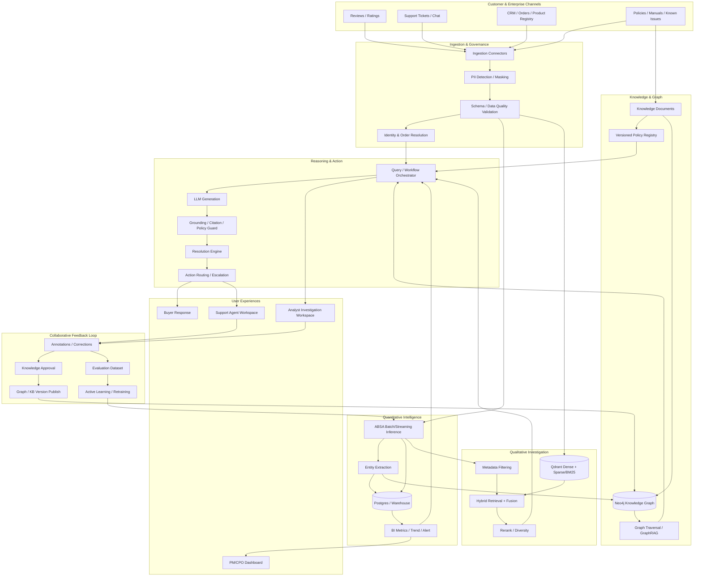
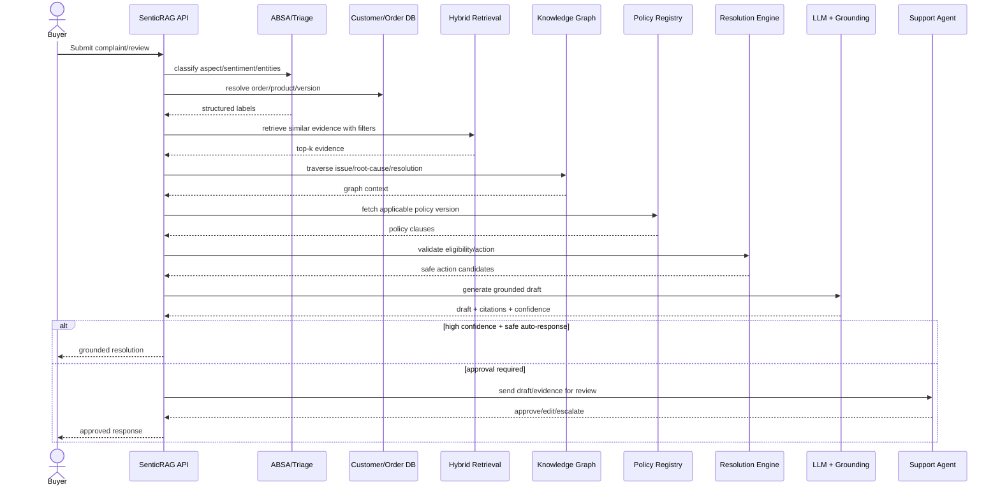
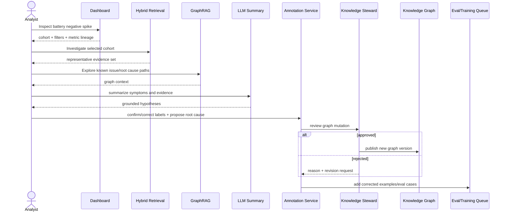
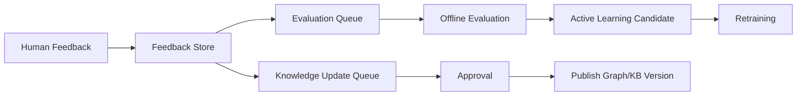
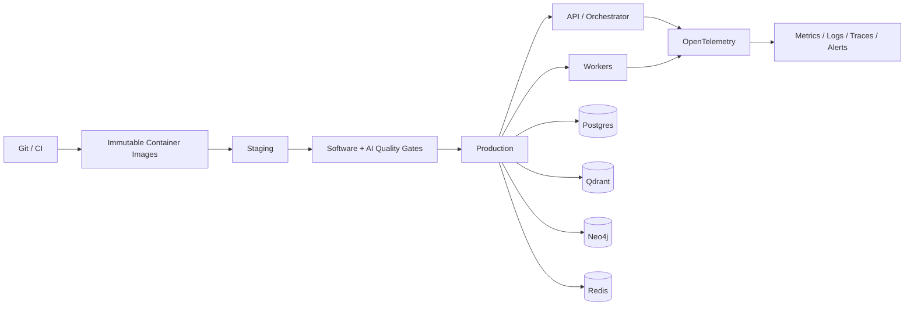

# FINAL PROJECT — SENTICRAG PLATFORM

## User-Story-Driven Customer Intelligence, Root-Cause Investigation & Actionable Customer Care

> **Phiên bản tái cấu trúc theo `Bai_Toan_Dat_Ra.md`**
> Trọng tâm mới: **User Story → Capability → Data/Knowledge → AI Pipeline → Action → Feedback → Metrics**.

---

## 0. Mục đích của bản viết lại

Bản `Final_project(3).md` trước đây có thế mạnh rõ rệt về production engineering: monorepo, Docker, CI/CD, EKS, Terraform, observability, testing, model release và rollback. Tuy nhiên, trọng tâm của tài liệu đó đang nằm ở **“làm thế nào để đưa hệ thống AI lên production”**, trong khi bài toán mới yêu cầu trả lời trước câu hỏi **“hệ thống phục vụ ai, giải quyết quyết định/hành động nào, bằng dữ liệu và tri thức nào?”**.

Bản viết lại này giữ lại các nguyên tắc production quan trọng của tài liệu cũ, nhưng chuyển chúng thành **lớp nền triển khai**. Xương sống của sản phẩm được tái định hình theo bốn nhóm người dùng chính:

1. **Buyer / Khách hàng** — cần được xử lý vấn đề nhanh, đúng chính sách và có căn cứ.
2. **Support Agent / Nhân viên CSKH** — cần ticket đã phân loại, bằng chứng, chính sách liên quan và draft phản hồi có thể kiểm soát.
3. **Product/CX Analyst / Chuyên viên phân tích** — cần nhìn toàn cảnh định lượng, điều tra định tính và đóng góp tri thức mới trở lại hệ thống.
4. **Product Manager / CPO** — cần theo dõi xu hướng lỗi, nguyên nhân gốc, tác động kinh doanh và hiệu quả xử lý khiếu nại.

Mục tiêu cuối cùng của SenticRAG không còn chỉ là **Customer Sentiment & Feedback Intelligence Engine**, mà là một nền tảng:

> **Observe → Understand → Explain → Resolve → Learn**

Trong đó:

- **Observe**: ABSA quét toàn bộ corpus để định lượng.
- **Understand**: Hybrid Retrieval tìm các trường hợp đại diện để điều tra.
- **Explain**: GraphRAG liên kết lỗi, phiên bản, nguyên nhân, policy, giải pháp và bằng chứng.
- **Resolve**: hệ thống tạo resolution draft hoặc hành động phù hợp cho CSKH.
- **Learn**: phản hồi của Analyst/Support Agent được đưa ngược vào Knowledge Graph, evaluation dataset và active-learning pipeline.

---

# 1. Product Thesis & Bài toán cốt lõi

## 1.1. Ba tầng giá trị của SenticRAG

| Tầng                    | Câu hỏi người dùng                | Cơ chế chính                    | Phạm vi dữ liệu                   | Đầu ra                                   |
| ------------------------ | -------------------------------------- | ---------------------------------- | ------------------------------------ | ------------------------------------------ |
| **Định lượng** | “Điều gì đang tăng/giảm?”      | ABSA                               | 100% corpus                          | KPI, trend, distribution, anomaly          |
| **Định tính**   | “Vì sao điều đó xảy ra?”       | Metadata filter + Hybrid Retrieval | Top-K có kiểm soát                | Evidence set, root-cause summary           |
| **Hành động**   | “Bây giờ phải xử lý thế nào?” | GraphRAG + Policy Retrieval + LLM  | Evidence + policy + customer context | Resolution draft, action route, escalation |

### Nguyên tắc phân công module

**ABSA không phải retrieval.**
ABSA phải chạy ở quy mô toàn bộ corpus để cung cấp macro-view và dữ liệu có cấu trúc.

**Retrieval không thay thế thống kê.**
Retrieval là “kính lúp” phục vụ root-cause investigation bằng Top-K review/ticket có liên quan.

**GraphRAG không phải chỉ để hỏi đáp.**
GraphRAG trong SenticRAG là lớp liên kết tri thức vận hành:

```text
Issue
→ Product / Version
→ Symptom
→ Root Cause
→ Policy
→ Resolution
→ Service Center / Owner
→ Evidence
```

**LLM không được tự quyết định chính sách.**
LLM chỉ tổng hợp, diễn đạt và đề xuất dựa trên policy/evidence đã retrieval; các hành động có rủi ro phải qua approval hoặc rule gate.

---

## 1.2. Vấn đề kinh doanh

Các doanh nghiệp có lượng review/ticket lớn thường gặp đồng thời bốn vấn đề:

1. **Không thể đọc thủ công toàn bộ feedback**, nên chỉ phản ứng với các trường hợp nổi bật hoặc khiếu nại nghiêm trọng.
2. **Dashboard sentiment tổng thể không giải thích nguyên nhân**, ví dụ biết “pin đang xấu đi” nhưng không biết do firmware nào, nhóm sản phẩm nào, biểu hiện nào.
3. **Knowledge Base và Product Intelligence bị tách rời**, khiến insight của Analyst không tự động giúp Support Agent trả lời tốt hơn.
4. **CSKH tạo ra nhiều tri thức mới nhưng tri thức này không quay lại mô hình**, dẫn tới cùng một lỗi phải điều tra lại nhiều lần.

SenticRAG giải bài toán bằng cách tạo một **closed-loop system**:

```text
Customer Feedback
    ↓
ABSA Quantification
    ↓
Root-Cause Retrieval
    ↓
Graph-linked Policy / Resolution
    ↓
Customer Resolution
    ↓
Human Annotation / Outcome
    ↓
Knowledge + Model Improvement
```

---

# 2. Personas & Jobs-To-Be-Done

## 2.1. Buyer — Khách hàng

**Job-To-Be-Done:**
“Khi sản phẩm gặp lỗi, tôi muốn nhận hướng dẫn đúng tình trạng và đúng chính sách mà không phải lặp lại thông tin nhiều lần.”

**Pain points:**

- Phải chờ agent đọc ticket từ đầu.
- Nhận câu trả lời chung chung không dựa trên model/version/order thực tế.
- Không biết có đủ điều kiện đổi/trả/bảo hành hay không.
- Phải chuyển nhiều bộ phận.

**Desired outcome:**

- FRT thấp.
- Câu trả lời có căn cứ.
- Biết bước tiếp theo ngay.
- Không bị yêu cầu cung cấp lại dữ liệu mà hệ thống đã có.

---

## 2.2. Support Agent — Nhân viên CSKH

**Job-To-Be-Done:**
“Khi nhận một ticket, tôi muốn hệ thống đã hiểu vấn đề, tìm đúng bằng chứng và chính sách, rồi tạo draft để tôi xử lý nhanh nhưng vẫn kiểm soát được.”

**Pain points:**

- Mất thời gian classify ticket.
- Tìm policy thủ công.
- Không biết lỗi có phải incident đang nổi lên hay không.
- Draft AI có thể nghe hợp lý nhưng thiếu căn cứ.

**Desired outcome:**

- Ticket có structured context.
- Bằng chứng và policy hiển thị cạnh draft.
- Có confidence/abstain/escalation.
- Một click feedback để sửa tri thức.

---

## 2.3. Product/CX Analyst — Chuyên viên phân tích

**Job-To-Be-Done:**
“Khi một KPI feedback biến động, tôi muốn đi từ số liệu tổng quan xuống review cụ thể, xác nhận root cause và cập nhật tri thức để hệ thống dùng lại.”

**Pain points:**

- BI và review explorer tách rời.
- Tốn thời gian đọc hàng trăm review.
- Insight sau phân tích nằm trong slide/Slack, không trở thành structured knowledge.
- Không có feedback loop cho model ABSA.

**Desired outcome:**

- Dashboard → drill-down → retrieval → evidence → annotation trong một workflow.
- Có versioning/audit cho annotation.
- Root cause được đưa vào graph và KB.
- Các correction trở thành evaluation/training data.

---

## 2.4. Product Manager / CPO

**Job-To-Be-Done:**
“Khi sản phẩm xuất hiện vấn đề, tôi muốn biết mức độ, xu hướng, phiên bản bị ảnh hưởng, nguyên nhân đã xác nhận và hiệu quả xử lý.”

**Pain points:**

- Sentiment score khó chuyển thành quyết định product.
- Không biết insight có đủ bằng chứng hay chỉ là vài review nổi bật.
- Không đo được từ complaint → resolution → outcome.

**Desired outcome:**

- Trend theo product/version/aspect/channel/time.
- Emerging issue detection.
- Root-cause có evidence.
- Resolution effectiveness và recurrence rate.

---

# 3. CORE USER STORIES — XƯƠNG SỐNG CỦA SẢN PHẨM

## 3.1. US-BUY-01 — Buyer báo lỗi và nhận hướng xử lý đúng policy

### User Story

> **As a Buyer**, khi tôi phản ánh sản phẩm bị lỗi, **I want** hệ thống nhận biết loại lỗi, kiểm tra thông tin mua hàng và tìm policy/solution phù hợp, **so that** tôi nhận được hướng giải quyết cụ thể thay vì câu trả lời chung chung.

### Example scenario

Khách hàng viết:

> “Sau khi update firmware 1.2, máy sạc rất chậm và nóng hơn bình thường.”

### Preconditions

- Review/ticket có `customer_ref` hoặc có cơ chế xác minh danh tính.
- Hệ thống biết `order_id`, `product_id`, `product_version`, ngày mua nếu người dùng đã liên kết tài khoản.
- Policy bảo hành/đổi trả đã được version hóa.
- Product version/firmware là entity có thể truy vấn.

### Happy path

1. Ticket được ingest.
2. PII được mask cho analytics/retrieval layer.
3. ABSA gán:
   - `aspect = battery/charging`
   - `sentiment = negative`
   - `entities = firmware_1.2, overheating, slow_charging`
4. Hệ thống truy vấn các ticket/review tương tự bằng metadata filter + hybrid retrieval.
5. GraphRAG kiểm tra:
   - Issue tương ứng.
   - Product/Firmware liên quan.
   - Root cause đã xác nhận hay chưa.
   - Policy đổi/trả/bảo hành.
   - Resolution đã được approved.
6. Resolution Engine kiểm tra eligibility dựa trên order/purchase date.
7. LLM tạo draft:
   - xin lỗi ngắn gọn;
   - mô tả vấn đề đã hiểu;
   - hướng dẫn bước tiếp theo;
   - policy reference;
   - yêu cầu thông tin còn thiếu nếu cần.
8. Nếu confidence thấp hoặc policy/action có rủi ro, chuyển agent duyệt.
9. Outcome được ghi lại để đánh giá hiệu quả resolution.

### Alternative / safety path

- **Không đủ bằng chứng:** AI không suy đoán root cause; trả về `needs_human_review=true`.
- **Không tìm thấy policy phù hợp:** không tự tạo quyền lợi cho khách hàng.
- **Thông tin đơn hàng không khớp:** yêu cầu xác minh thay vì dùng dữ liệu khách khác.
- **Safety issue:** route sang priority queue.

### Acceptance criteria

| ID        | Given                      | When                            | Then                                                         |
| --------- | -------------------------- | ------------------------------- | ------------------------------------------------------------ |
| BUY-AC-01 | Ticket có product/version | Ticket được xử lý          | Aspect + sentiment + entities được lưu có version model |
| BUY-AC-02 | Có policy phù hợp       | Draft được tạo              | Draft phải chứa`policy_id/version`                       |
| BUY-AC-03 | Có evidence review/ticket | Draft nêu root cause           | Root cause phải trace được tới evidence                 |
| BUY-AC-04 | Evidence không đủ       | LLM được gọi                | Hệ thống abstain/escalate, không “đoán”               |
| BUY-AC-05 | Ticket đã resolved       | Khách/agent phản hồi outcome | Outcome được gắn lại vào ticket/resolution             |

### Metrics

- First Response Time (FRT)
- Mean Time To Resolution (MTTR)
- First Contact Resolution (FCR)
- CSAT after resolution
- Unsupported-action rate
- Human escalation rate
- Resolution acceptance rate

---

## 3.2. US-AGENT-01 — Support Agent nhận ticket đã triage và có draft có căn cứ

### User Story

> **As a Support Agent**, tôi muốn mỗi ticket được tự động phân loại, có customer/order context, evidence và policy liên quan, **so that** tôi có thể giải quyết nhanh mà không phải tự tìm dữ liệu từ nhiều hệ thống.

### Agent workspace card

Mỗi ticket nên hiển thị tối thiểu:

```text
Customer: pseudonymized/customer-safe view
Order: #...
Product: X / Firmware: 1.2
Aspect: Battery > Charging
Sentiment: Negative
Urgency: Medium/High
Detected issue: Slow charging + overheating
Similar cases: 18
Emerging issue flag: Yes/No
Likely root cause: ... (status: confirmed / hypothesis)
Policy: Warranty-2026-v3
Recommended action: ...
Draft response: ...
Confidence: 0.xx
Evidence: [review_...], [ticket_...], [policy_...]
```

### Required interaction

Agent phải có thể:

- **Approve** draft.
- **Edit** draft trước khi gửi.
- **Reject** recommendation.
- Chọn lý do reject:
  - wrong aspect;
  - wrong root cause;
  - outdated policy;
  - incorrect eligibility;
  - tone/wording only;
  - missing evidence;
  - other.
- Gắn annotation mới.
- Escalate sang specialist.

### Acceptance criteria

| ID       | Requirement                                                                        |
| -------- | ---------------------------------------------------------------------------------- |
| AG-AC-01 | Draft không được hiển thị như “fact” nếu root cause chỉ là hypothesis. |
| AG-AC-02 | Mọi policy phải có source/version/effective date.                               |
| AG-AC-03 | Agent edit/reject phải được log để tạo feedback data.                       |
| AG-AC-04 | Agent có thể xem evidence gốc trước khi gửi.                                 |
| AG-AC-05 | Ticket state và final action phải được persist để tính MTTR/FCR/CSAT.      |

### Metrics

- Average Handle Time (AHT)
- Draft acceptance rate
- Draft edit distance / correction category
- Policy lookup time saved
- Escalation precision
- Reopen rate

---

## 3.3. US-ANALYST-01 — Analyst phát hiện trend, drill-down và xác nhận root cause

### User Story

> **As a Product/CX Analyst**, tôi muốn nhìn thấy biến động aspect trên toàn bộ corpus, drill-down sang các review/ticket đại diện và ghi lại root cause, **so that** insight trở thành tri thức dùng được cho product và CSKH.

### Example

Dashboard phát hiện:

```text
Aspect: battery
Negative ratio: 40%
WoW change: +15 percentage points
Affected product: Model X
Firmware: 1.2
```

Analyst bấm **Investigate**.

System tạo query có điều kiện:

```json
{
  "filters": {
    "product_id": "model-x",
    "firmware_version": "1.2",
    "aspect": "battery",
    "sentiment": "negative",
    "time_range": "last_14_days"
  },
  "query": "Các lỗi pin nổi bật và nguyên nhân có thể là gì?",
  "top_k": 20
}
```

### Analysis workflow

1. Dashboard định lượng hiển thị trend và cohort.
2. Retrieval lấy evidence representative/diverse, không chỉ các bản ghi gần nhau nhất về embedding.
3. LLM cluster/tóm tắt symptom patterns.
4. Graph traversal tìm các issue/root-cause/product-version đã biết.
5. Analyst đánh dấu:
   - `confirmed_root_cause`
   - `possible_root_cause`
   - `new_issue`
   - `duplicate_issue`
6. Analyst thêm note và evidence.
7. Nếu là tri thức mới, tạo proposed graph update.
8. Knowledge Steward/authorized Analyst approve.
9. Graph version mới được publish.
10. Các label correction đi vào active-learning/eval queue.

### Acceptance criteria

| ID       | Requirement                                                                |
| -------- | -------------------------------------------------------------------------- |
| AN-AC-01 | Dashboard metric phải trace được về số record được tính.         |
| AN-AC-02 | Investigation phải giữ nguyên metadata filters từ dashboard.           |
| AN-AC-03 | Retrieval result phải có source IDs và timestamp.                       |
| AN-AC-04 | Analyst annotation phải versioned và có author/time.                    |
| AN-AC-05 | Graph update không được silent overwrite; phải có approval/audit.    |
| AN-AC-06 | Corrected ABSA label phải có thể export thành evaluation/training set. |

### Metrics

- Time-to-root-cause
- Evidence coverage
- Analyst correction rate
- New issue discovery lead time
- Time-to-knowledge publication
- Recurrence after resolution

---

## 3.4. US-PM-01 — PM/CPO theo dõi mức độ và hiệu quả xử lý

### User Story

> **As a Product Manager/CPO**, tôi muốn biết issue nào đang tăng, phiên bản nào bị ảnh hưởng, root cause đã được xác nhận đến đâu và resolution có hiệu quả không, **so that** tôi ưu tiên roadmap và mitigation dựa trên evidence.

### Executive view

Không chỉ hiển thị sentiment score. Dashboard cần thể hiện:

```text
Issue: Slow charging after firmware 1.2
Status: Confirmed
Affected products: Model X, batch A/B
Affected users: 1,284 reviews/tickets in 30 days
Negative share: 42%
Trend: +17 pp vs prior period
Root cause: Firmware power-management regression
Resolution: Firmware 1.2.1 / downgrade guide / warranty fallback
Resolution success rate: 83%
Reopen rate: 7%
Median MTTR: ...
Evidence confidence: High
Owner: Firmware Team
```

### Acceptance criteria

- PM thấy được **population size**, không chỉ vài ví dụ.
- Root cause có trạng thái `hypothesis/confirmed/rejected`.
- Resolution có metric outcome.
- Mỗi issue có owner và lifecycle.
- PM có thể drill-down về evidence nhưng không mặc định được xem PII không cần thiết.

---

## 3.5. Secondary User Story — Knowledge Steward / Admin

Bốn persona trên là user stories bắt buộc của bài toán. Tuy nhiên, để vòng lặp tri thức an toàn, hệ thống cần thêm một operational role:

> **As a Knowledge Steward**, tôi muốn review các graph/policy updates trước khi publish, **so that** AI không học trực tiếp từ annotation chưa xác thực.

Role này chịu trách nhiệm:

- approve/reject graph mutation;
- retire outdated policy;
- resolve conflicting root causes;
- publish knowledge version;
- manage retention/access policy;
- audit data lineage.

---

# 4. Traceability Matrix — User Story → Capability → Module → KPI

| User Story        | Primary Capability         | Supporting Modules                                      | Main KPI                         |
| ----------------- | -------------------------- | ------------------------------------------------------- | -------------------------------- |
| US-BUY-01         | Personalized resolution    | ABSA, Retrieval, Policy, GraphRAG, Resolution Engine    | FRT, MTTR, CSAT                  |
| US-AGENT-01       | Agent copilot              | Triage, Customer Context, Retrieval, Drafting, Approval | AHT, draft acceptance            |
| US-ANALYST-01     | Root-cause investigation   | BI, Hybrid Retrieval, Graph Explorer, Annotation        | Time-to-root-cause               |
| US-PM-01          | Product issue intelligence | Aggregation, Issue lifecycle, Resolution analytics      | Issue lead time, recurrence      |
| Knowledge Steward | Governed learning loop     | Annotation, Graph versioning, Policy registry           | time-to-publish, rollbackability |

### Capability ownership principle

Một capability chỉ được xem là “hoàn thành” khi:

1. Có user story cụ thể.
2. Có data contract.
3. Có API/UI path.
4. Có evaluation metric.
5. Có audit/observability.
6. Có failure/escalation behavior.

---

# 5. End-to-End Architecture

## 5.1. Logical architecture



---

## 5.2. Hai pipeline phải tách rõ

### Pipeline A — Corpus Analytics / ABSA

```text
Ingest
→ PII Mask
→ Validate
→ ABSA/Entity Inference trên toàn bộ corpus
→ Structured Store
→ Aggregation
→ Dashboard / Trend / Alert
```

**Tính chất:**

- throughput-oriented;
- batch/micro-batch;
- không phụ thuộc `top_k`;
- reproducible theo model version;
- phục vụ định lượng.

### Pipeline B — Investigation & Resolution

```text
User query / ticket
→ metadata filter from ABSA/context
→ dense + sparse retrieval
→ fusion/reranking
→ graph traversal
→ policy resolution
→ evidence pack
→ LLM generation
→ grounding/guardrail
→ draft/action/escalation
```

**Tính chất:**

- latency-oriented;
- query-specific;
- top-k controlled;
- phải citation-aware;
- phục vụ định tính và hành động.

---

## 5.3. Chuẩn hóa kiến trúc 7 tầng GenAI & Agent Pipeline (Alignment với `Sep_25_ARCHITECTURE`)

Để đảm bảo tính nhất quán với khung lý thuyết chuẩn của AI Agent Pipeline (theo `Sep_25__AI_ARCHITECTURE.md` và `7_layer_architecture.json`), toàn bộ các thành phần của SenticRAG được định vị vào 7 tầng kiến trúc:

| Tầng (Layer) | Tên tầng kiến trúc | Các thành phần kỹ thuật cốt lõi | Vai trò & Trách nhiệm trong SenticRAG |
| :--- | :--- | :--- | :--- |
| **Layer 1** | **Input & Gateway Layer** | Multimodal Parsers, Semantic Router, PII Anonymizer, Rate Limiter | Tiếp nhận review/ticket từ đa kênh; ẩn danh PII (SĐT, tên, email) theo Luật BV dữ liệu cá nhân 2026; phân luồng truy vấn (Semantic Routing); kiểm soát tải và Rate Limiting. |
| **Layer 2** | **Core Reasoning & Orchestration** | Foundation Models (LLM/SLM), Planning Engine, Cyclic State Machine (FSM), Reflection Loop | Lập kế hoạch phân tích và sinh resolution; điều phối trạng thái xử lý ticket qua FSM tuần hoàn; tự phản biện (reflection loop) đối chiếu kết quả trước khi gửi tiếp. |
| **Layer 3** | **Hierarchical Memory Module** | Working Context (Core Memory), Message Buffer, Recall Storage, Archival Vector Memory | Quản lý bộ nhớ phân cấp của Agent; duy trì ngữ cảnh phiên hội thoại ticket; truy xuất lịch sử tương tác khách hàng và kinh nghiệm xử lý trước đây. |
| **Layer 4** | **Knowledge & Retrieval Layer** | Advanced RAG (Hybrid Search Dense + Sparse BM25), Cross-Encoder Reranker (BGE Reranker), GraphRAG (Neo4j) | Thực hiện tìm kiếm hỗn hợp đa phương thức; dung hợp điểm số qua Reciprocal Rank Fusion (RRF); tái xếp hạng độ liên quan; truy vết quan hệ thực thể trên Knowledge Graph. |
| **Layer 5** | **Tools & Action Protocols** | Function Calling, Model Context Protocol (MCP Host/Client/Server), MicroVM / Task Sandboxes | Cung cấp giao thức chuẩn để LLM gọi công cụ nội bộ (CRM API, ERP query, notification service, ticket escalation); đảm bảo môi trường sandbox an toàn khi thực thi action. |
| **Layer 6** | **Output & Guardrails Layer** | Hallucination Verifier, Pydantic Schema Validator, Output Filter, Policy Guard | Kiểm tra hallucination dựa trên evidence citations; ép schema Pydantic chặt chẽ; lọc đầu ra và chặn các phản hồi vi phạm chính sách hoặc cam kết hoàn tiền trái thẩm quyền. |
| **Layer 7** | **Observability & Operations** | Distributed Tracing (OpenTelemetry), Token/Cost Accounting, Drift Monitoring, Automated Evaluation | Thu thập traces/metrics phân tán; hạch toán chi phí token per ticket; theo dõi data drift và concept drift; kích hoạt đánh giá chất lượng tự động. |

---

## 5.4. Hierarchical Memory Architecture & Technical Role Mapping

Hệ thống phân cấp bộ nhớ giải quyết bài toán cốt lõi: **LLM không thể và không nên lưu toàn bộ ngữ cảnh trong prompt context**. Kế thừa trực tiếp từ `Sep_25__AI_ARCHITECTURE.md`, vai trò kỹ thuật của 4 loại Memory được hiện thực hóa trong SenticRAG như sau:

### Bảng phân loại vai trò của 4 loại Memory (Technical Memory Roles)

| Loại Memory | Vai trò kỹ thuật (Role) | Cơ chế lưu trữ (Storage) | Triển khai thực tế trong SenticRAG |
| :--- | :--- | :--- | :--- |
| **Working Memory** | Ngữ cảnh tức thì cho bước tính toán/suy luận hiện tại của Agent | In-context prompt window, Redis short-term cache | Payload ticket hiện tại, thuộc tính buyer sau khi giải mã, danh sách tool calls đang chờ xử lý, draft đang gen. |
| **Episodic Memory** | Lưu vết lịch sử tương tác, diễn biến sự vụ và kết quả quá khứ | RDBMS (PostgreSQL), external session store | Lịch sử mua hàng, lịch sử khiếu nại trước đây của khách hàng, chuỗi hội thoại CSKH nhiều lượt, kết quả xử lý ticket cũ. |
| **Semantic Memory** | Tri thức sự kiện, định nghĩa và quan hệ thực thể để reasoning | Vector Store (Qdrant) + Knowledge Graph (Neo4j) | Toàn bộ corpus review đã index, tài liệu kỹ thuật sản phẩm, ontology lỗi - triệu chứng - linh kiện - phiên bản firmware. |
| **Procedural Memory** | Quy tắc, quy trình, chỉ dẫn định hình hành vi xử lý | System prompt, versioned policy configs, Python decision trees | Cây quyết định chính sách bảo hành/đổi trả, playbook xử lý khiếu nại theo cấp độ rủi ro, rubric kiểm duyệt của CSKH Agent. |

### Cấu trúc bộ nhớ phân tầng (Hierarchical Memory Architecture)

```text
+-----------------------------------------------------------------------------------+
| 1. Working Context (Core Memory): System Prompt + Procedural Playbook + Current Ticket |
+-----------------------------------------------------------------------------------+
                                         |
                                         v
+-----------------------------------------------------------------------------------+
| 2. Message Buffer: Lịch sử hội thoại N-turns gần nhất (Sliding Window Buffer)     |
+-----------------------------------------------------------------------------------+
                                         |
                                         v
+-----------------------------------------------------------------------------------+
| 3. Recall Storage: Episodic Memory (Tra cứu vé cũ, lịch sử đơn hàng qua Postgres)  |
+-----------------------------------------------------------------------------------+
                                         |
                                         v
+-----------------------------------------------------------------------------------+
| 4. Archival Vector Memory: Semantic Memory (Hybrid Search Qdrant + GraphRAG Neo4j)|
+-----------------------------------------------------------------------------------+
```

---

# 6. Sequence Diagrams Theo User Story

## 6.1. Buyer complaint → actionable resolution



---

## 6.2. Analyst trend → root cause → knowledge update



---

# 7. Module Specifications

## 7.1. Ingestion & Data Quality

### Inputs

- product reviews;
- marketplace reviews;
- customer support tickets;
- chat/call transcripts if legally and operationally permitted;
- CRM/order records;
- product catalog/version registry;
- policy/manual/known-issue documents.

### Required fields

```text
source
source_record_id
created_at
text
language
product_id
product_version? 
customer_ref?      # pseudonymized key
order_ref?
channel
rating?
```

### Data quality checks

- duplicate detection;
- missing text/product;
- invalid timestamps;
- language detection;
- spam/empty review detection;
- source lineage;
- schema version.

---

## 7.2. Gateway, PII Anonymizer & Semantic Routing (Layer 1)

Cổng tiếp nhận (Input & Gateway) đảm nhiệm 3 vai trò kiểm soát an ninh và điều phối luồng dữ liệu trước khi đi vào các tầng xử lý sâu hơn:

### Rate Limiter & Throttling
- Triển khai thuật toán Sliding Window Counter (Redis) nhằm giới hạn tần suất gửi review/ticket từ các client.
- Chặn spam review hàng loạt, ngăn chặn tấn công DoS và kiểm soát chi phí gọi AI inference.

### Semantic Router (Điều phối luồng thông minh)
- Ngay khi nhận payload văn bản, Semantic Router phân loại nhanh intent cấp 1:
  - **Corpus Review / Macro Feedback** $\rightarrow$ Đẩy vào Queue của **Pipeline A (Batch ABSA Worker)** để phục vụ phân tích định lượng.
  - **Urgent Complaint / Support Ticket** $\rightarrow$ Đẩy vào **Pipeline B (Real-time Investigation & Resolution Engine)** để xử lý tức thì cho khách hàng/Agent.
  - **Out-of-scope / Chitchat** $\rightarrow$ Trả về phản hồi từ chối hoặc chuyển hướng mà không tiêu tốn tài nguyên RAG/Graph.

### PII Anonymizer & Identity Boundary

SenticRAG bắt buộc tách hai context xử lý dữ liệu:

#### Analytics context
- Pseudonymized customer key;
- Masked phone/email/address (regex + NER-based redaction);
- Role-based access control;
- Retention control.

#### Resolution context
Chỉ Support Agent / authorized service được phép truy cập thông tin định danh cần thiết để:
- Xác minh order;
- Xác định thời hạn warranty;
- Xác định service region / trạm bảo hành gần nhất;
- Liên hệ giải quyết khiếu nại cho khách hàng.

**Không bao giờ đưa raw PII vào vector payload trong Qdrant hoặc LLM prompt bên ngoài.**

---

## 7.3. ABSA Service — Quantitative Layer

### Recommended task decomposition

1. **Aspect Term Extraction (ATE)**
2. **Aspect/Category Classification**
3. **Aspect Polarity Classification (APC)**
4. **Optional ASTE/ACOS** cho dữ liệu đủ chất lượng:
   - aspect;
   - opinion;
   - sentiment;
   - category.

### Example output

```json
{
  "review_id": "rv_123",
  "model_version": "absa-2026-09-30",
  "aspects": [
    {
      "aspect": "battery",
      "term": "sạc",
      "sentiment": "negative",
      "confidence": 0.94
    },
    {
      "aspect": "temperature",
      "term": "nóng",
      "sentiment": "negative",
      "confidence": 0.91
    }
  ],
  "entities": [
    {"type": "firmware_version", "value": "1.2"}
  ]
}
```

### Storage principle

Không overwrite inference cũ. Lưu:

```text
review_id + model_version + taxonomy_version + inference_timestamp
```

để dashboard có thể reproduce metric.

---

## 7.4. Analytics / BI Layer

### Core metrics

- aspect mention count;
- aspect sentiment distribution;
- negative rate;
- change vs prior period;
- product/version/channel cohort;
- new-issue candidate count;
- resolution rate;
- recurrence rate.

### Drill-down contract

Mọi chart phải có thể sinh một **query context**:

```json
{
  "metric_id": "battery_negative_ratio",
  "filters": {
    "product_id": ["model-x"],
    "firmware_version": ["1.2"],
    "aspect": ["battery"],
    "sentiment": ["negative"],
    "date_from": "2026-09-01",
    "date_to": "2026-09-30"
  },
  "population_count": 1284
}
```

Context này được truyền nguyên vẹn sang Analyst Investigation.

---

## 7.5. Hybrid Retrieval Service

### Retrieval stack

```text
Metadata Filter
    ↓
Dense semantic retrieval
+
Sparse/BM25 lexical retrieval
    ↓
Rank fusion (Reciprocal Rank Fusion - RRF)
    ↓
Cross-Encoder Reranker (BGE Reranker - Deep contextual scoring)
    ↓
Diversity / representative sampling
    ↓
Evidence Pack
```

### Why hybrid

- Dense search tốt với paraphrase/semantic similarity.
- BM25/sparse tốt với mã lỗi, firmware, model, SKU, identifier và từ khóa hiếm.
- Không cộng trực tiếp raw dense score với BM25 score vì khác scale; dùng rank fusion phù hợp hơn.

### Metadata payload đề xuất

```json
{
  "review_id": "rv_123",
  "product_id": "model-x",
  "product_version": "rev-b",
  "firmware_version": "1.2",
  "aspect": ["battery", "temperature"],
  "sentiment": ["negative"],
  "channel": "ecommerce_review",
  "language": "vi",
  "created_at": "2026-09-28T10:20:00Z",
  "issue_ids": ["ISSUE-204"]
}
```

Các field dùng filter thường xuyên phải có payload index.

### Retrieval modes

1. **Case Similarity** — tìm ticket/review giống case hiện tại.
2. **Root Cause Investigation** — tìm evidence trong cohort đã filter.
3. **Policy Retrieval** — chỉ tìm tài liệu có hiệu lực trong policy namespace.
4. **Known Issue Retrieval** — tìm incident/bug đã approved.

---

## 7.6. Knowledge Graph / Ontology

### Core nodes

| Node               | Key properties                                   |
| ------------------ | ------------------------------------------------ |
| `Product`        | product_id, family, name                         |
| `ProductVersion` | version_id, hw_rev, release_date                 |
| `Firmware`       | version, release_date, status                    |
| `Aspect`         | aspect_id, name, taxonomy_version                |
| `Issue`          | issue_id, title, severity, status                |
| `Symptom`        | symptom_id, description                          |
| `RootCause`      | cause_id, description, status                    |
| `Policy`         | policy_id, version, effective_from, effective_to |
| `Resolution`     | resolution_id, type, approval_status             |
| `ServiceCenter`  | center_id, region, capabilities                  |
| `Evidence`       | evidence_id, source_type, source_id              |
| `Team`           | team_id, responsibility                          |

### Core edges

| Edge                                          | Meaning               |
| --------------------------------------------- | --------------------- |
| `Product-[:HAS_VERSION]->ProductVersion`    | cấu trúc sản phẩm |
| `ProductVersion-[:RUNS_FIRMWARE]->Firmware` | version mapping       |
| `Issue-[:AFFECTS]->ProductVersion`          | phạm vi issue        |
| `Issue-[:MANIFESTS_AS]->Symptom`            | biểu hiện           |
| `Issue-[:RELATED_TO_ASPECT]->Aspect`        | mapping BI ↔ graph   |
| `Issue-[:CAUSED_BY]->RootCause`             | nguyên nhân         |
| `RootCause-[:SUPPORTED_BY]->Evidence`       | bằng chứng          |
| `Issue-[:RESOLVED_BY]->Resolution`          | cách xử lý         |
| `Resolution-[:GOVERNED_BY]->Policy`         | policy constraint     |
| `Resolution-[:AVAILABLE_AT]->ServiceCenter` | nơi thực hiện      |
| `Issue-[:OWNED_BY]->Team`                   | ownership             |

### Root cause lifecycle

```text
hypothesis
→ under_review
→ confirmed
→ mitigated
→ monitored
→ closed
```

Không cho LLM tự chuyển trạng thái sang `confirmed`.

### Example Cypher-style traversal

```cypher
MATCH (i:Issue)-[:AFFECTS]->(pv:ProductVersion),
      (i)-[:CAUSED_BY]->(rc:RootCause),
      (i)-[:RESOLVED_BY]->(r:Resolution)-[:GOVERNED_BY]->(p:Policy)
WHERE pv.version_id = $version_id
  AND i.status IN ['confirmed','mitigated']
RETURN i, rc, r, p
```

---

## 7.7. GraphRAG Strategy

SenticRAG nên dùng ba mức truy vấn:

### A. Local / Entity-centered Graph Retrieval

Dùng khi câu hỏi gắn với:

- product/version;
- firmware;
- issue;
- policy;
- resolution.

Ví dụ:

> “Lỗi sạc chậm trên firmware 1.2 đã có root cause xác nhận chưa?”

### B. Corpus / Global Pattern Analysis

Dùng khi Analyst/PM hỏi:

> “Những nhóm lỗi nổi bật nhất của Model X trong quý này là gì?”

Tuy nhiên, global graph summarization phải được benchmark về cost và giá trị bổ sung so với warehouse + clustering. Không mặc định dùng GraphRAG cho mọi query.

### C. Vector + Graph Traversal

Đây là mode quan trọng nhất cho SenticRAG:

```text
semantic match review/ticket
→ map to issue/entity
→ graph expansion
→ policy/resolution context
```

---

## 7.8. Policy Registry & Resolution Engine

### Policy document must be structured

```json
{
  "policy_id": "warranty-standard",
  "version": "2026.3",
  "effective_from": "2026-07-01",
  "effective_to": null,
  "jurisdiction": "VN",
  "product_scope": ["model-x"],
  "rules": [
    {
      "rule_id": "W-12",
      "condition": "purchase_age_days <= 365 AND verified_defect = true",
      "allowed_actions": ["repair", "replacement"]
    }
  ]
}
```

### Resolution Engine responsibilities

- match policy by product/date/jurisdiction;
- evaluate eligibility;
- block invalid action;
- return required missing fields;
- generate machine-readable action candidate.

### Example output

```json
{
  "eligible": true,
  "allowed_actions": ["repair", "replacement"],
  "preferred_action": "repair",
  "policy_ref": {
    "policy_id": "warranty-standard",
    "version": "2026.3",
    "rule_id": "W-12"
  },
  "requires_human_approval": true
}
```

---

## 7.9. LLM Generation & Grounding Layer

LLM chỉ nhận **evidence pack** đã qua retrieval/orchestration.

### Core Reasoning & Orchestration Engine (Layer 2 & Layer 5)

Để tránh hiện tượng LLM hallucinate hoặc tự đưa ra phán quyết nghiệp vụ sai lệch, quá trình reasoning được điều phối qua 3 cơ chế:

1. **Planning Engine**: Phân tích yêu cầu từ ticket/query, bóc tách intent, lập kế hoạch thu thập bằng chứng từ các nguồn dữ liệu (Hybrid Vector, Graph, Policy).
2. **Cyclic State Machine (FSM)**: Máy trạng thái hữu hạn kiểm soát toàn bộ chu trình xử lý ticket:
   ```text
   Ingested → Triaged (ABSA) → Context_Retrieval → Evidence_Fusion → Resolution_Drafting → Guardrail_Verification → Human_Approval / Auto_Dispatch
   ```
3. **Reflection Loop**: Vòng lặp tự phản biện kiểm tra tính đầy đủ: Nếu điểm tự tin thấp (`confidence < 0.7`) hoặc bằng chứng chưa đủ để trả lời câu hỏi của khách hàng, FSM kích hoạt bước truy vấn bổ sung (Refinement Query) hoặc quyết định dừng (Abstain) và chuyển cấp (Escalate).
4. **Tools & Action Protocols (Function Calling & MCP)**: Sử dụng chuẩn Model Context Protocol (MCP) để kết nối Agent với các hệ thống backend nội bộ:
   - Tool `query_customer_order(order_id)`: Tra cứu thông tin đơn hàng và hạn bảo hành.
   - Tool `check_warranty_eligibility(serial_no, defect_code)`: Kiểm tra điều kiện bảo hành.
   - Tool `route_ticket_to_specialist(ticket_id, department)`: Điều phối vé sang kỹ thuật viên chuyên trách.

### Prompt context classes

```text
customer_context          # minimized
case_summary
absa_labels
retrieved_evidence
known_issue_graph_context
applicable_policy
allowed_actions
response_style
```

### Output schema (Pydantic Schema Validator)

```json
{
  "case_summary": "...",
  "recommended_response": "...",
  "recommended_actions": ["..."],
  "citations": [
    {"source_type": "policy", "source_id": "..."},
    {"source_type": "ticket", "source_id": "..."}
  ],
  "confidence": 0.0,
  "needs_human_review": true,
  "reason_for_review": "..."
}
```

### Output Guardrails & Verification (Layer 6)

- **Hallucination Verifier**: Kiểm tra từng câu khẳng định (claim) trong `recommended_response` xem có được hỗ trợ trực tiếp bởi ít nhất một citation trong evidence pack hay không.
- **Pydantic Schema Validator**: Ép kiểu nghiêm ngặt và validate toàn bộ JSON output của LLM; tự động retry nếu schema lỗi.
- **Policy Compliance Check**: Chặn tuyệt đối mọi cam kết bồi thường/hoàn tiền vượt mức thẩm quyền hoặc trái với `applicable_policy`.
- **PII Leakage Prevention**: Bộ lọc Output Filter quét và xóa bỏ mọi thông tin cá nhân chưa được che giấu trước khi trả lời ra ngoài.
- **Low-evidence Abstention**: Từ chối trả lời và chuyển cấp (escalation) cho Support Agent khi không tìm thấy policy hoặc bằng chứng phù hợp.

---

## 7.10. Collaborative Feedback Loop

### Feedback types

```text
ABSA correction
Retrieval relevance feedback
Root-cause confirmation/rejection
Policy stale flag
Resolution success/failure
Draft approve/edit/reject
New issue creation
Duplicate issue merge
```

### Feedback processing



### Important separation

**Human feedback ≠ immediate truth.**
Feedback phải đi qua status:

```text
proposed → reviewed → approved/rejected → published
```

---

# 8. Data Model

## 8.1. Relational tables

### Core operational tables

```text
customers
orders
products
product_versions
firmware_versions
reviews
support_tickets
interactions
resolution_actions
resolution_outcomes
```

### AI/analytics tables

```text
absa_predictions
entity_mentions
issue_assignments
retrieval_sessions
retrieval_results
llm_generations
citations
model_feedback
annotations
knowledge_change_requests
```

### Example `reviews`

```sql
reviews(
  review_id PK,
  source,
  source_record_id,
  customer_ref_nullable,
  order_ref_nullable,
  product_id,
  product_version_nullable,
  rating_nullable,
  language,
  review_text_masked,
  created_at,
  ingested_at,
  schema_version
)
```

### Example `absa_predictions`

```sql
absa_predictions(
  prediction_id PK,
  review_id FK,
  model_version,
  taxonomy_version,
  aspect,
  aspect_term_nullable,
  sentiment,
  confidence,
  created_at
)
```

---

## 8.2. Source of truth rules

| Data                    | Source of truth                      |
| ----------------------- | ------------------------------------ |
| Customer/order          | CRM/commerce system                  |
| Review/ticket raw event | source system + immutable ingest log |
| ABSA                    | model-versioned prediction table     |
| Policy                  | approved Policy Registry             |
| Root cause              | versioned Knowledge Graph            |
| Draft response          | generation log                       |
| Final customer response | support/ticket system                |
| Outcome                 | support workflow + customer feedback |

---

# 9. API Design

## 9.1. Ingest review/ticket

```http
POST /v1/feedback
```

```json
{
  "source": "marketplace",
  "source_record_id": "abc-123",
  "customer_ref": "cust_pseudo_456",
  "order_ref": "order_789",
  "product_id": "model-x",
  "product_version": "rev-b",
  "text": "Sau update 1.2 máy sạc rất chậm và nóng",
  "language": "vi",
  "created_at": "2026-09-30T10:00:00+07:00"
}
```

---

## 9.2. Dashboard drill-down / investigation

```http
POST /v1/investigations/search
```

```json
{
  "query": "Nguyên nhân phổ biến của lỗi pin trong cohort này?",
  "filters": {
    "product_id": ["model-x"],
    "firmware_version": ["1.2"],
    "aspect": ["battery"],
    "sentiment": ["negative"]
  },
  "retrieval": {
    "dense": true,
    "sparse": true,
    "fusion": "rrf",
    "top_k": 20,
    "rerank_top_n": 10
  }
}
```

### Response

```json
{
  "summary": "...",
  "hypotheses": [
    {
      "label": "firmware power-management regression",
      "status": "hypothesis",
      "evidence_ids": ["rv_12", "tk_88"]
    }
  ],
  "evidence": [],
  "graph_entities": [],
  "citations": []
}
```

---

## 9.3. Generate resolution draft

```http
POST /v1/resolution-drafts
```

```json
{
  "ticket_id": "tk_1001",
  "mode": "agent_assist"
}
```

### Response

```json
{
  "ticket_id": "tk_1001",
  "triage": {
    "aspect": ["battery", "temperature"],
    "sentiment": "negative",
    "urgency": "medium"
  },
  "known_issue": {
    "issue_id": "ISSUE-204",
    "status": "confirmed"
  },
  "policy": {
    "policy_id": "warranty-standard",
    "version": "2026.3"
  },
  "recommended_actions": ["repair_booking"],
  "draft": "...",
  "citations": ["ISSUE-204", "warranty-standard@2026.3"],
  "confidence": 0.91,
  "needs_human_review": true
}
```

---

## 9.4. Analyst/Agent feedback

```http
POST /v1/feedback/annotations
```

```json
{
  "target_type": "ticket",
  "target_id": "tk_1001",
  "annotation_type": "root_cause",
  "model_value": "battery_hardware_fault",
  "human_value": "firmware_power_management_regression",
  "status": "proposed",
  "comment": "Confirmed against firmware 1.2 release incident",
  "evidence_ids": ["inc_34", "rv_12", "rv_18"]
}
```

---

# 10. Related Projects & Research Synthesis

Phần này không xem các dự án ngoài như “đáp án để copy”, mà dùng chúng để kiểm chứng pattern và bổ sung những capability còn thiếu trong Final Project cũ.

## 10.1. PyABSA — Modular ABSA

**What it contributes**

- Tách ABSA thành các subtask rõ ràng: ATE, APC, ASTE/ACOS.
- Có unified training/evaluation/inference workflow.
- Có human-in-the-loop dataset annotation helpers.

**Apply to SenticRAG**

- Không mô tả sentiment model như một classifier đơn lẻ.
- Tách taxonomy + extraction + polarity + entity.
- Xây evaluation theo từng subtask và slice.

**Do not copy blindly**

- Framework choice phải benchmark trên Vietnamese/domain data thực tế.
- SenticRAG có thể dùng PhoBERT/DeBERTa/custom model mà không khóa vào PyABSA runtime.

Reference: https://github.com/yangheng95/PyABSA

---

## 10.2. Microsoft GraphRAG — Local vs Global reasoning pattern

**What it contributes**

- Local Search: reasoning quanh entity + related text units.
- Global Search: reasoning trên community summaries/corpus-wide themes.
- Phân biệt query mode thay vì “GraphRAG cho mọi câu hỏi”.

**Apply to SenticRAG**

- Local mode cho issue/product/version/policy.
- Global mode cho thematic analysis của corpus khi warehouse statistics chưa đủ.
- DRIFT/global pattern là research direction, không phải mặc định cho MVP.

**Important 2026 note**

Microsoft hiện mô tả GraphRAG repo là research project và phần lớn ở maintenance mode. Vì vậy SenticRAG nên học kiến trúc/query patterns từ project này, nhưng không nên coi nó là dependency lõi production nếu chưa benchmark/đánh giá maintenance risk.

References:

- https://github.com/microsoft/graphrag
- https://github.com/microsoft/graphrag/blob/main/docs/query/overview.md

---

## 10.3. Neo4j GraphRAG for Python — Production-oriented graph retrieval building blocks

**What it contributes**

- Official Neo4j GraphRAG package.
- VectorRetriever, HybridRetriever, VectorCypherRetriever, HybridCypherRetriever.
- Có thể vector search rồi mở rộng context bằng graph traversal.
- Hỗ trợ custom retriever / Text2Cypher patterns.

**Apply to SenticRAG**

Neo4j GraphRAG là candidate implementation tốt cho:

```text
review/ticket vector match
→ Issue/Product/Firmware node
→ Cypher traversal
→ Policy/Resolution/Owner
```

Điều này phù hợp trực tiếp với actionable-care story hơn việc chỉ dùng graph để “chat với tài liệu”.

References:

- https://neo4j.com/docs/neo4j-graphrag-python/current/
- https://github.com/neo4j/neo4j-graphrag-python

---

## 10.4. Qdrant — Hybrid retrieval + metadata filtering

**What it contributes**

- Dense + sparse/BM25 representations trong cùng collection.
- Hybrid query với rank fusion như RRF.
- Payload filter/index phù hợp với business metadata.

**Apply to SenticRAG**

ABSA output nên trở thành payload/filter:

```text
aspect
sentiment
product_id
product_version
firmware_version
channel
time
issue_id
```

Đây là cầu nối trực tiếp giữa quantitative layer và qualitative layer.

References:

- https://qdrant.tech/documentation/search/text-search/hybrid-search/
- https://qdrant.tech/documentation/search/filtering/

---

## 10.5. Argilla — Human feedback / collaborative annotation

**What it contributes**

- Collaboration giữa AI engineers và domain experts.
- Human feedback cho text classification, NER, RAG và LLM use cases.
- Record metadata, vectors, model suggestions và multi-annotator responses.

**Apply to SenticRAG**

Có thể dùng Argilla hoặc học data model của nó cho:

- analyst correction queue;
- ABSA disagreement review;
- RAG relevance judgment;
- response quality annotation;
- evaluation dataset curation.

Reference: https://github.com/argilla-io/argilla

---

## 10.6. Haystack — Pipeline, hybrid retrieval, evaluation & HITL patterns

**What it contributes**

Haystack hiện có tutorials/patterns cho:

- hybrid retrieval;
- metadata filtering;
- RAG evaluation;
- human-in-the-loop with agents;
- structured output;
- multi-agent/tool-calling pipelines.

**Apply to SenticRAG**

Giá trị chính không phải thay toàn bộ stack bằng Haystack, mà là học cách:

- componentize pipeline;
- serialize/test pipeline;
- tách retrieval/evaluation/HITL.

Reference: https://haystack.deepset.ai/tutorials

---

## 10.7. Open-source customer-support agent projects — Operational patterns

### AgentDesk

Project community này có một số pattern sát với SenticRAG:

- knowledge-grounded answer;
- answerability gate;
- human handoff;
- conversation → ticket loop;
- agent workspace;
- retrieval logs/quality analysis.

Reference: https://github.com/huabeitech/agent-desk

### LangGraph Customer Support Agent

Pattern đáng tham khảo:

- structured ticket classification;
- KB retrieval;
- human-in-the-loop approval gates;
- persistent state;
- escalation.

Reference: https://github.com/niti007/langgraph-customer-support-agent

**Caution:** đây là community projects, chỉ dùng làm UX/workflow inspiration; không dùng claims/metrics của repo làm benchmark cho SenticRAG nếu chưa tự kiểm chứng.

---

# 11. Những thay đổi quan trọng so với `Final_project(3).md`

## 11.1. Từ “pipeline-first” sang “user-story-first, pipeline-supported”

### Old emphasis

```text
source control
→ CI
→ image
→ ECR
→ EKS
→ monitoring
```

### New emphasis

```text
User problem
→ data required
→ intelligence required
→ action required
→ feedback captured
→ production mechanism
```

CI/CD vẫn cần, nhưng là **means**, không phải product outcome.

---

## 11.2. Thêm domain modules còn thiếu

Bản cũ có:

```text
api
rag_service
worker
retrieval
llm
ml_core
```

Bản mới cần domain boundary rõ hơn:

```text
absa
analytics
retrieval
graph
policy
resolution
feedback
customer_context
```

---

## 11.3. Từ generic `/predict` và `/ask` sang product APIs

Thay vì chỉ:

```text
/predict
/stats
/ask
```

Target API nên phản ánh user workflows:

```text
/v1/feedback
/v1/analytics/*
/v1/investigations/*
/v1/issues/*
/v1/resolution-drafts
/v1/annotations
/v1/knowledge-change-requests
```

`/ask` vẫn có thể tồn tại cho analyst Q&A, nhưng không nên là abstraction duy nhất.

---

## 11.4. Từ RAG answer quality sang resolution safety

Bản cũ nhấn mạnh Recall@K, groundedness và citation. Bản mới giữ các metric đó nhưng thêm:

- policy correctness;
- unsupported-action rate;
- escalation correctness;
- final resolution outcome;
- customer harm/PII leakage safeguards.

---

# 12. Repository Target State — Reorganized by Product Capabilities

```text
senticrag/
├── apps/
│   ├── api/
│   ├── agent_workspace/
│   ├── analyst_dashboard/
│   └── worker/
│
├── packages/
│   ├── common/
│   │   ├── logging/
│   │   ├── settings/
│   │   ├── auth/
│   │   └── audit/
│   ├── data_contracts/
│   ├── customer_context/
│   ├── absa/
│   │   ├── taxonomy/
│   │   ├── inference/
│   │   ├── evaluation/
│   │   └── calibration/
│   ├── analytics/
│   ├── retrieval/
│   │   ├── dense/
│   │   ├── sparse/
│   │   ├── fusion/
│   │   ├── rerank/
│   │   └── citations/
│   ├── graph/
│   │   ├── ontology/
│   │   ├── retrievers/
│   │   └── mutations/
│   ├── policy/
│   ├── resolution/
│   ├── llm/
│   │   ├── prompts/
│   │   ├── structured_outputs/
│   │   └── guardrails/
│   └── feedback/
│       ├── annotations/
│       ├── active_learning/
│       └── knowledge_approval/
│
├── pipelines/
│   ├── ingest_feedback/
│   ├── pii_masking/
│   ├── absa_batch/
│   ├── build_dense_sparse_index/
│   ├── graph_sync/
│   ├── policy_ingestion/
│   ├── eval_absa/
│   ├── eval_retrieval/
│   ├── eval_resolution/
│   └── retrain_absa/
│
├── infra/
│   ├── docker/
│   ├── compose/
│   ├── helm/
│   ├── terraform/
│   └── observability/
│
├── tests/
│   ├── unit/
│   ├── integration/
│   ├── contract/
│   ├── e2e/
│   ├── eval/
│   ├── smoke/
│   └── load/
│
├── docs/
│   ├── product/
│   │   ├── user-stories.md
│   │   ├── capability-map.md
│   │   └── acceptance-criteria.md
│   ├── architecture/
│   ├── ontology/
│   ├── adr/
│   ├── model-cards/
│   ├── data-cards/
│   └── runbooks/
│
└── configs/
```

---

# 13. Evaluation Framework

## 13.1. ABSA evaluation

| Metric                         | Purpose                          |
| ------------------------------ | -------------------------------- |
| Macro-F1                       | balanced class performance       |
| Per-aspect Precision/Recall/F1 | detect weak aspects              |
| Aspect extraction F1           | ATE quality                      |
| Sentiment confusion matrix     | error pattern                    |
| Calibration / ECE              | trust confidence threshold       |
| Slice metrics                  | product/language/channel/version |

---

## 13.2. Retrieval evaluation

| Metric                 | Purpose                         |
| ---------------------- | ------------------------------- |
| Recall@K               | relevant evidence coverage      |
| Precision@K            | evidence purity                 |
| nDCG@K                 | ranked relevance                |
| MRR                    | first useful evidence position  |
| Filter correctness     | metadata filtering safety       |
| Diversity / redundancy | avoid 10 near-duplicate reviews |

Hybrid retrieval phải benchmark tối thiểu ba modes:

```text
dense-only
sparse/BM25-only
hybrid fusion
```

Không mặc định hybrid tốt hơn nếu evaluation set không chứng minh.

---

## 13.3. Graph/Knowledge evaluation

- graph schema validity;
- orphan/duplicate entity rate;
- incorrect relation rate;
- root-cause evidence coverage;
- policy linkage correctness;
- stale entity/policy detection;
- graph mutation approval accuracy.

---

## 13.4. LLM / Resolution evaluation

| Metric                   | Description                                     |
| ------------------------ | ----------------------------------------------- |
| Groundedness             | claims supported by evidence                    |
| Citation precision       | citation thật sự support claim                |
| Citation completeness    | major claims có citation                       |
| Policy correctness       | action đúng policy version                    |
| Unsupported action rate  | AI đề xuất hành động không được phép |
| Abstention quality       | biết khi nào không đủ bằng chứng         |
| Draft acceptance rate    | agent chấp nhận                               |
| Edit reason distribution | lỗi nằm ở reasoning hay wording              |

---

## 13.5. Business metrics

```text
FRT
AHT
MTTR
FCR
CSAT
reopen_rate
escalation_rate
cost_per_ticket
resolution_success_rate
issue_recurrence_rate
```

### Important

Không tối ưu “ticket deflection” đơn độc. Tự động trả lời sai nhưng giảm ticket count là thất bại sản phẩm.

---

# 14. Security, Data Governance & Ethics

## 14.1. Current Vietnam legal baseline

Tại thời điểm bản tài liệu này được viết (2026), Việt Nam đã có **Luật Bảo vệ dữ liệu cá nhân số 91/2025/QH15**, có hiệu lực từ **01/01/2026**. Nghị định **356/2025/NĐ-CP** quy định chi tiết thi hành cũng có hiệu lực từ 01/01/2026.

Vì SenticRAG liên kết review/ticket với buyer/order/history, privacy-by-design không thể là appendix; nó phải nằm trong data architecture.

References:

- https://chinhphu.vn/?classid=1&docid=214590&pageid=27160
- https://vanban.chinhphu.vn/?docid=216387&pageid=27160&typegroupid=4

---

## 14.2. Controls bắt buộc ở mức kiến trúc

### Data minimization

LLM/retrieval chỉ nhận field cần cho task.

### Purpose separation

```text
analytics role != support role != admin role
```

### Pseudonymization

Analytics layer dùng pseudonymous identifiers.

### Access control

- RBAC/ABAC;
- least privilege;
- separate PII service;
- field-level controls nếu cần.

### Auditability

Log:

```text
who accessed what
who changed policy/graph
which model/version generated output
which evidence supported response
which human approved action
```

### Retention & deletion

Có retention policy theo data category, và workflow xử lý deletion/correction requests theo yêu cầu pháp lý áp dụng.

### Prompt/data leakage safeguards

- không log full prompt chứa PII ở nơi không cần;
- redact secrets;
- prevent cross-customer retrieval;
- tenant/customer filter bắt buộc trước semantic retrieval khi phù hợp.

---

## 14.3. Technical IAM Roles & Infrastructure Security Boundaries (Kế thừa từ `Final_project.md`)

Để đảm bảo tính bất biến, toàn vẹn và bảo mật ở cấp độ production theo kiến trúc AWS EKS và CI/CD blueprint trong `Final_project.md`, các ranh giới vai trò kỹ thuật (Technical Roles) được thiết lập chặt chẽ:

### A. GitHub Actions OIDC IAM Roles (Least-Privilege CI/CD)

Thay vì lưu trữ lâu dài các cặp Access Key / Secret Key tiềm ẩn rủi ro rò rỉ, quy trình tự động hóa GitHub Actions xác thực với AWS thông qua giao thức OpenID Connect (OIDC) với claim `id-token: write` và đảm nhận (assume) 3 role độc lập:

| IAM Role Name | Role ARN quy ước | Quyền hạn tối thiểu (Least Privilege Policy) | Ràng buộc bảo mật |
| :--- | :--- | :--- | :--- |
| **Builder Role** | `arn:aws:iam::<account_id>:role/github-project-a-builder` | `ecr:GetAuthorizationToken`, `ecr:BatchCheckLayerAvailability`, `ecr:PutImage`, `ecr:InitiateLayerUpload` | Chỉ được phép build và đẩy immutable container image digest lên AWS ECR. **Tuyệt đối không có quyền truy cập EKS hay Secrets Manager**. |
| **Deployer Role** | `arn:aws:iam::<account_id>:role/github-project-a-deployer` | `eks:DescribeCluster`, cập nhật Helm release trên namespace `senticrag-staging` | Chỉ được deploy các image digest đã được ký duyệt qua các AI quality gates lên môi trường Staging. |
| **Prod Deployer Role** | `arn:aws:iam::<account_id>:role/github-project-a-prod-deployer` | Triển khai Helm release trên namespace `senticrag-prod` | **Bắt buộc khóa chặt qua GitHub Environment `production`**: Yêu cầu phê duyệt thủ công (Required Reviewers), branch protection rule (`main`), và chặn triển khai chồng chéo (concurrency control). |

### B. EKS Pod Identity / IRSA Roles (One IAM Role per Application Service)

Tuân thủ nghiêm ngặt khuyến cáo bảo mật EKS: **Mỗi microservice sở hữu một Kubernetes ServiceAccount gắn liền với một IAM Role độc lập (EKS Pod Identity hoặc IRSA)**, loại bỏ hoàn toàn nguy cơ Pod lạm quyền của EC2 Worker Node (`aws_iam_role.nodes.arn`):

```text
Cluster Level:
    EKS Worker-Node Role (Chỉ cấp quyền Kubelet, VPC-CNI, SSM, EC2 Read-Only cho máy chủ)
          │
          ├── KHÔNG KẾ THỪA (Anti-pattern: Pod dùng chung Node Role)
          ▼
Pod / ServiceAccount Level (EKS Pod Identity / IRSA):
    ├── apps/api ServiceAccount
    │     └── IAM Role: senticrag-api-role
    │           ├── AWS Secrets Manager (Đọc DB password, Qdrant API key, LLM key qua Secrets Store CSI Driver)
    │           ├── S3: s3:GetObject (Đọc policy docs, knowledge documents)
    │           └── NetworkPolicy: Chỉ cho phép kết nối nội bộ Postgres:5432, Qdrant:6333, Neo4j:7687, Redis:6379
    │
    └── apps/batch_worker ServiceAccount
          └── IAM Role: senticrag-training-worker-role
                ├── S3: s3:GetObject, s3:PutObject trên bucket `senticrag-training-data` & `model-checkpoints`
                ├── CloudWatch Logs & Metrics
                └── Node Scheduling: Taints & Tolerations dành riêng cho GPU spot node group
```

### C. Container OS Non-Root User Roles

Tất cả container image đều được xây dựng tuân thủ tiêu chuẩn an ninh **Pod Security Standards (Restricted Profile)**:

- **Khởi tạo user không đặc quyền (Non-root user)**:
  - `Dockerfile.train`: Thiết lập `RUN useradd --create-home --uid 10001 trainer && USER trainer`. Toàn bộ batch training và feature extraction chạy dưới UID 10001 (`trainer`).
  - `Dockerfile.api`: Thiết lập `RUN useradd --create-home --uid 10001 app && USER app`. Web API FastAPI/Uvicorn chạy dưới UID 10001 (`app`).
- **Runtime Constraints trong Helm Chart**:
  - Bắt buộc cấu hình Pod Security Context: `runAsNonRoot: true`, `runAsUser: 10001`, `runAsGroup: 10001`.
  - Khóa hệ thống tệp root ở chế độ chỉ đọc: `readOnlyRootFilesystem: true` (các file cache tạm ghi vào `emptyDir` mount tại `/tmp`).
  - Loại bỏ hoàn toàn Linux capabilities: `capabilities.drop: ["ALL"]`.

---

# 15. Production Engineering — Retained from the Original Blueprint

Phần production engineering của Final Project cũ vẫn có giá trị và được giữ như **platform layer**.

## 15.1. Release invariants

- build once;
- immutable image digest;
- promote same artifact staging → production;
- model/data/config version attached to release;
- application rollback và model rollback tách biệt.

---

## 15.2. Independent scaling boundaries

Các workload không nên scale giống nhau:

```text
ABSA batch workers       → throughput / CPU/GPU batch
API                      → request concurrency
Retrieval                → QPS + vector DB latency
Graph                    → query latency / connection pool
LLM generation           → token/concurrency/cost
Background feedback jobs → queue depth
```

---

## 15.3. Observability dimensions mới

Bên cạnh CPU/RAM/latency, phải log dimensions theo product workflow:

```text
user_story
product_id
product_version
aspect
issue_id
policy_version
model_version
index_version
graph_version
prompt_version
resolution_type
human_review_result
```

### Core traces

Một resolution trace cần trả lời được:

```text
Which ticket?
Which ABSA labels?
Which retrieval query and filters?
Which evidence?
Which graph paths?
Which policy version?
Which prompt/model?
Which human approval?
Which final outcome?
```

---

# 16. Deployment Architecture

Production target có thể tiếp tục dùng nguyên tắc từ blueprint cũ:



### AI release gates phải gồm

```text
software tests
+ ABSA regression
+ retrieval regression
+ graph contract tests
+ policy/resolution safety tests
+ smoke/load tests
```

Không promote chỉ vì Kubernetes Pod `Ready`.

---

# 17. Product Acceptance Matrix

## 17.1. Buyer readiness

- [ ] Complaint được triage chính xác ở mức chấp nhận được theo eval set.
- [ ] Policy lookup có version/effective date.
- [ ] Low-confidence path escalates.
- [ ] Draft có citation/evidence.
- [ ] Outcome được lưu.

## 17.2. Agent readiness

- [ ] Ticket card chứa order/product/aspect/issue/policy.
- [ ] Agent xem được evidence.
- [ ] Approve/edit/reject feedback được capture.
- [ ] Không có action ngoài policy.
- [ ] Audit log đầy đủ.

## 17.3. Analyst readiness

- [ ] Dashboard metric có lineage.
- [ ] Drill-down giữ filter context.
- [ ] Hybrid retrieval có evaluation benchmark.
- [ ] Root-cause annotation versioned.
- [ ] Graph mutation có approval.
- [ ] Correction export vào eval/training pipeline.

## 17.4. PM readiness

- [ ] Issue trend có denominator/population.
- [ ] Root cause state rõ hypothesis vs confirmed.
- [ ] Resolution outcome đo được.
- [ ] Issue owner/lifecycle có thể theo dõi.
- [ ] Privacy rules không bị bypass khi drill-down.

---

# 18. Roadmap theo giá trị sản phẩm

Không nên bắt đầu bằng việc triển khai toàn bộ GraphRAG + Kubernetes + agentic automation cùng lúc. Thứ tự ưu tiên nên theo user value và dependency.

## Phase 1 — Quantitative truth layer

Build:

- ingestion;
- data contracts;
- PII masking;
- ABSA pipeline;
- warehouse;
- dashboard;
- metric lineage.

**Unlocks:** US-ANALYST-01 và US-PM-01 ở mức định lượng.

---

## Phase 2 — Investigation layer

Build:

- Qdrant dense + sparse retrieval;
- metadata indexes;
- analyst drill-down;
- retrieval evaluation set;
- citations/evidence UI.

**Unlocks:** root-cause investigation có evidence.

---

## Phase 3 — Knowledge & Resolution

Build:

- ontology;
- Neo4j graph;
- policy registry;
- issue lifecycle;
- resolution engine;
- agent workspace.

**Unlocks:** US-AGENT-01 và actionable part of US-BUY-01.

---

## Phase 4 — Collaborative Learning Loop

Build:

- annotation service/UI;
- knowledge approval;
- ABSA correction dataset;
- retrieval judgments;
- active learning/retraining;
- model/graph version publish.

**Unlocks:** closed-loop differentiator của SenticRAG.

---

## Phase 5 — Advanced GraphRAG / Automation

Evaluate before adopting:

- global graph summarization;
- DRIFT-like query mode;
- multi-step agent actions;
- auto-response for low-risk intents;
- proactive outreach.

Chỉ promote nếu quality/cost/safety benchmark tốt hơn baseline đơn giản.

---

# 19. Example End-to-End Scenario

## Situation

Trong 7 ngày, `battery` negative ratio tăng từ 22% lên 39% ở Model X, chủ yếu trên firmware 1.2.

## 1. ABSA detects macro signal

```text
battery_negative_rate = 39%
delta = +17 pp
population = 3,241 reviews/tickets
firmware_1.2 share = 71%
```

## 2. Analyst investigates

Filter:

```text
product=model-x
firmware=1.2
aspect=battery
sentiment=negative
```

Hybrid retrieval trả về evidence clusters:

1. slow charging;
2. overheating while charging;
3. battery drain after update.

## 3. Graph reasoning

Hệ thống phát hiện:

```text
Firmware 1.2
← AFFECTED_VERSION ← Issue ISSUE-204
→ MANIFESTS_AS → slow_charging
→ MANIFESTS_AS → overheating
→ CAUSED_BY → power_management_regression (under_review)
```

## 4. Analyst confirms

Sau khi Product/Firmware team xác nhận, root cause chuyển:

```text
under_review → confirmed
```

Graph update:

```text
ISSUE-204
→ RESOLVED_BY → Firmware 1.2.1
→ FALLBACK_RESOLUTION → downgrade guide
→ GOVERNED_BY → warranty-standard@2026.3
```

## 5. Support Agent receives new ticket

Ticket mới có symptom tương tự.

System tự động:

- classify;
- detect known issue;
- verify order;
- retrieve policy;
- create draft;
- cite ISSUE-204 + policy.

## 6. Customer outcome

Agent approve draft và khách làm theo resolution.

Outcome:

```text
resolved=true
resolution=firmware_update_1.2.1
reopened=false
csat=5
```

## 7. Learning loop

Outcome làm tăng evidence rằng resolution có hiệu quả và được dùng trong PM dashboard.

Đây là vòng lặp hoàn chỉnh mà Final Project cũ chưa thể hiện rõ:

```text
Macro signal
→ Root cause
→ Knowledge
→ Customer action
→ Outcome
→ Better knowledge
```

---

# 20. Risks & Design Decisions

## Risk 1 — Graph too early

**Risk:** ontology chưa ổn định nhưng đã build graph quá phức tạp.

**Mitigation:** bắt đầu từ small controlled ontology: Product, Version, Issue, Cause, Policy, Resolution, Evidence.

---

## Risk 2 — “LLM as business logic”

**Risk:** LLM tự suy policy/refund/warranty.

**Mitigation:** policy + resolution engine deterministic; LLM chỉ diễn đạt.

---

## Risk 3 — Retrieval bias

**Risk:** Top-K chỉ lấy review rất giống nhau và tạo cảm giác pattern lớn hơn thực tế.

**Mitigation:** cohort statistics + diversity sampling + retrieval evaluation.

---

## Risk 4 — Feedback poisoning / annotation disagreement

**Risk:** một analyst correction sai làm đổi knowledge.

**Mitigation:** proposed/reviewed/published states, provenance, multi-review cho sensitive updates.

---

## Risk 5 — Model drift

**Risk:** product/taxonomy thay đổi nhưng ABSA model không theo kịp.

**Mitigation:** slice monitoring, low-confidence queue, active learning, versioned taxonomy.

---

## Risk 6 — Policy staleness

**Risk:** RAG trả về policy cũ.

**Mitigation:** `effective_from/effective_to`, publish status, namespace filtering, stale-policy alerts.

---

## Risk 7 — Data privacy

**Risk:** PII lọt vào vector DB, prompt, logs hoặc analyst workspace.

**Mitigation:** PII boundary, minimization, RBAC, pseudonymization, audit, retention.

---

# 21. Final Definition of Done

SenticRAG chỉ được coi là hoàn chỉnh khi có bằng chứng end-to-end cho từng user story.

## Product

- [ ] 4 user stories chính chạy được E2E.
- [ ] Buyer complaint có resolution path.
- [ ] Agent có grounded draft và feedback controls.
- [ ] Analyst có quant → qual → knowledge loop.
- [ ] PM có issue/resolution outcome view.

## AI quality

- [ ] ABSA evaluation report.
- [ ] Dense vs sparse vs hybrid retrieval benchmark.
- [ ] RAG groundedness/citation evaluation.
- [ ] Policy/action safety evaluation.

## Knowledge

- [ ] Versioned ontology.
- [ ] Graph mutation workflow.
- [ ] Policy registry versioning.
- [ ] Evidence provenance.

## Data governance

- [ ] PII masking and role separation.
- [ ] Audit trail.
- [ ] retention/deletion workflow.
- [ ] access-control tests.

## Production engineering

- [ ] immutable build/release artifacts.
- [ ] CI + AI regression gates.
- [ ] observability across model/index/graph/policy versions.
- [ ] rollback for app/model/knowledge.
- [ ] incident runbooks.

---

# 22. Recommended Final Project Narrative for Presentation / Defense

Khi trình bày dự án, không nên mở đầu bằng EKS, Qdrant hay Neo4j. Narrative nên là:

### 1. Problem

> Doanh nghiệp có hàng trăm nghìn review/ticket nhưng không thể đồng thời nhìn toàn cảnh, tìm nguyên nhân và chuyển insight thành hành động CSKH.

### 2. Insight

> ABSA và RAG giải hai bài toán khác nhau: ABSA định lượng toàn corpus, Retrieval điều tra Top-K. GraphRAG nối insight với product/version/policy/resolution.

### 3. User Stories

- Buyer cần giải quyết đúng policy.
- Agent cần grounded copilot.
- Analyst cần root-cause + feedback loop.
- PM cần issue intelligence + resolution effectiveness.

### 4. Architecture

> Batch ABSA + Hybrid Retrieval + Knowledge Graph + Resolution Engine + Human Feedback Loop.

### 5. Differentiator

> Insight không kết thúc ở dashboard. Nó quay trở lại Knowledge Graph và cải thiện CSKH/model.

### 6. Engineering credibility

> Hệ thống có data/model/index/graph/policy versioning, evaluation gates, observability, RBAC và rollback.

Đây là câu chuyện mạnh hơn nhiều so với “đã deploy AI lên Kubernetes”, vì nó chứng minh cả:

```text
Product thinking
+ Data/ML
+ RAG/GraphRAG
+ Backend architecture
+ Human-in-the-loop
+ MLOps/Production AI Engineering
```

---

# 23. Sources & Further Reading

## Internal project sources

1. `Bai_Toan_Dat_Ra.md` — product/research objective for SenticRAG.
2. `Final_project(3).md` — original production engineering blueprint.

## External references used for the redesign

### ABSA

- PyABSA — https://github.com/yangheng95/PyABSA

### GraphRAG

- Microsoft GraphRAG — https://github.com/microsoft/graphrag
- Microsoft GraphRAG query overview — https://github.com/microsoft/graphrag/blob/main/docs/query/overview.md
- Neo4j GraphRAG for Python — https://neo4j.com/docs/neo4j-graphrag-python/current/
- Neo4j GraphRAG repository — https://github.com/neo4j/neo4j-graphrag-python

### Retrieval

- Qdrant Hybrid Search — https://qdrant.tech/documentation/search/text-search/hybrid-search/
- Qdrant Filtering — https://qdrant.tech/documentation/search/filtering/

### Human feedback

- Argilla — https://github.com/argilla-io/argilla

### RAG / Agent orchestration patterns

- Haystack tutorials — https://haystack.deepset.ai/tutorials
- AgentDesk — https://github.com/huabeitech/agent-desk
- LangGraph Customer Support Agent — https://github.com/niti007/langgraph-customer-support-agent

### Vietnam data protection

- Law No. 91/2025/QH15 — https://chinhphu.vn/?classid=1&docid=214590&pageid=27160
- Decree No. 356/2025/NĐ-CP — https://vanban.chinhphu.vn/?docid=216387&pageid=27160&typegroupid=4

---

# 24. Final Recommendation

Kiến trúc tốt nhất cho SenticRAG không phải là kiến trúc có nhiều công nghệ nhất. Nó là kiến trúc mà mỗi thành phần đều trace được về một user story và một outcome.

Do đó, target state nên được hiểu như sau:

```text
100% Feedback Corpus
        │
        ▼
ABSA / Entity Extraction
        │
        ├──────────────► BI / Trend / Alert ─────────► PM/CPO
        │                         │
        │                         ▼
        │                 Analyst Investigation
        │                         │
        ▼                         ▼
Metadata-enriched         Hybrid Retrieval
Review/Ticket Index               │
        │                         ▼
        └──────────────────► Evidence Pack
                                   │
                                   ▼
                           Knowledge Graph
                         Issue / Cause / Policy
                                   │
                                   ▼
                           Resolution Engine
                                   │
                       ┌───────────┴───────────┐
                       ▼                       ▼
                 Support Agent              Buyer
                       │                       │
                       └───────────┬───────────┘
                                   ▼
                                Outcome
                                   │
                                   ▼
                         Human Feedback Loop
                                   │
                     ┌─────────────┴─────────────┐
                     ▼                           ▼
              Knowledge Update             Model/Eval Data
```

**Key design principle:**

> **SenticRAG không chỉ “phân tích khách hàng nói gì”. SenticRAG phải biến feedback thành quyết định có bằng chứng, hành động có kiểm soát và tri thức ngày càng tốt hơn.**
