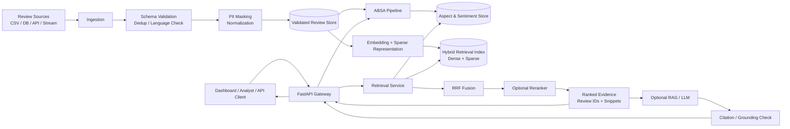
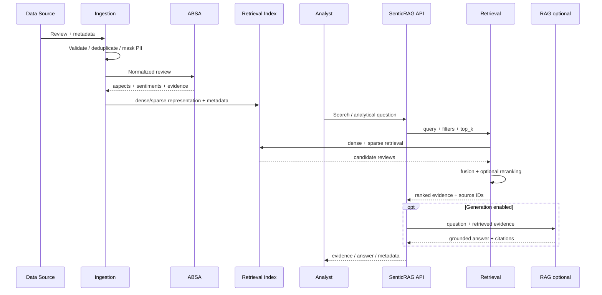
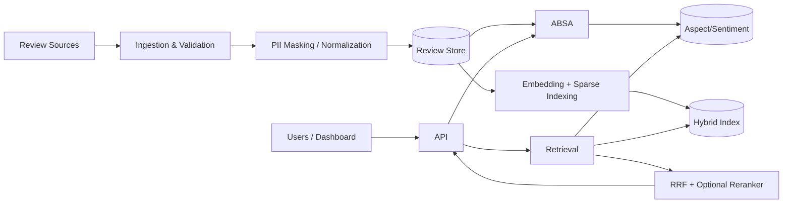
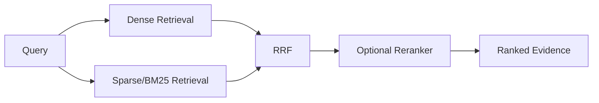

# Nghiên cứu chuyên sâu: Thiết kế `GIOI_THIEU_SAN_PHAM_VI.md` cho SenticRAG với ABSA và Retrieval

## Tóm tắt điều hành

**Kết luận quan trọng nhất:** `GIOI_THIEU_SAN_PHAM_VI.md` **không nên là một user story**, nhưng cũng **không nên chỉ là một problem description**. Hình thức phù hợp nhất với dự án là một **Problem-led Product Specification** — tài liệu giới thiệu và đặc tả sản phẩm bắt đầu từ bài toán kinh doanh, sau đó xác định người dùng, giá trị, phạm vi, kiến trúc mức cao, contract của từng module, các user story đại diện, acceptance criteria, yêu cầu phi chức năng, dữ liệu, vận hành và cách đo thành công.

Lý do là user story được thiết kế để biểu diễn một phần chức năng tương đối nhỏ, có giá trị và đủ nhỏ để triển khai/kiểm thử; tiêu chí INVEST còn yêu cầu story phải Independent, Negotiable, Valuable, Estimable, Small và Testable. Trong khi đó, Product Goal và Product Backlog tồn tại ở mức cao hơn để mô tả trạng thái tương lai của sản phẩm và phân rã nó thành các hạng mục nhỏ hơn. Vì vậy, biến toàn bộ `GIOI_THIEU_SAN_PHAM_VI.md` thành một user story sẽ trộn lẫn **product vision** với **implementation backlog**. citeturn11search1turn11search7

Ba tài liệu hiện tại cũng cho thấy cần tách rõ mục đích tài liệu. File `GIOI_THIEU_SAN_PHAM_VI.md` hiện mô tả một **“Trợ Lý Ảo Kiosk TMA”** theo hướng sales/demo, không phải SenticRAG. fileciteturn0file0 Trong khi đó, `README.md` xác định SenticRAG là hệ thống phân tích phản hồi với **ABSA, hybrid retrieval Dense + BM25, RRF, reranking, citation**, cùng các service `/predict`, `/stats`, `/ask`. fileciteturn0file2 `Final_project(2).md` tiếp tục đặt SenticRAG vào target architecture gồm FastAPI, Postgres/Redis/Qdrant, pipelines, evaluation, Docker, observability và production deployment, đồng thời nói rõ một số phần là **target state chứ chưa được audit/xác minh như implementation hiện hữu**. fileciteturn0file1

Do đó, tôi khuyến nghị **thay nội dung** của `GIOI_THIEU_SAN_PHAM_VI.md`, không mở rộng tài liệu kiosk hiện tại.

**Định vị tài liệu nên là:**

> `GIOI_THIEU_SAN_PHAM_VI.md` = “Tài liệu giới thiệu sản phẩm + đặc tả mức sản phẩm”, giải thích **vì sao sản phẩm tồn tại, ai sử dụng, module làm gì, contract là gì, thế nào được coi là đạt**.
> `README.md` = tài liệu kỹ thuật dành cho developer.
> `docs/architecture/*` = chi tiết kiến trúc.
> `docs/model_cards/*` = model behavior/evaluation.
> `docs/data_cards/*` = nguồn dữ liệu và governance.
> `docs/runbooks/*` = vận hành.

**Bài toán sản phẩm đề xuất:**

> Doanh nghiệp có lượng lớn phản hồi khách hàng dạng văn bản nhưng khó biến chúng thành thông tin có cấu trúc và bằng chứng có thể truy nguyên. SenticRAG biến phản hồi thô thành **aspect + sentiment**, cho phép **truy xuất đúng các phản hồi liên quan**, và ở lớp RAG tùy chọn, tạo câu trả lời có **citation về review gốc**.

Cách định nghĩa này phù hợp với ABSA kinh điển: SemEval-2014 phân tách bài toán theo aspect/aspect category và polarity thay vì chỉ gán một sentiment cho toàn văn bản. citeturn11search8 Nó cũng phù hợp với nguyên lý RAG: hệ thống kết hợp kiến thức tham số với nguồn tri thức truy xuất được, nhằm cải thiện khả năng cập nhật kiến thức và provenance. citeturn14search7

**Các giả định được sử dụng trong báo cáo:**

| Giả định                                                                                  | Căn cứ / trạng thái                                                                                                                                                                   |
| -------------------------------------------------------------------------------------------- | ----------------------------------------------------------------------------------------------------------------------------------------------------------------------------------------- |
| Dữ liệu chính là review/feedback khách hàng                                            | Suy ra từ README và blueprint của SenticRAG. fileciteturn0file2                                                                                                                  |
| Tiếng Việt là ngôn ngữ chính; có khả năng mở rộng tiếng Anh                      | PhoBERT và taxonomy hiện tại cho thấy trọng tâm tiếng Việt; song ngữ chưa được xác định thành requirement bắt buộc. fileciteturn0file2                           |
| Taxonomy ban đầu gồm`quality`, `price`, `delivery`, `customer_service`            | Theo README hiện tại; cần version hóa taxonomy, không coi đây là ontology cuối cùng. fileciteturn0file2                                                                   |
| Retrieval là module trả về ranked evidence; generation`/ask` là lớp downstream        | Đây là cách tách module tôi đề xuất để retrieval có thể đánh giá độc lập. README hiện có`/ask` và citation. fileciteturn0file2                              |
| FastAPI, Qdrant, Redis/Postgres là target stack                                             | Được mô tả trong hai tài liệu dự án. fileciteturn0file1 fileciteturn0file2                                                                                           |
| Chưa có số liệu production về QPS, corpus size, hardware, latency hay F1/Recall         | Không có benchmark xác minh trong các tài liệu được cung cấp; các ngưỡng số phía dưới là**mục tiêu khởi điểm đề xuất**, phải thay bằng benchmark thật. |
| Các claim “giảm 50% chi phí” hoặc “chính xác 100%” chưa có benchmark đính kèm | README hiện chứa các claim như vậy; không nên đưa vào tài liệu product chính thức cho đến khi có bằng chứng reproducible. fileciteturn0file2                     |

## Đánh giá tài liệu hiện tại và cách tổ chức nội dung đúng

Tài liệu kiosk hiện tại làm khá tốt một việc: kể hành trình người dùng và giá trị sản phẩm bằng ngôn ngữ dễ hiểu. Nhưng nó đang mô tả sản phẩm khác hoàn toàn — kiosk thoại song ngữ, ASR/TTS, đặt lịch và dashboard lễ tân. fileciteturn0file0 Với SenticRAG, nên **giữ cách trình bày problem/value-oriented**, nhưng thay domain, stakeholder, workflows và acceptance criteria bằng ABSA + Retrieval.

Một `GIOI_THIEU_SAN_PHAM_VI.md` tốt cho dự án này nên trả lời sáu câu hỏi theo thứ tự:

| Câu hỏi                                 | Nội dung phải có                                                              |
| ----------------------------------------- | -------------------------------------------------------------------------------- |
| **Why?**                            | Bài toán khách hàng/doanh nghiệp và hậu quả nếu không giải quyết     |
| **Who?**                            | Ai sử dụng, ai hưởng lợi, ai chịu trách nhiệm                            |
| **What?**                           | ABSA và Retrieval làm gì / không làm gì                                    |
| **How does information flow?**      | Input, output, data source, pipeline, API, integration                           |
| **How good is good enough?**        | Business KPI, ML metrics, retrieval metrics, NFR, acceptance criteria            |
| **How do we trust and operate it?** | Data governance, privacy, security, monitoring, testing, deployment, limitations |

Đây cũng là điểm khác biệt giữa **user story** và **product specification**. Scrum Guide mô tả Product Goal là trạng thái tương lai của sản phẩm; Product Backlog sau đó được refinement thành các item nhỏ và chính xác hơn. Một sản phẩm có boundary, stakeholder và user/customer rõ ràng. citeturn11search1 User story vì thế nên được đặt **bên trong section của mỗi module**, đóng vai trò ví dụ end-to-end và nguồn để tạo backlog, không phải làm khung cho toàn bộ file.

Một cấu trúc tài liệu hợp lý là:

```text
GIOI_THIEU_SAN_PHAM_VI.md
│
├── Tóm tắt điều hành
├── Bài toán, bối cảnh và giá trị
├── Phạm vi và giả định
├── Người dùng / stakeholder
├── Mục tiêu và chỉ số thành công
├── Kiến trúc tổng quan
│
├── Module ABSA
│   ├── Mục đích
│   ├── Stakeholder
│   ├── Input / Output contract
│   ├── Dữ liệu
│   ├── Pipeline
│   ├── Scenarios
│   ├── User stories
│   ├── Acceptance criteria
│   ├── NFR
│   ├── API / integration
│   ├── Deployment
│   ├── Monitoring
│   └── Testing
│
├── Module Retrieval
│   └── [cùng cấu trúc]
│
├── Data governance & ethics
├── Security & privacy
├── Deployment & observability
├── Testing & release gates
├── Roadmap / activities
├── Limitations & risks
└── References
```

Điều quan trọng là **không biến file này thành README thứ hai**. README hiện đã chứa repository layout, quickstart và Gitflow. fileciteturn0file2 `Final_project(2).md` còn chứa chi tiết sâu về EKS, Helm, Terraform, ECR, CI/CD và production runbooks. fileciteturn0file1 Trong `GIOI_THIEU_SAN_PHAM_VI.md`, chỉ nên mô tả những chi tiết kỹ thuật nào ảnh hưởng trực tiếp đến product contract hoặc acceptance.

Một câu mở đầu phù hợp hơn tài liệu kiosk hiện tại là:

```markdown
# SenticRAG — Nền tảng Phân tích Cảm xúc Theo Khía cạnh
# và Truy xuất Trí tuệ Phản hồi Khách hàng

> SenticRAG giúp doanh nghiệp chuyển hàng nghìn phản hồi khách hàng
> dạng văn bản thành thông tin có cấu trúc theo từng khía cạnh,
> tìm lại bằng chứng liên quan và hỗ trợ trả lời câu hỏi có khả năng
> truy nguyên về phản hồi gốc.

SenticRAG gồm hai năng lực cốt lõi:

1. **ABSA (Aspect-Based Sentiment Analysis):**
   xác định khách hàng đang nói về khía cạnh nào và cảm xúc đối với
   từng khía cạnh.

2. **Retrieval:**
   tìm và xếp hạng những phản hồi/bằng chứng liên quan nhất cho
   một câu hỏi hoặc nhu cầu phân tích.

Lớp RAG có thể sử dụng các kết quả Retrieval làm bằng chứng để
tạo câu trả lời có trích dẫn; tuy nhiên Retrieval được thiết kế và
đánh giá như một module độc lập.
```

Tôi cũng khuyến nghị thay những từ như **“production-ready”, “enterprise-grade”, “100% chính xác”, “triệt tiêu hallucination”, “giảm 50% chi phí”** bằng các phát biểu có điều kiện và metric đo được. Blueprint hiện tại đã thận trọng xác định nhiều phần là target state và các benchmark chưa được cung cấp. fileciteturn0file1 Một product document tốt nên nói “mục tiêu”, “đã đo”, “chưa đo”, “version nào”, thay vì biến aspiration thành fact.

## Đặc tả cấp dự án và kiến trúc đề xuất

**Mục tiêu cấp sản phẩm** nên được viết theo outcome, không theo công nghệ:

> **Product Goal:** Giúp đội Product, Customer Experience, Customer Support và Business Analyst hiểu *khách hàng đang nói về vấn đề gì, cảm xúc ra sao, bằng chứng cụ thể nằm ở đâu*, với kết quả đủ chính xác, nhanh, có thể truy nguyên và quản trị được để hỗ trợ quyết định.

Đó là abstraction tốt hơn “xây PhoBERT + Qdrant”, vì model hoặc database có thể đổi mà Product Goal không đổi. Tương tự, Scrum Guide xem Product Goal là objective dài hạn còn implementation details nằm ở backlog. citeturn11search1

**Stakeholder map đề xuất:**

| Stakeholder                  | Giá trị nhận được                                | Điều họ cần tin tưởng                              |
| ---------------------------- | ------------------------------------------------------ | -------------------------------------------------------- |
| Customer Experience Manager  | Biết vấn đề tiêu cực tập trung ở aspect nào   | Aspect/sentiment đủ chính xác, có drill-down review |
| Product Manager              | Tìm pain point theo sản phẩm/phiên bản/thời gian | Filter đúng, kết quả có provenance                  |
| Customer Support             | Tìm nhanh những phản hồi tương tự               | Retrieval nhanh và phù hợp                            |
| Business Analyst             | Phân tích trend, cohort, nguyên nhân               | Dữ liệu có lineage và taxonomy ổn định            |
| Data Scientist / ML Engineer | Train, evaluate và cải thiện ABSA/retrieval         | Dataset/version/model/eval reproducible                  |
| Data Engineer                | Ingest, validate, index dữ liệu                      | Schema rõ và failure handling rõ                      |
| Platform/SRE                 | Chạy service ổn định                               | SLO, metrics, tracing, rollback                          |
| Security/Privacy/Legal       | Giảm rủi ro dữ liệu cá nhân và AI               | Access control, retention, audit, governance             |
| Management                   | Đo ROI và adoption                                   | KPI business, không chỉ model accuracy                 |

**Success metrics phải có bốn tầng**, tránh lỗi phổ biến “F1 cao = sản phẩm thành công”:

| Tầng     | Metric nên dùng                                                     | Mục tiêu ví dụ                                                        |
| --------- | --------------------------------------------------------------------- | ------------------------------------------------------------------------- |
| Business  | thời gian từ câu hỏi → insight, % insight có evidence, adoption | giảm thời gian phân tích thủ công; mục tiêu số cần đo baseline |
| ABSA      | Macro-F1, per-aspect F1, confusion matrix, coverage                   | ví dụ MVP Macro-F1 ≥ 0,80*                                             |
| Retrieval | Recall@K, nDCG@K/MRR, zero-result rate, citation validity             | ví dụ Recall@10 ≥ 0,85*                                                |
| System    | p95 latency, throughput, availability, error rate, index freshness    | ví dụ ABSA p95 ≤ 300 ms*, Retrieval p95 ≤ 250 ms*                     |
| Data      | schema rejection, duplicate rate, PII leakage, label agreement, drift | PII trong application logs = 0 theo test suite*                           |

\* **Các con số trên là giả định planning cho MVP, không phải benchmark hiện hữu của SenticRAG.** Tốt nhất giữ placeholder `[TBD_AFTER_BASELINE]` trong bản đầu và khóa giá trị sau benchmark sprint đầu tiên.

ISO/IEC 25010:2023 định nghĩa product quality model với chín characteristic và đặc biệt cho phép dùng mô hình này khi xác định requirements, testing objectives, quality-control criteria và acceptance criteria. Vì thế, NFR không nên chỉ có latency mà cần nhìn cả reliability, security, maintainability và các thuộc tính chất lượng khác. citeturn12search1turn12search12

**Kiến trúc đề xuất:**



Đây gần với target architecture hiện đã được mô tả trong README và production blueprint: ingestion/validation, ABSA, embeddings, Qdrant, retrieval, citation, API và observability là các thành phần riêng biệt. fileciteturn0file1 fileciteturn0file2 Về retrieval, Qdrant hiện hỗ trợ hybrid dense + sparse và RRF, phù hợp với architecture đã chọn cho SenticRAG. citeturn11search2turn11search6

**Luồng dữ liệu end-to-end:**



Phần Retrieval nên vẫn hoạt động hữu ích khi LLM tắt. Điều này giảm coupling, cho phép benchmark relevance độc lập, và tránh việc “câu trả lời nghe hợp lý” che đi retrieval kém. Đây là một design recommendation; nguyên lý RAG ban đầu cũng tách việc truy xuất non-parametric memory ra khỏi generation. citeturn14search7

## Đặc tả module ABSA

ABSA nên được mô tả như một **product capability có contract rõ**, không phải “model PhoBERT”.

SemEval-2014 định nghĩa ABSA quanh việc nhận diện target/aspect và polarity tương ứng, cho thấy lý do một review như “máy đẹp nhưng giao hàng quá chậm” không thể được biểu diễn tốt bởi một nhãn sentiment duy nhất. citeturn11search8 Với tiếng Việt, PhoBERT là một mô hình tiền huấn luyện đơn ngữ tiếng Việt được công bố bởi VinAI và ACL, do đó là candidate hợp lý để benchmark cho encoder-based ABSA; tuy nhiên không có cơ sở để tuyên bố PhoBERT mặc định tốt nhất cho dữ liệu SenticRAG nếu chưa benchmark chính dataset đó. citeturn12search0

**Mục đích nên ghi trong tài liệu:**

> Module ABSA biến một review không cấu trúc thành danh sách các **khía cạnh được đề cập**, **sentiment đối với từng khía cạnh**, mức confidence và — nếu cấu hình — đoạn text làm bằng chứng. Kết quả phục vụ dashboard, analytics, trend detection, filtering và downstream Retrieval/RAG.

**Stakeholder chính:** CX, Product Manager, BA, Support, Data Science. CX/Product hưởng lợi từ aggregate insight; Support/BA hưởng lợi từ drill-down; ML team dùng output quality metrics để cải thiện model.

**Input contract đề xuất:**

```json
{
  "review_id": "RV-000123",
  "text": "Máy rất đẹp nhưng giao hàng quá chậm.",
  "language": "vi",
  "metadata": {
    "product_id": "P01",
    "channel": "ecommerce",
    "rating": 3,
    "created_at": "2026-09-20T10:00:00+07:00"
  }
}
```

Các field tối thiểu nên là `review_id` và `text`; metadata không nên bị model phụ thuộc ngầm nếu không được ghi rõ trong model card.

**Output contract đề xuất:**

```json
{
  "review_id": "RV-000123",
  "language": "vi",
  "taxonomy_version": "aspect-v1",
  "model_version": "absa-phobert-2026-09-001",
  "aspects": [
    {
      "aspect": "product_quality",
      "sentiment": "positive",
      "confidence": 0.91,
      "evidence": "Máy rất đẹp"
    },
    {
      "aspect": "delivery",
      "sentiment": "negative",
      "confidence": 0.97,
      "evidence": "giao hàng quá chậm"
    }
  ]
}
```

Nên trả `model_version` và `taxonomy_version`, bởi nếu taxonomy hoặc model thay đổi mà output schema không thể truy nguyên version thì analytics lịch sử sẽ rất khó giải thích.

**Nguồn dữ liệu.** Production data nên ưu tiên dữ liệu do tổ chức sở hữu hoặc có quyền xử lý, được version hóa và có lineage. Với nghiên cứu tiếng Việt, UIT-ViSFD là nguồn tham khảo hữu ích: repository công bố 11.122 feedback smartphone, 10 aspects và 3 polarities, chia train/dev/test; tuy nhiên tác giả cũng yêu cầu công ty liên hệ khi sử dụng dataset cho mục đích thương mại. Vì vậy không nên ghi “public dataset = free for commercial production”. citeturn12search2

**Processing pipeline nên ghi rõ:**

```text
Raw review
   ↓
Schema validation
   ↓
PII masking
   ↓
Unicode / whitespace normalization
   ↓
Language detection / routing
   ↓
Aspect detection
   ↓
Sentiment per detected aspect
   ↓
Optional evidence-span extraction
   ↓
Confidence / schema validation
   ↓
Store + API response
   ↓
Monitoring / drift statistics
```

Taxonomy phải là artifact versioned, ví dụ:

```yaml
taxonomy_version: aspect-v1

aspects:
  - product_quality
  - price
  - delivery
  - customer_service

sentiments:
  - positive
  - neutral
  - negative
```

Bốn aspect trên xuất phát từ định hướng hiện tại trong README chứ chưa được chứng minh là ontology hoàn chỉnh cho production. fileciteturn0file2

**So sánh model ABSA:**

| Lựa chọn                   | Điểm mạnh                                                                                        | Hạn chế                                                                          | Compute          | Vai trò khuyến nghị                                                                                    |
| ---------------------------- | --------------------------------------------------------------------------------------------------- | ---------------------------------------------------------------------------------- | ---------------- | --------------------------------------------------------------------------------------------------------- |
| TF-IDF + Logistic Regression | đơn giản, nhanh, dễ tạo baseline và debug                                                     | biểu diễn ngữ nghĩa/ngữ cảnh hạn chế                                       | thấp, CPU       | **Bắt buộc giữ làm baseline**; README đã xác định candidate này. fileciteturn0file2 |
| PhoBERT fine-tuned           | encoder tiền huấn luyện chuyên tiếng Việt; phù hợp để benchmark downstream Vietnamese NLP | train/inference nặng hơn baseline; cần fine-tuning và monitoring               | trung bình      | Candidate chính cho dữ liệu Việt sau benchmark. citeturn12search0                               |
| viBERT-class model           | đã nằm trong candidate set của dự án                                                          | chưa có benchmark SenticRAG được cung cấp                                    | trung bình      | So sánh trên cùng split/eval harness. fileciteturn0file2                                         |
| Multilingual Transformer     | hữu ích nếu corpus thực sự Việt–Anh/code-switching                                           | có thể tốn tài nguyên và không mặc định hơn model Việt                 | trung bình/cao  | Chỉ thêm nếu business requirement xác nhận multilingual                                              |
| LLM structured extraction    | ontology linh hoạt, dễ prototype hoặc hỗ trợ labeling                                          | latency/cost cao hơn, output cần validation và khó kiểm soát hơn classifier | cao/biến động | weak labeling, adjudication hoặc fallback; không chọn mặc định nếu classifier đáp ứng           |

Lưu ý: đây là **decision matrix**, không phải ranking chất lượng đã được đo. Candidate thắng phải được chọn bằng test set versioned, latency benchmark và cost profile trên hardware thực tế.

**Kịch bản sử dụng cụ thể:**

> Trong một tuần có 40.000 review. CX Manager không muốn đọc từng review; họ xem tỷ lệ sentiment âm theo `delivery`, phát hiện spike, drill down vào review gốc, rồi chuyển bằng chứng cho đội vận hành.

> Product Manager lọc `product_id=P01`, aspect `product_quality`, sentiment `negative`, so sánh xu hướng trước/sau release.

> Retrieval có thể dùng aspect/sentiment do ABSA sinh ra như filter để trả lời “Các khiếu nại tiêu cực về giao hàng trong tháng này là gì?”.

**User story ABSA mẫu:**

> **Là một Customer Experience Manager**, tôi muốn hệ thống tự động nhận diện từng khía cạnh được đề cập và sentiment tương ứng trong feedback, **để tôi biết chính xác nguyên nhân nào đang tạo ra trải nghiệm tiêu cực mà không phải đọc thủ công mọi review**.

Story này đủ hướng người dùng và giá trị; implementation như “dùng PhoBERT” không thuộc story. Nguyên tắc INVEST nhấn mạnh user story phải có giá trị, đủ nhỏ và testable. citeturn11search7

**Acceptance criteria ABSA mẫu:**

| ID         | Given / When / Then                                                                           | Tiêu chí                                                                                               |
| ---------- | --------------------------------------------------------------------------------------------- | -------------------------------------------------------------------------------------------------------- |
| ABSA-AC-01 | Given review “Máy đẹp nhưng giao hàng quá chậm”, when`/predict` được gọi, then | output chứa ít nhất`product_quality=positive`, `delivery=negative` theo taxonomy đã phê duyệt |
| ABSA-AC-02 | Given một request hợp lệ                                                                   | response đúng JSON schema và có`review_id`, `model_version`, `taxonomy_version`                |
| ABSA-AC-03 | Given review không chứa aspect trong taxonomy                                               | model không bắt buộc bịa một aspect; behavior`[]`/`other` phải được quy định              |
| ABSA-AC-04 | Given malformed payload                                                                       | API trả lỗi validation có cấu trúc, không chạy inference                                          |
| ABSA-AC-05 | Given evaluation set đã khóa                                                               | Macro-F1 ≥ ngưỡng release;**MVP giả định: 0,80**, phải thay sau baseline                    |
| ABSA-AC-06 | Given critical aspect                                                                         | per-aspect F1 không thấp hơn floor;**MVP giả định: 0,75**                                    |
| ABSA-AC-07 | Given target production hardware                                                              | p95 inference ≤**300 ms giả định**, sau warm-up và với payload length đã quy định        |
| ABSA-AC-08 | Given request có PII                                                                         | raw PII không xuất hiện trong application log sau masking policy                                      |
| ABSA-AC-09 | Given hai model versions                                                                      | dashboard/report có thể xác định output nào do version nào tạo                                   |
| ABSA-AC-10 | Given unsupported language                                                                    | service trả trạng thái rõ ràng thay vì âm thầm áp dụng model Việt                             |

**Integration/API đề xuất:**

```http
POST /v1/absa/predict
POST /v1/absa/predict:batch
GET  /v1/absa/models/current
GET  /v1/absa/taxonomy
GET  /health/ready
```

Batch nên có `max_batch_size` rõ ràng; large offline workloads nên đi qua pipeline/job thay vì một HTTP request khổng lồ.

**Deployment.** TF-IDF baseline có thể chạy CPU rất nhẹ; Transformer cần benchmark CPU/GPU trước khi quyết định node class. Production blueprint hiện đề xuất Dockerized services và tách release/scaling boundaries, nhưng EKS/Helm/Terraform nên được ghi là **target deployment architecture** nếu chưa có evidence deployment thật. fileciteturn0file1

**Observability ABSA** nên theo dõi `request_count`, error rate, p50/p95/p99 inference latency, model/taxonomy version, aspect frequency, predicted-label distribution, confidence distribution, input length, unsupported-language rate và drift indicators. OpenTelemetry hiện hỗ trợ traces, metrics và logs để tạo correlation end-to-end. citeturn14search1

**Testing ABSA:**

| Loại            | Nội dung                                                                                    |
| ---------------- | -------------------------------------------------------------------------------------------- |
| Unit             | normalizer, taxonomy mapping, schema validation, PII masker, post-processing                 |
| Integration      | API → model artifact → output schema → database                                           |
| Data validation  | nulls, duplicates, language, label validity, split leakage, PII                              |
| ML validation    | Macro-F1, per-aspect F1, confusion matrix, slice theo product/channel/text length            |
| Regression       | candidate model không được giảm metric dưới release floor so với production baseline |
| Performance      | p50/p95/p99, throughput, RAM/VRAM, cold/warm behavior                                        |
| Robustness       | typo, emoji, slang, code-switching, negation, rất dài/rất ngắn                           |
| Privacy/security | log-redaction test, auth, unauthorized access, malformed payload                             |

## Đặc tả module Retrieval

Retrieval không nên được mô tả đơn giản là “vector search”. Contract thực sự của module là:

> Với một query và các filter tùy chọn, trả về **tập bằng chứng được xếp hạng**, có `review_id`, snippet, metadata, score/rank và `index_version`, để downstream analytics hoặc RAG có thể kiểm chứng được nguồn.

README hiện đã chọn hướng hybrid Dense + BM25, RRF và reranker trên Qdrant. fileciteturn0file2 Đây là hướng hợp lý cho use case review vì lexical retrieval xử lý tốt exact terms/IDs trong khi dense retrieval bổ sung semantic matching; Qdrant chính thức hỗ trợ kết hợp sparse và dense trong hybrid query. citeturn11search11turn11search6

**Input contract đề xuất:**

```json
{
  "query": "Khách hàng phàn nàn gì về giao hàng trong tháng 9?",
  "top_k": 10,
  "filters": {
    "date_from": "2026-09-01",
    "date_to": "2026-09-30",
    "aspect": ["delivery"],
    "sentiment": ["negative"]
  },
  "rerank": true
}
```

**Output contract đề xuất:**

```json
{
  "query_id": "Q-20260929-001",
  "index_version": "reviews-2026-09-28-v3",
  "latency_ms": 87,
  "hits": [
    {
      "rank": 1,
      "review_id": "RV-002471",
      "score": 0.842,
      "snippet": "Đơn giao chậm hơn lịch dự kiến bốn ngày...",
      "source": "ecommerce",
      "metadata": {
        "product_id": "P01",
        "aspect": ["delivery"],
        "sentiment": ["negative"],
        "created_at": "2026-09-18T08:21:00+07:00"
      }
    }
  ]
}
```

Score không nên được trình bày cho business user như “84,2% đúng”; dense similarity, BM25 score, RRF score và reranker score có ngữ nghĩa khác nhau. RRF được thiết kế để kết hợp các ranked lists mà không yêu cầu các relevance score có cùng scale. citeturn14search0

**Data/index pipeline:**

```text
Validated review
      ↓
Chunking policy
      ↓
Metadata enrichment
      ├── review_id
      ├── product/channel/date
      └── ABSA aspect/sentiment
      ↓
Dense embedding ───────┐
                        ├── Hybrid index
Sparse/BM25 form ──────┘
      ↓
Payload/filter indexes
      ↓
Versioned index
      ↓
Golden-query evaluation
      ↓
Promote index version
```

Với review ngắn, một review có thể là một retrieval unit. Nếu source chuyển thành tài liệu dài, cần explicit chunking strategy. Không nên áp dụng arbitrary chunk size từ tutorial cho mọi loại dữ liệu.

**So sánh Retrieval methods:**

| Phương pháp        | Tốt ở đâu                                                        | Điểm yếu                                                          | Khi phù hợp                                              | Khuyến nghị                                                                                                                                              |
| --------------------- | -------------------------------------------------------------------- | -------------------------------------------------------------------- | ---------------------------------------------------------- | ---------------------------------------------------------------------------------------------------------------------------------------------------------- |
| BM25 / sparse lexical | keyword, tên sản phẩm, mã, phrase cụ thể                       | paraphrase hoặc query khác từ vựng có thể bị miss             | exact-search, baseline                                     | Giữ làm baseline và một nhánh hybrid; BM25 là lexical scoring phổ biến dựa trên term/document statistics. citeturn15search0turn15search5 |
| Dense vector          | semantic similarity, paraphrase                                      | exact ID/từ hiếm có thể không nổi bật; cần embedding compute | natural-language search                                    | Dùng làm semantic branch                                                                                                                                 |
| Hybrid Dense + Sparse | bắt cả semantic và lexical evidence                               | phức tạp/index lớn hơn, cần fusion                              | corpus review có cả query tự nhiên lẫn entity/keyword | **Default recommendation** cho SenticRAG; Qdrant hỗ trợ cả hai representations. citeturn11search11                                          |
| Hybrid + RRF          | fusion theo rank, không yêu cầu score scales tương thích       | thêm tuning candidate depth/rank window                             | khi có ≥2 retrievers                                     | **Default fusion** trước khi có bằng chứng lựa chọn khác. citeturn14search0turn11search6                                             |
| Hybrid + reranker     | có thể cải thiện thứ tự top candidates nếu reranker phù hợp | thêm model calls và latency                                        | accuracy-sensitive top-N                                   | Bật chỉ khi held-out eval chứng minh gain; Qdrant cũng khuyến nghị đo reranking trên evaluation data. citeturn11search10                     |

**So sánh indexing:**

| Index                  | Mục tiêu                              | Trade-off                                       | Vai trò trong SenticRAG                                                                                                                        |
| ---------------------- | --------------------------------------- | ----------------------------------------------- | ----------------------------------------------------------------------------------------------------------------------------------------------- |
| Inverted/sparse index  | lexical retrieval                       | không thay thế semantic vector retrieval      | BM25/sparse branch                                                                                                                              |
| Exact/full vector scan | exact nearest-neighbor baseline         | chi phí tăng mạnh theo corpus                | benchmark nhỏ hoặc correctness reference                                                                                                      |
| HNSW                   | approximate dense nearest-neighbor      | cần RAM/index build và tuning recall–latency | lựa chọn dense index mặc định khi dùng Qdrant; Qdrant hiện dùng HNSW cho dense vector index. citeturn15search12                   |
| Payload index          | filter theo aspect/date/product/channel | tăng storage/index-management                  | rất quan trọng nếu filter-heavy; Qdrant khuyến nghị tạo index cho filter fields trước ingestion. citeturn11search5turn15search9 |

Các tham số HNSW như `m`, `ef_construct` và query-time `ef` ảnh hưởng build/search behavior; chúng phải được tune qua benchmark chứ không copy blind từ project khác. citeturn15search12

**User story Retrieval mẫu:**

> **Là một Product Manager**, tôi muốn nhập câu hỏi “Khách hàng phàn nàn gì về giao hàng của P01 trong tháng này?” và nhận các phản hồi liên quan nhất kèm nguồn gốc, **để tôi có thể kiểm chứng insight trước khi ra quyết định**.

Một story cho analyst:

> **Là một Business Analyst**, tôi muốn filter kết quả theo thời gian, sản phẩm, aspect và sentiment, **để cùng một query có thể được phân tích theo cohort mà không phải export toàn bộ dữ liệu và lọc thủ công**.

Một story cho downstream RAG:

> **Là một người dùng `/ask`**, tôi muốn mọi luận điểm quan trọng trong câu trả lời có liên kết tới review/evidence đã truy xuất, **để tôi phân biệt được nội dung có bằng chứng với suy luận của mô hình**.

**Acceptance criteria Retrieval mẫu:**

| ID        | Acceptance criterion                                                                                                            |
| --------- | ------------------------------------------------------------------------------------------------------------------------------- |
| RET-AC-01 | Request hợp lệ trả`hits[]` theo thứ tự rank và luôn chứa `review_id`, `snippet`, `metadata`, `index_version`  |
| RET-AC-02 | Filter`product_id/aspect/sentiment/date` không trả item vi phạm filter                                                     |
| RET-AC-03 | Với golden query set versioned,**MVP giả định Recall@10 ≥ 0,85**; khóa lại sau baseline                            |
| RET-AC-04 | **MVP giả định nDCG@10 ≥ 0,75** nếu dataset có graded relevance                                                     |
| RET-AC-05 | 100%`review_id` trả ra phải resolve được tới source record hiện hữu                                                   |
| RET-AC-06 | Với query không có bằng chứng đủ tốt, hệ thống cho phép trả empty/insufficient-results thay vì buộc có kết quả |
| RET-AC-07 | Search không reranker có**p95 ≤ 250 ms giả định** trên corpus/hardware baseline đã ghi trong benchmark           |
| RET-AC-08 | Reranker chỉ được enable production nếu quality gain trên held-out set đủ bù latency/cost theo release criterion       |
| RET-AC-09 | Mỗi index build có`index_version`, embedding model version, source-data snapshot/version                                    |
| RET-AC-10 | Index candidate không được promote nếu golden-query regression vượt tolerance                                            |
| RET-AC-11 | Query PII/sensitive logs tuân thủ redaction policy                                                                            |
| RET-AC-12 | Khi index chưa ready/rebuilding, readiness và error response phản ánh đúng trạng thái, không trả silent partial index |

Không nên đặt arbitrary `score_threshold` trước khi có labeled data. Qdrant cảnh báo threshold áp dụng cho fused score có thể âm thầm cắt result list nếu giá trị được copy từ dense-only search; threshold nên dựa trên evaluation thực tế. citeturn11search5

**API đề xuất:**

```http
POST /v1/retrieval/search
POST /v1/retrieval/search:batch
GET  /v1/retrieval/indexes/current
GET  /v1/retrieval/indexes/{version}/status

POST /v1/ask
GET  /health/ready
```

Phân biệt rõ:

```text
/retrieval/search
    query
      ↓
    ranked evidence
      ↓
    DONE

/ask
    query
      ↓
    retrieval
      ↓
    evidence
      ↓
    LLM
      ↓
    citation validation
      ↓
    natural-language answer
```

Điều này quan trọng vì Retrieval quality và Generation quality là hai failure domains khác nhau. Blueprint hiện cũng đề xuất đánh giá retrieval với Recall@K/MRR/citation và generation với groundedness riêng. fileciteturn0file1

**Monitoring Retrieval** nên bao gồm end-to-end latency và stage latency (`embedding_ms`, `sparse_ms`, `dense_ms`, `fusion_ms`, `rerank_ms`), zero-result rate, result count, index age, indexed document count, `index_version`, filter usage, cache hit, dependency error và offline retrieval metrics. Với distributed services, trace propagation cho phép liên hệ các span của cùng request xuyên nhiều service. citeturn14search1turn14search12

**Testing Retrieval:**

| Loại            | Tests                                                                             |
| ---------------- | --------------------------------------------------------------------------------- |
| Unit             | query normalization, filter construction, RRF, rank handling, citation formatting |
| Integration      | ingestion → Qdrant → query → source resolution                                 |
| Contract         | stable request/response schema                                                    |
| Retrieval eval   | Recall@K, MRR, nDCG@K trên golden queries                                        |
| Filter eval      | exact correctness của product/aspect/date filters                                |
| Index validation | point count, vector/index state, embedding/index version compatibility            |
| Regression       | compare candidate vs current production index                                     |
| Performance      | cold/warm p50/p95/p99, concurrency, corpus-size scaling                           |
| Failure          | Qdrant unavailable, timeout, partial index, malformed filter                      |
| Security         | unauthorized queries, injection-like metadata/filter payloads, PII logging        |

## Yêu cầu xuyên suốt: dữ liệu, NFR, bảo mật, triển khai và vận hành

**Data governance** không nên nằm như một đoạn “bảo mật dữ liệu” chung chung. Mỗi dataset/index/model phải trả lời được:

```text
Nguồn từ đâu?
Ai sở hữu?
Mục đích sử dụng?
Có quyền sử dụng / train / commercial use không?
Có PII không?
PII nào được giữ, mask hay xóa?
Ai được truy cập?
Version nào?
Retention bao lâu?
Có thể xóa một data subject/source record như thế nào?
Model/index nào được tạo từ version dữ liệu nào?
```

Tại Việt Nam, Luật Bảo vệ dữ liệu cá nhân số 91/2025/QH15 được ban hành ngày 26/06/2025 và có hiệu lực từ **01/01/2026**. Vì dự án xử lý review có thể chứa tên, số điện thoại, địa chỉ, account identifiers hoặc nội dung cá nhân, data governance cần được coi là product requirement chứ không chỉ là security hardening. citeturn13search0turn13search14

Tính đến ngày 29/09/2026, Luật Trí tuệ nhân tạo số 134/2025/QH15 cũng đã có hiệu lực từ **01/03/2026**. Nguồn Chính phủ mô tả định hướng lấy con người làm trung tâm, an toàn, quyền con người và kiểm soát của con người, đồng thời nêu các hành vi AI gây phân biệt đối xử hoặc sử dụng trái pháp luật. Việc xác định nghĩa vụ cụ thể của SenticRAG phụ thuộc use case, data và risk classification thực tế, vì vậy product documentation nên có owner pháp lý/compliance thay vì tự tuyên bố “tuân thủ đầy đủ”. citeturn13search1turn13search4

Một bảng governance có thể ghi:

| Asset          | Owner      | Sensitivity            | Retention                 | Versioning                     | Controls              |
| -------------- | ---------- | ---------------------- | ------------------------- | ------------------------------ | --------------------- |
| Raw reviews    | Data Owner | có thể chứa PII     | `[TBD]`                 | source snapshot                | restricted access     |
| Masked reviews | Data/ML    | internal               | `[TBD]`                 | dataset manifest               | role-based            |
| Labels         | ML/Product | internal               | theo dataset              | label schema version           | audit changes         |
| ABSA model     | ML         | internal IP            | đến khi deprecated      | model version/hash             | controlled promotion  |
| Embeddings     | ML/Data    | derived sensitive data | cùng/lower than source   | embedding model + data version | controlled access     |
| Qdrant index   | Platform   | derived data           | rebuildable               | index version                  | backup/access control |
| Query logs     | Platform   | có thể nhạy cảm    | ngắn và rõ mục đích | daily partitions               | redact/hash PII       |

**Đạo đức và Responsible AI.** NIST AI RMF tổ chức AI risk management thành Govern, Map, Measure và Manage, nhấn mạnh quản trị rủi ro xuyên vòng đời thay vì chỉ đánh giá model trước release. citeturn12search3turn12search7 ISO/IEC 42001:2023 cũng đặt AI trong một management system với risk, governance, transparency và continuous improvement. citeturn12search8 Với SenticRAG, các điểm cần ghi rõ gồm bias theo dialect/channel/product group, việc sentiment model có thể sai, không sử dụng sentiment để suy đoán thuộc tính nhạy cảm không có căn cứ, human review cho quyết định quan trọng, khả năng truy nguyên evidence và cơ chế correction/removal dữ liệu.

**NFR matrix đề xuất:**

| Nhóm           | Requirement đề xuất                                                                           |
| --------------- | ------------------------------------------------------------------------------------------------ |
| Performance     | ABSA p95 ≤ 300 ms*; Retrieval no-rerank p95 ≤ 250 ms*                                          |
| Throughput      | benchmark QPS trên hardware đã khóa; không ghi “high scale” nếu chưa đo                |
| Scalability     | scale service và index độc lập; benchmark ít nhất current corpus, 3× và 10× data volume |
| Availability    | API availability target 99,5–99,9%* tùy business criticality                                   |
| Reliability     | timeout/retry/fallback rõ; no silent partial result                                             |
| Security        | authentication, authorization, least privilege, TLS, rate limit, secret management               |
| Privacy         | data minimization, PII masking/redaction, access/retention/deletion policy                       |
| Traceability    | mọi output có model/index/taxonomy version khi liên quan                                      |
| Maintainability | typed contracts, versioned config, CI tests, reproducible artifacts                              |
| Portability     | Docker image; environment-specific configuration ngoài image                                    |
| Observability   | traces + metrics + logs; release/model/index dimensions                                          |
| Recoverability  | backup/snapshot/rebuild procedure; previous model/index có thể rollback                        |
| Data freshness  | index freshness SLO, ví dụ <15 phút batch* hoặc theo product requirement                     |

\* Giả định starter target.

ISO/IEC 25010:2023 phù hợp để dùng như checklist tránh bỏ sót quality requirements thay vì chỉ tối ưu performance. citeturn12search12

**Security/privacy design:**

```text
Internet / Internal Client
          ↓
 Auth + Rate Limit
          ↓
       API Layer
          ↓
  ┌───────┴────────┐
 ABSA          Retrieval
  │                 │
 Model          Qdrant Index
  │                 │
  └──── audit/telemetry ────┐
                             ↓
                    Redacted Observability

Raw data → PII masking → internal processed data
              │
              └── sensitive mapping access restricted
```

Không log nguyên review theo mặc định chỉ vì nó “tiện debug”. Log nên tập trung vào request IDs, model/index versions, timings, error categories và non-sensitive aggregate dimensions.

**Deployment recommendation theo mức trưởng thành:**

| Stage                   | ABSA                                | Retrieval                        | Infrastructure                            |
| ----------------------- | ----------------------------------- | -------------------------------- | ----------------------------------------- |
| Developer               | local artifact                      | local Qdrant                     | Docker Compose                            |
| CI                      | lightweight/test artifact           | ephemeral test index             | isolated runner                           |
| Staging                 | release candidate                   | staging index snapshot           | containerized environment                 |
| Production              | immutable model/application version | promoted immutable index version | target Kubernetes/EKS nếu thực sự cần |
| Batch training/indexing | separate job                        | separate build/index job         | independent scheduling                    |

Production blueprint hiện đã lựa chọn EKS, Helm, Terraform, ECR, S3 artifacts và independent scaling boundaries như target state. fileciteturn0file1 Tuy nhiên `GIOI_THIEU_SAN_PHAM_VI.md` nên nói “deployment target” thay vì mô tả hàng trăm dòng Kubernetes YAML.

**Observability hierarchy:**

```text
Business
    time-to-insight / adoption / issue trends
        ↓
ML quality
    F1 / Recall@K / nDCG / drift
        ↓
Application
    latency / errors / throughput / versions
        ↓
Dependencies
    Qdrant / DB / Redis / external LLM
        ↓
Infrastructure
    CPU / memory / GPU / disk / network
```

OpenTelemetry hỗ trợ traces, metrics và logs; đây là abstraction hợp lý để liên kết request qua ABSA, Retrieval và downstream RAG. citeturn14search1

**Release gate nên yêu cầu đồng thời software + ML/data quality:**

```text
Code changes
   ↓
lint / type / unit
   ↓
integration tests
   ↓
data validation
   ↓
ABSA or retrieval regression
   ↓
security checks
   ↓
staging smoke
   ↓
latency/load gate
   ↓
promotion
   ↓
post-deploy monitoring
```

Một model có Macro-F1 cao nhưng làm p95 tăng gấp năm lần không mặc nhiên là release tốt. Tương tự, index mới có latency nhanh nhưng Recall@10 giảm mạnh cũng không nên được promote. Đây là lý do quality gate phải multi-dimensional.

## Mẫu `GIOI_THIEU_SAN_PHAM_VI.md` sẵn sàng sử dụng

Dưới đây là skeleton tôi khuyến nghị sử dụng làm bản mới. Nó cố ý giữ product document đủ cụ thể để BA/Product/Engineer thống nhất contract, nhưng không lặp toàn bộ implementation guide.

```markdown
---
title: "SenticRAG — Giới thiệu sản phẩm và đặc tả mức sản phẩm"
language: "vi"
status: "draft"
version: "0.1.0"
owner: "Product / AI Engineering"
last_updated: "2026-09-29"
---

# SenticRAG — Phân tích Cảm xúc Theo Khía cạnh
# và Truy xuất Trí tuệ Phản hồi Khách hàng

> **Trạng thái tài liệu:** Draft
>
> **Mục đích:** Giải thích bài toán, người dùng, giá trị,
> contract và tiêu chí thành công của SenticRAG.
>
> Các chi tiết implementation sâu được quản lý tại
> `docs/architecture/`, `docs/model_cards/`,
> `docs/data_cards/` và `docs/runbooks/`.

## Tóm tắt điều hành

SenticRAG giúp tổ chức biến lượng lớn phản hồi khách hàng
dạng văn bản thành insight có cấu trúc và bằng chứng có thể
truy nguyên.

Sản phẩm có hai năng lực cốt lõi:

- **ABSA:** xác định khách hàng đang đề cập tới khía cạnh nào
  và cảm xúc đối với từng khía cạnh.
- **Retrieval:** tìm và xếp hạng các phản hồi liên quan nhất
  đối với một truy vấn và tập filter.

Một lớp RAG tùy chọn có thể dùng evidence do Retrieval trả về
để tạo câu trả lời có citation.

## Bài toán cần giải quyết

Các đội Product, Customer Experience và Business Analysis
thường phải xử lý lượng lớn review không cấu trúc.

Những câu hỏi điển hình:

- Khách hàng đang không hài lòng về vấn đề nào?
- Vấn đề giao hàng tăng hay giảm trong tháng này?
- Những bằng chứng cụ thể nào hỗ trợ kết luận đó?
- Các phản hồi nào tương tự câu hỏi/phàn nàn hiện tại?

Đọc và phân loại review hoàn toàn thủ công tốn thời gian,
khó duy trì nhất quán và khó mở rộng.

SenticRAG cung cấp pipeline có thể đo lường và truy nguyên
để biến review thành aspect/sentiment và ranked evidence.

## Phạm vi

### Trong phạm vi

- ingest và validate customer reviews;
- masking dữ liệu cá nhân theo policy;
- ABSA;
- hybrid Retrieval;
- filters theo metadata;
- versioned model/index;
- evaluation;
- API;
- observability;
- optional grounded RAG.

### Ngoài phạm vi hiện tại

- tự động thực hiện quyết định ảnh hưởng trực tiếp tới khách hàng;
- coi sentiment output như kết luận tuyệt đối;
- sử dụng dữ liệu không có quyền xử lý;
- suy luận thuộc tính nhạy cảm từ sentiment.

## Người dùng và stakeholder

| Vai trò | Nhu cầu |
|---|---|
| CX Manager | xem sentiment theo aspect và drill-down |
| Product Manager | hiểu pain point của từng sản phẩm |
| Business Analyst | tìm evidence và trend |
| Customer Support | tìm feedback tương tự |
| Data/ML | huấn luyện và đánh giá model |
| Platform/SRE | vận hành ổn định |
| Security/Privacy | kiểm soát dữ liệu và quyền truy cập |

## Mục tiêu sản phẩm

**Product Goal:**

Giúp đội nghiệp vụ trả lời:

> "Khách hàng đang nói gì, cảm xúc ra sao,
> và bằng chứng cụ thể nằm ở đâu?"

với kết quả có thể đo lường, truy nguyên và quản trị.

## Chỉ số thành công

| Nhóm | Metric | Target |
|---|---|---|
| Business | time-to-insight | TBD |
| ABSA | Macro-F1 | TBD sau baseline |
| ABSA | per-aspect F1 | TBD |
| Retrieval | Recall@10 | TBD |
| Retrieval | nDCG@10 | TBD |
| System | ABSA p95 latency | TBD |
| System | Retrieval p95 latency | TBD |
| Reliability | error rate | TBD |
| Data | PII leakage in logs | 0 theo test suite |

Không công bố target chính thức trước khi benchmark trên
dataset và hardware đại diện cho môi trường production.

## Kiến trúc tổng quan



## Module ABSA

### Mục đích

Chuyển review thành một hoặc nhiều aspect và sentiment
tương ứng.

### Input

```json
{
  "review_id": "RV-000123",
  "text": "Máy đẹp nhưng giao hàng quá chậm.",
  "language": "vi",
  "metadata": {
    "product_id": "P01"
  }
}
```

### Output

```json
{
  "review_id": "RV-000123",
  "taxonomy_version": "aspect-v1",
  "model_version": "MODEL_VERSION",
  "aspects": [
    {
      "aspect": "product_quality",
      "sentiment": "positive",
      "confidence": 0.91,
      "evidence": "Máy đẹp"
    },
    {
      "aspect": "delivery",
      "sentiment": "negative",
      "confidence": 0.97,
      "evidence": "giao hàng quá chậm"
    }
  ]
}
```

### Taxonomy ban đầu

```yaml
aspects:
  - product_quality
  - price
  - delivery
  - customer_service

sentiments:
  - positive
  - neutral
  - negative
```

Taxonomy này là giả định ban đầu và phải được xác nhận
với domain owner.

### User story

**Là một Customer Experience Manager,**
tôi muốn hệ thống tự động phân loại cảm xúc theo từng
khía cạnh,
**để tôi biết chính xác nguyên nhân nào tạo ra feedback
tiêu cực mà không phải đọc tất cả review thủ công.**

### Acceptance criteria

- response tuân thủ schema;
- mọi output có model/taxonomy version;
- review có nhiều aspect có thể trả nhiều labels;
- không bắt buộc tạo aspect khi không có evidence;
- Macro-F1 và per-aspect F1 phải vượt release threshold;
- latency phải đạt target trên hardware được ghi nhận;
- raw PII không xuất hiện trong logs.

### API

```text
POST /v1/absa/predict
POST /v1/absa/predict:batch
GET  /v1/absa/taxonomy
GET  /v1/absa/models/current
```

### Monitoring

Theo dõi:

- latency;
- error rate;
- model version;
- aspect distribution;
- sentiment distribution;
- confidence distribution;
- data/concept drift;
- PII-redaction failures.

### Testing

- unit tests;
- schema/contract tests;
- integration tests;
- dataset validation;
- offline ML evaluation;
- slice tests;
- regression tests;
- load tests;
- privacy/security tests.

## Module Retrieval

### Mục đích

Nhận query và filters, sau đó trả về các source records
liên quan nhất theo thứ tự relevance.

Retrieval không phụ thuộc bắt buộc vào LLM generation.

### Input

```json
{
  "query": "Khách hàng phàn nàn gì về giao hàng?",
  "top_k": 10,
  "filters": {
    "aspect": ["delivery"],
    "sentiment": ["negative"]
  },
  "rerank": true
}
```

### Output

```json
{
  "query_id": "Q-001",
  "index_version": "INDEX_VERSION",
  "hits": [
    {
      "rank": 1,
      "review_id": "RV-002471",
      "score": 0.842,
      "snippet": "Đơn giao chậm hơn lịch dự kiến...",
      "metadata": {
        "aspect": ["delivery"],
        "sentiment": ["negative"]
      }
    }
  ]
}
```

### Retrieval pipeline



### User story

**Là một Product Manager,**
tôi muốn tìm những review liên quan nhất đến câu hỏi của mình
và xem source gốc,
**để tôi có thể kiểm chứng insight trước khi ra quyết định.**

### Acceptance criteria

- mọi hit có review/source ID;
- filters hoạt động chính xác;
- golden-query Recall@K đạt release threshold;
- index version luôn được trả về;
- không buộc trả kết quả nếu evidence không đủ;
- latency đạt SLO;
- index mới không được promote nếu regression test fail.

### API

```text
POST /v1/retrieval/search
POST /v1/retrieval/search:batch
GET  /v1/retrieval/indexes/current
```

### Monitoring

Theo dõi:

- total retrieval latency;
- embedding latency;
- sparse/dense search latency;
- fusion/reranking latency;
- zero-result rate;
- index freshness;
- index version;
- source-resolution failures;
- Recall@K / nDCG offline.

### Testing

- query/filter unit tests;
- Qdrant integration tests;
- golden-query evaluation;
- index-validation tests;
- regression tests;
- load tests;
- timeout/failure tests.

## Data Governance

Mọi nguồn dữ liệu phải có:

- owner;
- purpose;
- legal/licensing status;
- sensitivity classification;
- PII policy;
- lineage;
- version;
- retention policy;
- access policy;
- deletion procedure.

Model và index artifact phải truy ngược được tới
dataset/config version đã tạo ra chúng.

## Security và Privacy

Thiết kế theo nguyên tắc:

- data minimization;
- least privilege;
- authentication và authorization;
- encryption in transit/at rest;
- secrets không nằm trong source code;
- không log raw PII;
- audit privileged access;
- retention có thời hạn.

Các nghĩa vụ pháp lý cụ thể phải được privacy/legal owner
xác nhận theo deployment context.

## Deployment

Target architecture:

```text
Containerized services
        ↓
Staging
        ↓
Quality / security / latency gates
        ↓
Production
        ↓
Observability
        ↓
Rollback if required
```

ABSA, Retrieval, worker và offline pipelines nên có
release/scaling boundaries phù hợp với workload riêng.

## Release Criteria

Một release chỉ được promote khi:

1. unit/integration tests pass;
2. data validation pass;
3. ML/retrieval regression gates pass;
4. security checks pass;
5. API smoke tests pass;
6. latency/load target pass;
7. artifact versions được ghi nhận;
8. rollback target tồn tại.

## Giới hạn

SenticRAG hỗ trợ ra quyết định, không thay thế hoàn toàn
đánh giá của con người.

ABSA có thể phân loại sai, đặc biệt với sarcasm, slang,
review quá ngắn hoặc domain chưa thấy trong training data.

Retrieval có thể bỏ sót evidence; vì vậy quality phải được
đánh giá trên golden-query set và theo dõi liên tục.

Không sử dụng confidence score như xác suất tuyệt đối nếu
model chưa được kiểm định/calibrate cho mục đích đó.

## Roadmap

| Phase       | Deliverable                           |
| ----------- | ------------------------------------- |
| Discovery   | taxonomy, stakeholder, data inventory |
| Data        | ingestion, validation, labeling rules |
| Baseline    | TF-IDF/BM25 baselines                 |
| ABSA        | candidate models + evaluation         |
| Retrieval   | dense/sparse/hybrid evaluation        |
| Integration | APIs + storage + dashboard            |
| Hardening   | privacy, security, observability      |
| Validation  | UAT, load, regression                 |
| Release     | versioned production candidate        |

## References

Xem danh sách authoritative sources của dự án trong
`docs/references.md`.

```

Cấu trúc trên còn tạo một ranh giới tốt: **acceptance criteria trong product document là externally observable contract**, còn các implementation tasks như “viết class QdrantClient”, “cấu hình Helm chart” hay “fine-tune checkpoint X” nên ở issue/backlog.

## Lộ trình triển khai, nguồn tham khảo và bước tiếp theo

Một lộ trình thực tế cho MVP nên xây baseline trước khi đưa vào các kỹ thuật phức tạp. Thời gian dưới đây là **planning assumption**, không phải cam kết estimate vì chưa biết quy mô đội ngũ, độ sạch dữ liệu và tình trạng repository.

| Giai đoạn | Thời gian giả định | Hoạt động | Exit criteria |
|---|---:|---|---|
| Discovery & product framing | Tuần 1 | stakeholder interviews, problem statement, taxonomy, success metrics, scope | Product Goal + taxonomy v0 + metric definitions |
| Data audit & governance | Tuần 1–2 | inventory, PII, licensing, schemas, labeling policy | data card + validated sample |
| Baselines | Tuần 2–3 | TF-IDF ABSA baseline, BM25 retrieval baseline | reproducible baseline reports |
| ABSA candidates | Tuần 3–5 | PhoBERT/viBERT candidates, error/slice analysis | model candidate vượt agreed gate |
| Retrieval candidates | Tuần 4–6 | dense, hybrid, RRF, optional reranking | golden-query benchmark |
| API & integration | Tuần 5–7 | `/predict`, `/search`, storage/version contracts | E2E staging scenario |
| Quality & operations | Tuần 7–8 | monitoring, privacy tests, latency/load, rollback | release gates green |
| UAT & documentation | Tuần 8–9 | analyst/CX evaluation, docs, limitations | stakeholder sign-off |
| Production hardening | +2–4 tuần nếu cần | HA, autoscaling, disaster recovery, security hardening | production readiness evidence |

Một nguyên tắc quan trọng là **baseline-first**. Với ABSA, giữ TF-IDF/Logistic Regression làm control. Với Retrieval, giữ BM25 làm control. Chỉ thêm Transformer, dense retrieval, hybrid fusion và reranker nếu chúng cho improvement đo được. Qdrant cũng khuyến nghị dùng evaluation results để quyết định tuning và chỉ thêm reranking khi improvement giữ được trên held-out queries. citeturn11search10

**Các bước tiếp theo nên diễn ra theo thứ tự sau:**

| Ưu tiên | Quyết định cần khóa | Artifact tạo ra |
|---|---|---|
| Ngay | đổi `GIOI_THIEU_SAN_PHAM_VI.md` từ kiosk → SenticRAG product specification | document v0.1 |
| Ngay | xác nhận domain và aspect taxonomy với business owner | `aspect_taxonomy_v1.yaml` |
| Ngay | định nghĩa canonical review schema và PII policy | data contract + data card |
| Tiếp theo | dựng ABSA baseline và test split khóa | `absa_baseline_report.json` |
| Tiếp theo | tạo 100–300+ golden retrieval queries với relevance judgments tùy nguồn lực | retrieval eval dataset |
| Sau baseline | benchmark BM25 vs Dense vs Hybrid RRF | retrieval benchmark report |
| Sau benchmark | quyết định có cần reranker không | ADR |
| Trước release | thay toàn bộ `[TBD]` SLO/metric bằng số đo thật | acceptance matrix |
| Trước production | audit các claim “production-ready”, cost reduction, accuracy | evidence-backed product copy |
| Vận hành | version model, taxonomy, embedding model, index và dataset | release manifest |

Golden-query set đặc biệt quan trọng. Không có relevance labels thì lựa chọn retrieval architecture dễ trở thành đánh giá cảm tính. Qdrant hiện khuyến nghị tuning pipeline dựa trên evaluation data và cảnh báo nhiều setting có thể làm recall thay đổi mà không tạo lỗi kỹ thuật. citeturn11search5turn11search10

**Nguồn chính thống/primary nên đưa vào `docs/references.md`:**

| Chủ đề | Nguồn authoritative |
|---|---|
| ABSA canonical task | [SemEval-2014 Task 4 — ACL Anthology](https://aclanthology.org/S14-2004/) citeturn11search8 |
| Vietnamese NLP | [PhoBERT — ACL Anthology](https://aclanthology.org/2020.findings-emnlp.92/) citeturn12search0 |
| Vietnamese sentiment dataset | [UIT-ViSFD — repository của tác giả](https://github.com/LuongPhan/UIT-ViSFD) citeturn12search2 |
| RAG foundation | [Retrieval-Augmented Generation — NeurIPS 2020](https://papers.nips.cc/paper/2020/hash/6b493230205f780e1bc26945df7481e5-Abstract.html) citeturn14search7 |
| Hybrid retrieval | [Qdrant Hybrid Search](https://qdrant.tech/documentation/search/text-search/hybrid-search/) citeturn11search11 |
| Hybrid/RRF query | [Qdrant Hybrid Queries](https://qdrant.tech/documentation/search/hybrid-queries/) citeturn11search6 |
| Vector indexing | [Qdrant Indexing](https://qdrant.tech/documentation/manage-data/indexing/) citeturn15search12 |
| RRF | [Elasticsearch RRF Reference](https://www.elastic.co/docs/reference/elasticsearch/rest-apis/reciprocal-rank-fusion) citeturn14search0 |
| Product quality | [ISO/IEC 25010:2023](https://committee.iso.org/standard/78176.html) citeturn12search12 |
| AI governance | [ISO/IEC 42001:2023](https://www.iso.org/standard/81230.html) citeturn12search8 |
| AI risk management | [NIST AI RMF](https://www.nist.gov/itl/ai-risk-management-framework) citeturn12search3turn12search7 |
| Observability | [OpenTelemetry Signals](https://opentelemetry.io/docs/concepts/signals/) citeturn14search1 |
| Product/backlog framing | [Scrum Guide](https://scrumguides.org/scrum-guide.html) citeturn11search1 |
| User-story quality | [Agile Alliance — INVEST](https://agilealliance.org/glossary/invest/) citeturn11search7 |
| Bảo vệ dữ liệu tại Việt Nam | [Luật số 91/2025/QH15 — Công báo Chính phủ](https://congbao.chinhphu.vn/van-ban/luat-so-91-2025-qh15-45578.htm) citeturn13search0 |
| AI tại Việt Nam | [Luật số 134/2025/QH15 — Cổng văn bản Chính phủ](https://vanban.chinhphu.vn/?docid=216334&orggroupid=1&pageid=27160) citeturn13search7 |

Từ góc độ kiến trúc tài liệu, bộ hồ sơ cuối cùng nên có quan hệ như sau:

```text
GIOI_THIEU_SAN_PHAM_VI.md
│
│  WHY / WHO / WHAT / SUCCESS
│
├── README.md
│      HOW TO RUN / DEVELOP
│
├── docs/architecture/
│      HOW THE SYSTEM IS BUILT
│
├── docs/data_cards/
│      WHAT DATA / RIGHTS / QUALITY / LINEAGE
│
├── docs/model_cards/
│      MODEL LIMITATIONS / METRICS / SLICES
│
├── docs/evaluation/
│      ABSA + RETRIEVAL BENCHMARK EVIDENCE
│
├── docs/adr/
│      WHY THIS TECHNICAL CHOICE
│
└── docs/runbooks/
       HOW TO OPERATE / RECOVER
```

Đây là điểm cân bằng phù hợp cho dự án: `GIOI_THIEU_SAN_PHAM_VI.md` **khởi đầu bằng problem description, được tổ chức như product specification, và dùng user stories + acceptance criteria như bằng chứng rằng từng capability thực sự giải quyết nhu cầu người dùng**. Nó không biến thành một sales brochure như file kiosk hiện tại, cũng không biến thành một engineering blueprint thứ hai. fileciteturn0file0 fileciteturn0file1 fileciteturn0file2
